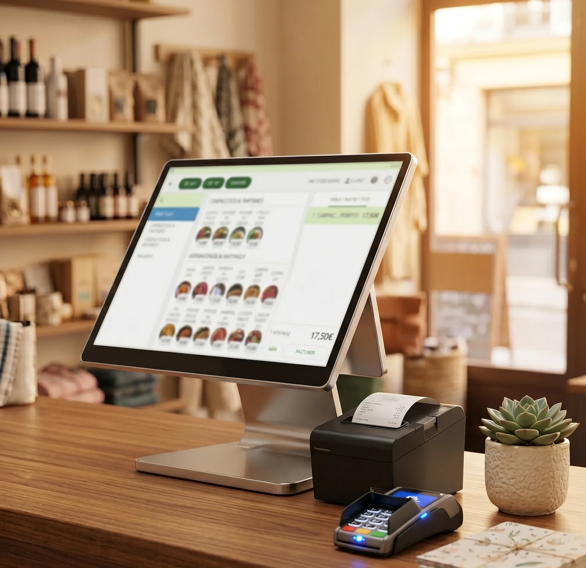

# Bibliothèque Front DCB : source unique des sections

> **Document clé du projet.** Tout le code visuel du site est répertorié ici : chaque type de section avec son code canonique desktop (`.d-shell`) ET mobile (`.m-shell`), copiable tel quel.
> Extrait le 11/06/2026 des pages de référence du site. Document vivant : maintenu par les agents (front-builder, mobile-builder) à chaque nouveau pattern validé. Si un pattern canonique évolue dans sa page source, mettre à jour le bloc correspondant ici.

---

## 0. Mode d'emploi : règles non négociables

1. **Ne JAMAIS inventer une section.** Toute nouvelle page ou section part d'un pattern de ce document. On copie le bloc canonique, on adapte le contenu et l'accent, on ne touche pas à la structure ni aux classes.
2. **Adaptations autorisées uniquement** : textes (via copywriter-site), couleur d'accent (table section 2), liens (`href`, respecter la profondeur `data-base`), images/placeholders, IDs d'ancres. Tout le reste (classes Tailwind, structure DOM, attributs ARIA) reste identique.
3. **Pattern absent de la bibliothèque** : vérifier d'abord la matrice (annexe A) et les signatures one-off (section 5). Si la section n'existe vraiment nulle part : passage obligatoire par `impeccable` (shape) + validation utilisateur, puis AJOUT du nouveau pattern dans ce document.
4. **Recherche rapide** : chaque pattern a un ID `P-xx`. Grep l'ID dans ce fichier, ou grep le marqueur de commentaire indiqué dans la page source pour voir le code en contexte.
5. Le code ci-dessous est extrait des pages réelles : il contient le contenu de la page de référence (boulangerie, hub caisse, hub IT...). Ce contenu est un EXEMPLE à remplacer, pas un texte à dupliquer (anti duplicate content, cf. `docs/content-reference.md`).

**Pages de référence utilisées :**
| Rôle | Page |
|---|---|
| Sous-page type (kit complet) | `caisse-enregistreuse/boulangerie/index.html` |
| Hub type | `caisse-enregistreuse/index.html` et `maintenance-informatique/index.html` |
| Narration process | `visibilite-web/creation-site-internet/index.html` |
| Narration urgence | `maintenance-informatique/maintenance-depannage/index.html` |

---

## 1. Squelette de page complet (dual-shell)

Toute page = UN fichier HTML contenant `.d-shell` (desktop >640px) + `.m-shell` (mobile ≤640px). Le squelette ci-dessous vient de la sous-page boulangerie (profondeur 2).

**À adapter lors de la copie :**
- `<title>`, meta description, canonical, Open Graph, JSON-LD : propres à la page (agent seo-expert).
- `data-page` et `data-base` sur `<html>` : `./` racine, `../` profondeur 1, `../../` profondeur 2.
- Chemins CSS/JS : préfixés selon la profondeur, avec cache-bust (`css/style.css?v=8`, `js/scripts.js?v=21`, versions à vérifier sur les autres pages au moment de la création).
- Variable d'accent de la page (voir section 2).

### 1.1 Head + ouverture des shells (lignes 1 à 112 de la référence)

```html
<!DOCTYPE html>
<html lang="fr" data-base="../../">
<head>
<meta charset="utf-8">
<meta name="viewport" content="width=device-width, initial-scale=1.0, viewport-fit=cover">
<title>Caisse enregistreuse boulangerie NF525 | DCB Technologies</title>
<meta name="description" content="Caisse enregistreuse boulangerie NF525 : formules automatiques, monnayeur, clôture Z. Prise en main à distance immédiate, sur site en moins de 4h en 71/69/01/42.">
<meta property="og:title" content="Caisse enregistreuse boulangerie NF525 | DCB Technologies">
<meta property="og:description" content="Caisse enregistreuse pour boulangerie certifiée NF525 : gestion des formules, monnayeur automatique, clôture Z. Installation sur site.">
<meta property="og:url" content="https://dcb-technologies.fr/caisse-enregistreuse/boulangerie/">
<meta property="og:type" content="website">
<meta property="og:image" content="https://dcb-technologies.fr/assets/og-caisse.jpg">
<meta name="twitter:card" content="summary_large_image">
<meta name="twitter:title" content="Caisse enregistreuse boulangerie NF525 | DCB Technologies">
<meta name="twitter:description" content="Caisse enregistreuse pour boulangerie certifiée NF525 : gestion des formules, monnayeur automatique, clôture Z. Installation sur site.">
<meta name="twitter:image" content="https://dcb-technologies.fr/assets/og-caisse.jpg">
<link rel="canonical" href="https://dcb-technologies.fr/caisse-enregistreuse/boulangerie/">
<link rel="preconnect" href="https://fonts.googleapis.com">
<link rel="preconnect" href="https://fonts.googleapis.com">
<link rel="preconnect" href="https://fonts.gstatic.com" crossorigin>
<link href="https://fonts.googleapis.com/css2?family=Sora:wght@400;600;700;800&family=Inter:wght@400;500;600&display=swap" rel="stylesheet">
<link href="https://fonts.googleapis.com/css2?family=Material+Symbols+Outlined:wght,FILL@100..700,0..1&display=swap" rel="stylesheet">
<link rel="stylesheet" href="../../css/style.css?v=12">
<link rel="stylesheet" href="../../css/tailwind.min.css?v=17">
<style>
  .material-symbols-outlined { font-variation-settings:'FILL' 0,'wght' 400,'GRAD' 0,'opsz' 24; display:inline-block; vertical-align:middle; }
  .tonal-shift-elevation { box-shadow: 4px 4px 0px 0px rgba(7,43,107,0.04); }
  body { font-family: 'Inter', sans-serif; }
  @keyframes hero-blob-a { 0%,100% { transform: translate(30%,-30%) scale(1); } 50% { transform: translate(22%,-22%) scale(1.12); } }
  @keyframes hero-blob-b { 0%,100% { transform: translateY(0); opacity:1; } 50% { transform: translateY(-20px); opacity:0.7; } }
  .hero-blob-a { animation: hero-blob-a 16s ease-in-out infinite; }
  .hero-blob-b { animation: hero-blob-b 12s ease-in-out infinite; }
  @media (prefers-reduced-motion: reduce) { .hero-blob-a, .hero-blob-b { animation: none !important; } }
  /* Shells mobile / desktop */
  .m-shell { display: none }
  @media(max-width:640px) {
    .m-shell { display: block }
    .d-shell { display: none }
    #dcb-phone-fab { display: none !important }
    /* Accent boulangerie : ambre #F59E0B sur tous les em/eyebrow/FAB mobiles */
    [data-metier="boulangerie"] .eyebrow,
    [data-metier="boulangerie"] .hero h1 em,
    [data-metier="boulangerie"] .sec h2 em,
    [data-metier="boulangerie"] .tech .eyebrow,
    [data-metier="boulangerie"] .tech h2 em { color: var(--boul) }
    [data-metier="boulangerie"] .fab .b1 { background: var(--boul); box-shadow: 0 10px 22px -6px rgba(245,158,11,0.55) }
    /* Tous les CTA solides (hero, final, sheet) → ambre boulangerie */
    [data-metier="boulangerie"] .btn-pri { background: var(--boul)}

  }
  .dcb-dot.is-active::before { background: #F59E0B !important; }
</style>
<link rel="stylesheet" href="../../m/css/mobile.css?v=27" media="screen and (max-width:640px)">
<!-- Preload LCP image mobile : remplacer par .webp quand l'image réelle sera disponible -->
<link rel="preload" as="image" href="../../assets/placeholder-hero-boulangerie.jpg" fetchpriority="high" media="(max-width:640px)">
<script type="application/ld+json">
{
  "@context": "https://schema.org",
  "@type": "FAQPage",
  "mainEntity": [
    {"@type": "Question", "name": "Une caisse enregistreuse est-elle obligatoire pour ma boulangerie ?", "acceptedAnswer": {"@type": "Answer", "text": "Si vous êtes assujetti à la TVA, vous devez utiliser un logiciel certifié NF525 depuis 2018. En cas de contrôle fiscal, l'amende est de 7 500 € par système de caisse non conforme. CashMag gère votre conformité en continu : attestation NF525 disponible en un clic depuis votre caisse, même à 5h du matin."}},
    {"@type": "Question", "name": "Ma boulangerie ouvre à 5h : pouvez-vous intervenir à cette heure-là ?", "acceptedAnswer": {"@type": "Answer", "text": "Oui. Nous planifions nos installations selon vos horaires réels. Si votre boulangerie ouvre à 5h, on est là à 5h. En cas de panne, on prend la main à distance immédiatement. Si on doit se déplacer, le délai garanti est de moins de 4h."}},
    {"@type": "Question", "name": "Le monnayeur automatique est-il compatible avec n'importe quelle caisse ?", "acceptedAnswer": {"@type": "Answer", "text": "Le monnayeur que nous installons fonctionne en connexion directe avec CashMag. Les montants sont transmis automatiquement, sans ressaisie. Si vous avez déjà une caisse d'une autre marque, nous vérifions la compatibilité gratuitement."}},
    {"@type": "Question", "name": "Puis-je gérer plusieurs boulangeries depuis le même back-office ?", "acceptedAnswer": {"@type": "Answer", "text": "Oui. CashMag permet la gestion multi-sites avec un back-office centralisé. Statistiques par boulangerie ou en vue consolidée. Nos techniciens configurent votre installation sur mesure selon le nombre de points de vente."}},
    {"@type": "Question", "name": "Que se passe-t-il si ma caisse tombe en panne un samedi matin ?", "acceptedAnswer": {"@type": "Answer", "text": "Vous nous appelez sur notre numéro direct : 04 82 53 05 10. On prend la main à distance immédiatement. Si on doit passer chez vous, c'est garanti en moins de 4h. Le samedi matin n'est pas une exception."}},
    {"@type": "Question", "name": "CashMag communique-t-il avec mon terminal de paiement ?", "acceptedAnswer": {"@type": "Answer", "text": "Oui. Le montant est transmis automatiquement au TPE, sans ressaisie et sans risque d'erreur. Si vous avez déjà un TPE en place, nous vérifions la compatibilité gratuitement."}},
    {"@type": "Question", "name": "CashMag gère-t-il les ventes au poids et les produits maison ?", "acceptedAnswer": {"@type": "Answer", "text": "Oui. Articles au poids, prix variables, familles de fabrication maison avec codes TVA respectifs. Toute la configuration est faite par nos techniciens lors de l'installation."}}
  ]
}
</script>
<script type="application/ld+json">{"@context":"https://schema.org","@type":"BreadcrumbList","itemListElement":[{"@type":"ListItem","position":1,"name":"Accueil","item":"https://dcb-technologies.fr/"},{"@type":"ListItem","position":2,"name":"Caisse Enregistreuse","item":"https://dcb-technologies.fr/caisse-enregistreuse/"},{"@type":"ListItem","position":3,"name":"Boulangerie","item":"https://dcb-technologies.fr/caisse-enregistreuse/boulangerie/"}]}</script>
<script type="application/ld+json">
{
  "@context": "https://schema.org",
  "@type": "Service",
  "@id": "https://dcb-technologies.fr/caisse-enregistreuse/boulangerie/#service",
  "serviceType": "Caisse enregistreuse boulangerie NF525",
  "name": "Caisse enregistreuse pour boulangerie : installation, formation et SAV sur site",
  "description": "Caisse tactile NF525 pour boulangerie et pâtisserie : gestion des formules, monnayeur automatique, clôture Z. Installation sur site en Saône-et-Loire, Rhône, Ain et Loire.",
  "url": "https://dcb-technologies.fr/caisse-enregistreuse/boulangerie/",
  "brand": {"@type": "Brand", "name": "CashMag"},
  "provider": {"@id": "https://dcb-technologies.fr/#localbusiness"},
  "areaServed": [
    {"@type": "City", "name": "Lyon"},
    {"@type": "City", "name": "Mâcon"},
    {"@type": "City", "name": "Chalon-sur-Saône"},
    {"@type": "City", "name": "Villefranche-sur-Saône"},
    {"@type": "City", "name": "Bourg-en-Bresse"},
    {"@type": "City", "name": "Roanne"},
    {"@type": "City", "name": "Paray-le-Monial"},
    {"@type": "AdministrativeArea", "name": "Saône-et-Loire (71)"},
    {"@type": "AdministrativeArea", "name": "Rhône (69)"},
    {"@type": "AdministrativeArea", "name": "Ain (01)"},
    {"@type": "AdministrativeArea", "name": "Loire (42)"}
  ],
  "offers": {
    "@type": "AggregateOffer",
    "priceCurrency": "EUR",
    "lowPrice": "59",
    "highPrice": "77",
    "offerCount": 2,
    "description": "Essentiel dès 59 €/mois (matériel + logiciel CashMag + installation + formation, sans maintenance) ou Pack Boulangerie 77 €/mois (maintenance 7j/7 24h/24 incluse). Location 60 mois sans apport, ou offre Sur mesure avec monnayeur et multi-caisses. Matériel garanti 5 ans."
  }
}
</script>
<style>.faq-item{background:#F8F9FA !important}</style>
</head>
<body>
<div class="d-shell">
<div id="dcb-nav"></div>
<main class="pt-[76px]">

```

### 1.2 Transition `/d-shell` vers `.m-shell` + frame mobile haute

Entre la fin du desktop et la première section mobile. `data-metier` sur `.m-shell` selon la page. Placeholders vides (injection scripts.js).

```html
</main>
<div id="dcb-footer"></div>
</div><!-- /d-shell -->

<!-- ═══════════════════════════════════════════════════════════════
     MOBILE SHELL  (visible ≤640 px uniquement : .m-shell)
═══════════════════════════════════════════════════════════════ -->
<div class="m-shell" data-metier="boulangerie">

<!-- SKIP LINK -->
<a class="skip-link" href="#m-main">Aller au contenu principal</a>

<!-- PROGRESS BAR -->
<div class="progress" aria-hidden="true"><span id="m-pg"></span></div>

<!-- HEADER : injecté par scripts.js via #m-nav -->
<div id="m-nav"></div>

<!-- MAIN CONTENT -->
<main id="m-main">
```

### 1.3 Fin de page : frame mobile injectée + scripts

Les placeholders `m-nav`, `m-menu`, `m-fab`, `m-sheet`, `m-footer` restent VIDES : scripts.js les remplit. Ne jamais hardcoder la frame mobile.

```html
</main><!-- /m-main -->

<!-- FRAME MOBILE : injecté par scripts.js -->
<div id="m-footer"></div>
<div id="m-fab"></div>
<div id="m-sheet"></div>
<div id="m-menu"></div>

</div><!-- /m-shell -->
<script src="../../js/scripts.js?v=32"></script>
</body>
</html>
```

---

## 2. Tokens et accents (rappel, source : CLAUDE.md racine, section "Grammaire visuelle")

### Règle maîtresse : deux familles de pages
- **Pages marque** (accueil, hubs, contact, notre-adn, blog, saone-et-loire, cashmag) : l'orange `#F57C00` est la couleur identité (eyebrows, icônes, badges, CTA, CTA final).
- **Pages narration** (toutes les sous-pages métier/service) : ZÉRO orange, l'accent de la page habille tout. Exceptions : filet signature footer (orange constant) et cards cross-sell vers une page marque (orange = couleur de destination). NB : la frame injectée par scripts.js (téléphone nav, FAB, sheet) est encore orange partout ; son passage à `--page-accent` est une cible à implémenter (trigger words `13header`/`13footer` requis), ne pas la "corriger" page par page.

### Base
| Token | Hex | Usage |
|---|---|---|
| Primary | `#0B3D91` | Titres, liens actifs, hero |
| Primary Dark | `#072B6B` | Footer, gradients de fin |
| Orange DCB | `#F57C00` | Pages marque : identité · Pages narration : interdit (hors exceptions ci-dessus) |
| Surfaces | `#FFFFFF` / `#F8F9FA` / `#F3F4F5` | Alternance par shift tonal, zéro bordure 1px |
| Text muted | `#4A5568` (`text-slate-500`) | Texte secondaire |

### Accents par page : paires `--accent` / `--accent-dark` (à substituer dans les patterns copiés)
| Pages | Accent | Dark |
|---|---|---|
| boulangerie, infogerance-pme | `#F59E0B` | `#D97706` |
| restaurant, maintenance-depannage, seo-sea-local | `#EF4444` | `#DC2626` |
| commerce-de-detail, cloud-securite, hebergement | `#0D9488` | `#0F766E` |
| coiffure, outils-collaboratifs | `#A855F7` | `#9333EA` |
| borne-de-commande, location-vente-installation | `#4F46E5` | `#4338CA` |
| monnayeur | `#059669` | `#047857` |
| creation-site-internet | `#7C3AED` | `#6D28D9` |
| cashmag | `#76B737` | `#5E9028` |
| hairnet | `#4527A4` + or `#C59C45` | : |
| pages marque (orange DCB) | `#F57C00` | `#E06E00` |

Règles d'application lors de la copie d'un pattern :
- Remplacer TOUTES les occurrences de l'accent source par l'accent cible (un seul accent dominant par sous-page).
- Le CTA final (P-09) et ses atomes (topbar, icône tel) passent par `var(--accent)` / `var(--accent-dark)`, JAMAIS de couleur en dur. Ailleurs l'accent est inline dans les classes Tailwind (`text-[#F59E0B]`, `bg-[#F59E0B]/10`, etc.).
- Card cross-sell : couleur de la page de DESTINATION, pas celle de la page courante.
- Déclinaisons rouge autorisées uniquement en gradients/dark : `#F87171` (clair), `#DC2626`/`#B91C1C` (foncé).

### Règle pastille d'icône (validée client, 12/06/2026)
- **Pastille d'icône = surface OPPOSÉE à celle de la section** : grise `#F8F9FA` sur section blanche, blanche sur section grise. Sur les pages marque, l'icône reste orange `#F57C00`.
- **JAMAIS d'ombre sous les pastilles** d'icône (la surface opposée fait le contraste, pas un drop-shadow).

### Règle tooltips/abbr (validée client, 12/06/2026)
- **Jamais de soulignement pointillé ni surlignage sur les abréviations.** Pas d'attribut `title` sur les `<abbr>` : utiliser `data-tooltip` + `aria-label` uniquement.
- Forme correcte : `<abbr data-tooltip="..." aria-label="...">SIGLE</abbr>`, sans `title`.

### Conventions structurelles
- Sections : `py-12 lg:py-16` · Containers : `max-w-7xl mx-auto px-6` · Cards : `rounded-xl`/`rounded-2xl` + `tonal-shift-elevation` · CTA : `rounded-[14px]` · `<main>` desktop : `pt-[76px]`.
- H2 standard : `font-sora text-3xl md:text-4xl font-bold text-[#0B3D91]`. Labels : `text-[11px] font-bold tracking-[0.2em] uppercase`.
- IDs mobiles préfixés `m-`. Zéro tiret cadratin dans tout contenu.
- Après toute modification de classes : rebuild Tailwind (`./tools/tailwindcss.exe -c tailwind.config.js -i css/tailwind-input.css -o css/tailwind.min.css --minify`).

---

## 3. Kit sous-page (référence : boulangerie)

L'enchaînement standard d'une sous-page métier/service :
**Desktop** : Hero → Trust bar → Features → Problème/Solution → Pricing → Témoignages → Cross-sell → FAQ → CTA final.
**Mobile** : S1 Hero → S2 Marquee → S3 Pain → S4 Features → S5 Pricing → S6 Témoignages → S7 Cross-sell → S8 FAQ → S9 CTA final.
L'ordre mobile peut être réajusté par l'agent cro-expert (narration mobile ≠ desktop), mais les blocs restent ceux-ci.

### P-01 · Hero sous-page

Usage : toutes les sous-pages. Accent : badge, surlignage du H1, boutons secondaires.
Variantes desktop (pointeurs, même rôle, autre signature visuelle) :
- Silo IT "Trust Layered Operations" (photo + dashboard flottant + badge) : `maintenance-informatique/maintenance-depannage/index.html`, marqueur `<!-- 1. HERO -->` (code en P-01b ci-dessous).
- Silo Web "duo MacBook + iPhone" : `visibilite-web/creation-site-internet/index.html`, marqueur `<!-- 1. HERO -->` (signature exclusive silo web, voir section 5).

**Desktop (marqueur `<!-- 1. HERO -->`) :**
```html
<!-- 1. HERO -->
<section class="bg-gradient-to-br from-[#92400E] to-[#B45309] py-12 lg:py-16 relative overflow-hidden">
  <div class="absolute inset-0 pointer-events-none" aria-hidden="true">
    <div class="hero-blob-a absolute top-0 right-0 w-[560px] h-[560px] bg-white/10 rounded-full blur-3xl"></div>
    <div class="hero-blob-b absolute bottom-0 left-1/4 w-[460px] h-[460px] bg-[#F59E0B]/12 rounded-full blur-3xl"></div>
  </div>
  <div class="max-w-7xl mx-auto px-6 grid grid-cols-1 lg:grid-cols-12 gap-12 lg:gap-16 items-center relative z-10">
    <div class="lg:col-span-7 space-y-6 dcb-stagger">
      <div class="flex flex-wrap gap-3">
        <span class="bg-[#F59E0B] text-white px-4 py-1.5 rounded-full text-[11px] font-bold tracking-widest uppercase border border-[#F59E0B]">Boulangerie &amp; Pâtisserie</span>
        <span class="hidden md:inline-block bg-white/10 text-white px-4 py-1.5 rounded-full text-[11px] font-bold tracking-widest uppercase border border-white/20">Installation sur site</span>
        <span class="hidden md:inline-block bg-white/10 text-white px-4 py-1.5 rounded-full text-[11px] font-bold tracking-widest uppercase border border-white/20">Formation incluse</span>
      </div>
      <h1 class="font-sora text-4xl md:text-[2.75rem] lg:text-5xl font-bold text-white leading-[1.1] tracking-tight">Caisse enregistreuse boulangerie <abbr data-tooltip="Norme Française 525 pour logiciels de caisse, conforme à la loi anti-fraude TVA (article 286 du CGI). Amende 7 500 € par caisse sans justificatif de conformité." aria-label="Norme Française 525 pour logiciels de caisse, conforme à la loi anti-fraude TVA (article 286 du CGI). Amende 7 500 € par caisse sans justificatif de conformité.">NF525</abbr>, <br><span class="text-[#F59E0B] italic font-semibold">installée par vos techniciens</span></h1>
      <p class="text-white/65 text-lg md:text-xl max-w-xl leading-relaxed">Votre rush du matin, vos formules, vos invendus, votre clôture du soir. Tout est pensé pour le quotidien d'une boulangerie, pas pour un commerce générique. Formule Essentiel dès 59 €/mois, un technicien DCB vient chez vous pour tout configurer.</p>
      <div class="space-y-4">
        <div class="flex items-center gap-3 text-white"><span class="material-symbols-outlined text-[#F59E0B]" style="font-variation-settings:'FILL' 1">check_circle</span>Formules détectées automatiquement à l'encaissement</div>
        <div class="flex items-center gap-3 text-white"><span class="material-symbols-outlined text-[#F59E0B]" style="font-variation-settings:'FILL' 1">check_circle</span>Suivi de fabrication et gestion des invendus intégrés</div>
        <div class="flex items-center gap-3 text-white"><span class="material-symbols-outlined text-[#F59E0B]" style="font-variation-settings:'FILL' 1">check_circle</span>Clôture Z et export comptable automatiques</div>
      </div>
      <div class="flex flex-wrap gap-4 pt-2">
        <a href="#tarifs" class="dcb-btn-hover bg-[#F59E0B] text-white px-8 py-4 rounded-lg font-bold flex items-center gap-3">Voir les tarifs <span class="material-symbols-outlined">arrow_forward</span></a>
        <a href="tel:0482530510" class="dcb-btn-hover border-2 border-white text-white px-8 py-4 rounded-lg font-bold flex items-center gap-2"><span class="material-symbols-outlined">call</span> 04 82 53 05 10</a>
      </div>
    </div>
    <div class="hidden lg:block lg:col-span-5 relative">
      
      <div class="absolute -bottom-4 -left-4 bg-white p-5 rounded-xl shadow-xl">
        <p class="text-[11px] font-bold uppercase tracking-widest text-[#F59E0B] mb-1">Monnayeur compatible</p>
        <p class="font-sora text-xl font-bold text-[#0B3D91]">Zéro erreur de caisse</p>
      </div>
    </div>
  </div>
</section>

```

**Mobile Family A, hero éditorial (marqueur `<!-- S1 : HERO -->`) :**
```html
<!-- S1 : HERO -->
<section class="hero" style="background:linear-gradient(135deg,#92400E 0%,#B45309 100%)">
  <div class="chips">
    <span class="chip">Boulangerie &amp; Pâtisserie</span>
    <span class="chip gold">Dès 59 €/mois</span>
  </div>
  <h1>Caisse enregistreuse boulangerie <abbr data-tooltip="Norme Française 525, conforme à la loi anti-fraude TVA depuis 2018" aria-label="Norme Française 525, conforme à la loi anti-fraude TVA depuis 2018">NF525</abbr>, <em>installée par vos techniciens</em>.</h1>
  <p class="lede">Formules, invendus, clôture Z : pensé pour une boulangerie, pas un commerce générique. Dès 59&nbsp;€/mois, un technicien DCB vient chez vous pour tout configurer.</p>

  <div class="scene">
    <div class="tpv">
      
    </div>
    <div class="float1" aria-hidden="true">
      <div class="ic"><span class="material-symbols-outlined fill" style="font-variation-settings:'FILL' 1">payments</span></div>
      <div><div class="lb">Formules</div><div class="vl">Auto</div></div>
    </div>
    <div class="float2" aria-hidden="true">
      <div class="ic"><span class="material-symbols-outlined" style="font-variation-settings:'FILL' 1">verified</span></div>
      <div><div class="lb">NF525</div><div class="vl">Conforme</div></div>
    </div>
  </div>

  <div class="checks">
    <div><span class="material-symbols-outlined fill" style="font-variation-settings:'FILL' 1">check_circle</span>Formules détectées automatiquement à l'encaissement</div>
    <div><span class="material-symbols-outlined fill" style="font-variation-settings:'FILL' 1">check_circle</span>Suivi de fabrication et gestion des invendus intégrés</div>
    <div><span class="material-symbols-outlined fill" style="font-variation-settings:'FILL' 1">check_circle</span>Clôture Z et export comptable automatiques</div>
  </div>

  <div class="cta-row">
    <button class="btn btn-pri" data-sheet aria-label="Demander un devis caisse boulangerie">Demander un devis<span class="material-symbols-outlined" aria-hidden="true">arrow_forward</span></button>
    <a class="btn btn-icon" href="tel:0482530510" aria-label="Appeler DCB Technologies"><span class="material-symbols-outlined fill" style="font-variation-settings:'FILL' 1">call</span></a>
  </div>
</section>

```

**Mobile Family B, hero à stat dominante (référence depannage, stat "moins de 4h") :**
```html
<!-- S1 : HERO (Family B - stat <4h) -->
<section class="hero">
  <div class="chips">
    <span class="chip"><span class="material-symbols-outlined fill">build</span>Dépannage IT</span>
    <span class="chip red" style="white-space:nowrap;flex-shrink:0">Intervention &lt;4h · 7j/7</span>
  </div>
  <h1>Maintenance et <em>dépannage informatique</em>.</h1>
  <p class="lede">Intervention prioritaire pour garantir la continuité de votre activité. Techniciens salariés, sur site en moins de 4 heures.</p>

  <div class="scene">
    <div class="tpv">
      
    </div>
    <div class="float-stat" aria-hidden="true">
      <div class="ic" style="background:linear-gradient(135deg,#EF4444,#DC2626)"><span class="material-symbols-outlined">speed</span></div>
      <div class="txt">
        <div class="num">&lt;4h</div>
        <div class="desc">Intervention garantie</div>
      </div>
    </div>
  </div>

  <div class="checks">
    <div><span class="material-symbols-outlined fill">check_circle</span>Monitoring préventif 24/7</div>
    <div><span class="material-symbols-outlined fill">check_circle</span>Télémaintenance immédiate</div>
    <div><span class="material-symbols-outlined fill">check_circle</span>Remplacement matériel J+1</div>
  </div>

  <div class="cta-row">
    <a class="btn btn-pri" href="../../contact/index.html" aria-label="Demander un devis maintenance">Demander un devis<span class="material-symbols-outlined" aria-hidden="true">arrow_forward</span></a>
    <a class="btn btn-icon" href="tel:0482530510" aria-label="Appeler DCB Technologies"><span class="material-symbols-outlined fill">call</span></a>
  </div>
</section>

```

### P-01b · Hero desktop silo IT (Trust Layered)

Usage : sous-pages IT. 3 layers z-index : photo équipe + mini dashboard flottant + badge garantie.
```html
<!-- 1. HERO -->
<section class="bg-gradient-to-br from-[#7F1D1D] to-[#991B1B] py-12 lg:py-16 relative overflow-hidden dcb-parallax">
  <div class="absolute inset-0 opacity-10 pointer-events-none dcb-parallax-layer" data-speed="0.35">
    <div class="hero-blob-a absolute -top-24 -right-24 w-96 h-96 bg-white rounded-full blur-3xl"></div>
    <div class="absolute bottom-0 left-0 w-full h-1/2 bg-gradient-to-t from-[#991B1B] to-transparent"></div>
  </div>
  <div class="max-w-7xl mx-auto px-6 grid grid-cols-1 lg:grid-cols-12 gap-12 lg:gap-16 items-center relative z-10">
    <div class="lg:col-span-7 space-y-6 dcb-stagger">
      <div class="flex flex-wrap gap-3">
        <span class="bg-[#EF4444] text-white px-4 py-1.5 rounded-full text-[11px] font-bold tracking-widest uppercase border border-[#EF4444]">Maintenance &amp; Dépannage</span>
        <span class="hidden md:inline-flex bg-white/10 text-white px-4 py-1.5 rounded-full text-[11px] font-bold tracking-widest uppercase border border-white/20 items-center gap-1">
          <span class="material-symbols-outlined text-[14px]">verified</span> Intervention &lt;4h
        </span>
        <span class="hidden md:inline-block bg-white/10 text-white px-4 py-1.5 rounded-full text-[11px] font-bold tracking-widest uppercase border border-white/20">7j/7</span>
      </div>
      <h1 class="font-sora text-4xl md:text-[2.75rem] lg:text-5xl font-bold text-white leading-[1.1] tracking-tight">Maintenance et dépannage informatique</h1>
      <p class="text-white/70 text-lg max-w-xl leading-relaxed">Intervention prioritaire pour garantir la continuité de votre activité. Nos techniciens salariés veillent sur votre infrastructure et interviennent en moins de 4 heures.</p>
      <div class="space-y-4">
        <div class="flex items-center gap-3 text-white"><span class="material-symbols-outlined text-[#EF4444]" style="font-variation-settings:'FILL' 1">check_circle</span>Monitoring préventif 24/7</div>
        <div class="flex items-center gap-3 text-white"><span class="material-symbols-outlined text-[#EF4444]" style="font-variation-settings:'FILL' 1">check_circle</span>Télémaintenance immédiate</div>
        <div class="flex items-center gap-3 text-white"><span class="material-symbols-outlined text-[#EF4444]" style="font-variation-settings:'FILL' 1">check_circle</span>Remplacement matériel J+1</div>
      </div>
      <div class="flex flex-wrap gap-4 pt-2">
        <a href="../../contact/index.html" class="dcb-btn-hover bg-[#EF4444] text-white px-8 py-4 rounded-lg font-bold flex items-center gap-3">Demander un devis <span class="material-symbols-outlined">arrow_forward</span></a>
        <a href="tel:0482530510" class="dcb-btn-hover border-2 border-white text-white px-8 py-4 rounded-lg font-bold flex items-center gap-2"><span class="material-symbols-outlined">call</span> 04 82 53 05 10</a>
      </div>
    </div>
    <!-- HERO IDENTITY : Trust Layered Operations (3 layers avec z-index, identité silo informatique) -->
    <div class="hidden lg:block lg:col-span-5 relative pt-8">
      <!-- LAYER 1 : Main image placeholder v2.0 (photo humaine équipe DCB, technicien en intervention) -->
      

      <!-- LAYER 2 : Floating mini dashboard card (offset top-right), identité IT "live monitoring" -->
      <!-- IMAGE PLACEHOLDER v2.0 : possibilité d'intégrer un mini screenshot monitoring réel -->
      <div class="absolute -top-2 -right-6 z-30 bg-white rounded-xl shadow-xl p-4 w-52 dcb-reveal dcb-reveal-scale">
        <div class="flex items-center gap-2 mb-3">
          <span class="relative flex items-center justify-center w-3 h-3">
            <span class="absolute inline-flex h-3 w-3 rounded-full bg-[#10B981] opacity-60 animate-ping"></span>
            <span class="relative inline-flex h-2 w-2 rounded-full bg-[#10B981]"></span>
          </span>
          <span class="text-[11px] font-bold tracking-widest text-slate-500 uppercase">Système</span>
        </div>
        <p class="font-sora text-2xl font-bold text-[#0B3D91] leading-none mb-1">Online</p>
        <p class="text-xs text-slate-500 leading-relaxed">4 départements monitorés 24/7</p>
      </div>

      <!-- LAYER 3 : Trust badge garantie intervention (bottom-left) -->
      <div class="absolute -bottom-4 -left-4 z-30 bg-white p-5 rounded-xl shadow-xl">
        <p class="text-[11px] font-bold uppercase tracking-widest text-[#EF4444] mb-1">Intervention garantie</p>
        <p class="font-sora text-xl font-bold text-[#0B3D91]">&lt; 4h sur site, 7j/7</p>
      </div>
    </div>
  </div>
</section>

```

### P-02 · Trust bar (desktop) / Marquee (mobile)

Usage : toutes les pages, juste sous le hero. 4 items de preuve (NF525, délai SAV, local, partenaire). Accent : icônes.

**Desktop (marqueur `<!-- 2. TRUST BAR -->`) :**
```html
<!-- 2. TRUST BAR -->
<section class="py-6 bg-white">
  <div class="max-w-7xl mx-auto px-6">
    <div class="grid grid-cols-2 gap-5 md:flex md:flex-wrap md:items-center md:justify-between md:gap-y-4 dcb-stagger">
      <div class="flex items-center gap-3">
        <span class="material-symbols-outlined text-[#F59E0B] text-3xl" style="font-variation-settings:'FILL' 1">verified</span>
        <span class="font-semibold text-base md:text-xl text-slate-500">Certifié NF525</span>
      </div>
      <div class="flex items-center gap-3">
        <span class="material-symbols-outlined text-[#F59E0B] text-3xl" style="font-variation-settings:'FILL' 1">shield</span>
        <span class="font-semibold text-base md:text-xl text-slate-500">Garantie 5 ans</span>
      </div>
      <div class="flex items-center gap-3">
        <span class="material-symbols-outlined text-[#F59E0B] text-3xl" style="font-variation-settings:'FILL' 1">support_agent</span>
        <span class="font-semibold text-base md:text-xl text-slate-500">SAV 7j/7 24h/24</span>
      </div>
      <div class="flex items-center gap-3">
        <span class="material-symbols-outlined text-[#F59E0B] text-3xl" style="font-variation-settings:'FILL' 1">water_drop</span>
        <span class="font-semibold text-base md:text-xl text-slate-500">Matériel étanche</span>
      </div>
    </div>
  </div>
</section>

```

**Mobile, marquee infini + équivalent lecteur d'écran statique (marqueur `<!-- S2 : TRUST BAR MARQUEE -->`) :**
```html
<!-- S2 : TRUST BAR MARQUEE -->
<ul class="sr-only">
  <li>Intervention sur site en moins de 4h</li>
  <li>Garantie 5 ans matériel</li>
  <li>Certifié NF525</li>
  <li>Matériel étanche</li>
  <li>SAV 7j/7 24h/24</li>
</ul>
<div class="marquee" aria-hidden="true">
  <div class="marquee-track">
    <div class="it"><span class="material-symbols-outlined fill" style="font-variation-settings:'FILL' 1">verified</span>Certifié NF525</div>
    <div class="it"><span class="material-symbols-outlined fill" style="font-variation-settings:'FILL' 1">speed</span>Intervention &lt;4h</div>
    <div class="it"><span class="material-symbols-outlined fill" style="font-variation-settings:'FILL' 1">verified_user</span>Garantie 5 ans</div>
    <div class="it"><span class="material-symbols-outlined fill" style="font-variation-settings:'FILL' 1">water_drop</span>Matériel étanche</div>
    <div class="it"><span class="material-symbols-outlined fill" style="font-variation-settings:'FILL' 1">support_agent</span>SAV 7j/7 24h/24</div>
    <div class="it" aria-hidden="true"><span class="material-symbols-outlined fill" style="font-variation-settings:'FILL' 1">verified</span>Certifié NF525</div>
    <div class="it" aria-hidden="true"><span class="material-symbols-outlined fill" style="font-variation-settings:'FILL' 1">speed</span>Intervention &lt;4h</div>
    <div class="it" aria-hidden="true"><span class="material-symbols-outlined fill" style="font-variation-settings:'FILL' 1">verified_user</span>Garantie 5 ans</div>
    <div class="it" aria-hidden="true"><span class="material-symbols-outlined fill" style="font-variation-settings:'FILL' 1">water_drop</span>Matériel étanche</div>
    <div class="it" aria-hidden="true"><span class="material-symbols-outlined fill" style="font-variation-settings:'FILL' 1">support_agent</span>SAV 7j/7 24h/24</div>
  </div>
</div>

```

### P-03 · Problème / Solution (pain points)

Usage : toutes les pages (hub : "PROBLÈME / CONSTAT"). 3 douleurs concrètes, la 1ère = SAV (téléphone 04 82 53 05 10 cité). Accent : icônes et surlignages.

**Desktop (marqueur `<!-- 5. PROBLÈME / SOLUTION -->`) :**
```html
<!-- 5. PROBLÈME / SOLUTION -->
<section class="py-12 lg:py-16 bg-white">
  <div class="max-w-7xl mx-auto px-6">
    <div class="max-w-3xl mb-12 dcb-reveal">
      <span class="text-[11px] font-bold tracking-[0.2em] text-[#F59E0B] uppercase block mb-3">Le constat</span>
      <h2 class="font-sora text-3xl md:text-4xl font-bold text-[#0B3D91] leading-tight">Ce que vivent la plupart des boulangers avant de nous appeler</h2>
    </div>
    <div class="space-y-10 md:space-y-12 dcb-stagger">

      <div class="flex gap-6 md:gap-12 items-start">
        <span class="font-sora text-6xl font-bold text-[#F59E0B]/20 leading-none shrink-0 select-none">01</span>
        <div class="pt-2">
          <h3 class="font-sora text-xl font-semibold text-[#0B3D91] mb-3">La file s'allonge, des clients repartent</h3>
          <p class="text-slate-500 text-base leading-relaxed max-w-2xl">Un encaissement lent ou une erreur de monnaie crée une tension immédiate. Chaque seconde perdue à la caisse se paie cash : une file qui grossit, un client qui hésite, un panier qui reste sur le comptoir.</p>
        </div>
      </div>

      <div class="flex gap-6 md:gap-12 items-start">
        <span class="font-sora text-6xl font-bold text-[#F59E0B]/20 leading-none shrink-0 select-none">02</span>
        <div class="pt-2">
          <h3 class="font-sora text-xl font-semibold text-[#0B3D91] mb-3">Vous fabriquez à l'intuition, vous jetez trop</h3>
          <p class="text-slate-500 text-base leading-relaxed max-w-2xl">Sans données fiables, la production repose sur l'approximation. Combien de baguettes demain ? Quels articles partent entre 7h et 9h ? Sans réponse précise, vous surchargez ou vous manquez. Du gaspillage dans un cas, des clients repartent les mains vides dans l'autre.</p>
        </div>
      </div>

      <div class="flex gap-6 md:gap-12 items-start">
        <span class="font-sora text-6xl font-bold text-[#F59E0B]/20 leading-none shrink-0 select-none">03</span>
        <div class="pt-2">
          <h3 class="font-sora text-xl font-semibold text-[#0B3D91] mb-3">30 minutes de clôture chaque soir</h3>
          <p class="text-slate-500 text-base leading-relaxed max-w-2xl">Recompter les billets, réconcilier les modes de paiement, chercher les écarts. Après une journée qui commence à 4h, c'est la dernière chose dont vous avez besoin. Et pourtant, c'est là chaque soir.</p>
        </div>
      </div>

    </div>
  </div>
</section>

```

**Mobile (marqueur `<!-- S3 : PROBLEME / SOLUTION (pain points) -->`) :**
```html
<!-- S3 : PROBLEME / SOLUTION (pain points) -->
<section class="sec s1">
  <p class="eyebrow">Le constat</p>
  <h2>Ce que vivent la plupart des boulangers <em>avant de nous appeler</em>.</h2>
  <div class="pain">
    <div class="row">
      <div class="n">01</div>
      <div>
        <h3>La file s'allonge, des clients repartent</h3>
        <p>Un encaissement lent ou une erreur de monnaie crée une tension. Avec CashMag et un monnayeur, chaque transaction prend moins de 15 secondes.</p>
      </div>
    </div>
    <div class="row">
      <div class="n">02</div>
      <div>
        <h3>Vous fabriquez à l'intuition, vous jetez trop</h3>
        <p>Sans données fiables, la production repose sur l'approximation. CashMag donne les stats de vente par article, par heure, par jour.</p>
      </div>
    </div>
    <div class="row">
      <div class="n">03</div>
      <div>
        <h3>30 minutes de clôture chaque soir</h3>
        <p>Recompter les billets, réconcilier les paiements, chercher les écarts. La clôture Z automatique centralise tout en un clic, en moins de 3 minutes.</p>
      </div>
    </div>
  </div>
</section>

```

### P-04 · Features métier

Usage : sous-pages. Grille de fonctionnalités spécifiques au métier/service. Accent : icônes, puces.

**Desktop (marqueur `<!-- 3. FEATURES MÉTIER -->`) :**
```html
<!-- 3. FEATURES MÉTIER -->
<section class="py-12 lg:py-16 bg-[#F8F9FA]">
  <div class="max-w-7xl mx-auto px-6">
    <div class="grid grid-cols-1 lg:grid-cols-12 gap-12 items-start">
      <div class="lg:col-span-4 lg:sticky lg:top-24 dcb-reveal dcb-reveal-left">
        <span class="text-[11px] font-bold tracking-[0.2em] text-[#F59E0B] uppercase block mb-3">Votre quotidien</span>
        <h2 class="font-sora text-3xl md:text-4xl font-bold text-[#0B3D91] mb-4 leading-tight">Ce que votre caisse fait pour vous chaque jour</h2>
        <p class="text-slate-500 text-base leading-relaxed mb-6"><abbr data-tooltip="Logiciel de caisse CashMag, certifié NF525 par l'AFNOR. DCB Technologies est installateur agréé." aria-label="Logiciel de caisse CashMag, certifié NF525 par l'AFNOR. DCB Technologies est installateur agréé.">CashMag</abbr> est le logiciel de caisse boulangerie certifié NF525 que nous installons sur site, configuré pour les horaires et les contraintes d'une boulangerie artisanale. On l'a déployé chez des boulangers à Mâcon, Chalon, Villefranche. Chacun est différent parce que chaque boulangerie a ses propres contraintes.</p>
        <a href="../cashmag/index.html" class="inline-flex items-center gap-2 text-[#0B3D91] font-bold text-sm hover:text-[#F57C00] transition-colors">En savoir plus sur CashMag <span class="material-symbols-outlined text-sm">arrow_forward</span></a>
      </div>
      <div class="lg:col-span-8 grid grid-cols-1 md:grid-cols-2 gap-8 dcb-stagger">
        <div class="space-y-3">
          <div class="w-11 h-11 bg-[#F59E0B]/10 flex items-center justify-center rounded-lg"><span class="material-symbols-outlined text-[#F59E0B]" style="font-variation-settings:'FILL' 1">restaurant_menu</span></div>
          <h3 class="font-sora text-lg font-semibold text-[#0B3D91]">Formules automatiques</h3>
          <p class="text-slate-500 text-sm leading-relaxed">Vous créez une formule en 2 minutes. En caisse, elle se déclenche dès que les bons articles sont scannés. Votre vendeur n'a rien à faire, la file avance.</p>
        </div>
        <div class="space-y-3">
          <div class="w-11 h-11 bg-[#F59E0B]/10 flex items-center justify-center rounded-lg"><span class="material-symbols-outlined text-[#F59E0B]" style="font-variation-settings:'FILL' 1">precision_manufacturing</span></div>
          <h3 class="font-sora text-lg font-semibold text-[#0B3D91]">Stocks et fabrication</h3>
          <p class="text-slate-500 text-sm leading-relaxed">Combien de baguettes tradition demain ? CashMag vous le dit. Stocks, matières premières, alertes de fabrication. Vous produisez juste, vous jetez moins.</p>
        </div>
        <div class="space-y-3">
          <div class="w-11 h-11 bg-[#F59E0B]/10 flex items-center justify-center rounded-lg"><span class="material-symbols-outlined text-[#F59E0B]" style="font-variation-settings:'FILL' 1">history</span></div>
          <h3 class="font-sora text-lg font-semibold text-[#0B3D91]">Clôture et export comptable</h3>
          <p class="text-slate-500 text-sm leading-relaxed">Un clic, 3 minutes, c'est bouclé. Le rapport Z part directement chez votre comptable. Vous fermez la caisse en 3 minutes, pas en trente.</p>
        </div>
        <div class="space-y-3">
          <div class="w-11 h-11 bg-[#F59E0B]/10 flex items-center justify-center rounded-lg"><span class="material-symbols-outlined text-[#F59E0B]" style="font-variation-settings:'FILL' 1">monitoring</span></div>
          <h3 class="font-sora text-lg font-semibold text-[#0B3D91]">Suivi d'activité en direct</h3>
          <p class="text-slate-500 text-sm leading-relaxed">Vos articles porteurs, vos invendus, votre CA heure par heure. Vous voyez ce qui marche et vous ajustez votre production le lendemain.</p>
        </div>
      </div>
    </div>
  </div>
</section>

```

**Mobile `.cm-feats` (marqueur `<!-- S4 : FEATURES METIER -->`) :**
```html
<!-- S4 : FEATURES METIER -->
<section class="sec">
  <p class="eyebrow">Votre quotidien</p>
  <h2>Ce que CashMag fait pour vous <em>chaque matin</em>.</h2>
  <div class="cm-feats" style="margin-top:14px">
    <div class="ft">
      <div class="ic" style="background:rgba(245,158,11,0.10);color:#F59E0B">
        <span class="material-symbols-outlined" style="font-variation-settings:'FILL' 1">restaurant_menu</span>
      </div>
      <div>
        <h3>Formules automatiques</h3>
        <p>Vous créez une formule en 2 minutes. En caisse, elle se déclenche dès que les bons articles sont scannés. La file avance sans effort.</p>
      </div>
    </div>
    <div class="ft">
      <div class="ic" style="background:rgba(245,158,11,0.10);color:#F59E0B">
        <span class="material-symbols-outlined" style="font-variation-settings:'FILL' 1">precision_manufacturing</span>
      </div>
      <div>
        <h3>Stocks et fabrication</h3>
        <p>Combien de baguettes tradition demain ? CashMag vous le dit. Alertes de fabrication, matières premières, invendus. Vous produisez juste.</p>
      </div>
    </div>
    <div class="ft">
      <div class="ic" style="background:rgba(245,158,11,0.10);color:#F59E0B">
        <span class="material-symbols-outlined" style="font-variation-settings:'FILL' 1">history</span>
      </div>
      <div>
        <h3>Clôture Z en 1 clic</h3>
        <p>Un clic, 3 minutes, c'est bouclé. Le rapport Z part chez votre comptable automatiquement. Vous fermez la caisse en 3 minutes, pas en trente.</p>
      </div>
    </div>
    <div class="ft">
      <div class="ic" style="background:rgba(245,158,11,0.10);color:#F59E0B">
        <span class="material-symbols-outlined" style="font-variation-settings:'FILL' 1">monitoring</span>
      </div>
      <div>
        <h3>Suivi d'activité en direct</h3>
        <p>Vos articles porteurs, vos invendus, votre CA heure par heure. Vous voyez ce qui marche et ajustez la production le lendemain.</p>
      </div>
    </div>
  </div>
  <a href="../../caisse-enregistreuse/cashmag/index.html" style="display:inline-flex;align-items:center;gap:6px;margin-top:18px;font-size:13.5px;font-weight:700;color:var(--p)">En savoir plus sur CashMag<span class="material-symbols-outlined" style="font-size:16px">arrow_forward</span></a>
</section>

```

### P-05 · Pricing 3 formules

Usage : sous-pages avec offre packagée (boulangerie, restaurant, depannage, infogerance, creation-site...). Formule du milieu = featured (badge + accent). Tarifs : uniquement des montants validés client (sinon placeholder explicite).

**Desktop (marqueur `<!-- 4. PRICING -->`) :**
```html
<!-- 4. PRICING -->
<section id="tarifs" class="py-12 lg:py-16 bg-[#F8F9FA] scroll-mt-24">
  <div class="max-w-7xl mx-auto px-6">
    <div class="mb-10 dcb-reveal">
      <span class="text-[11px] font-bold tracking-[0.2em] text-[#F59E0B] uppercase block mb-2">Tarification transparente</span>
      <h2 class="font-sora text-3xl md:text-4xl font-bold text-[#0B3D91]">Choisissez votre configuration</h2>
      <p class="text-slate-500 mt-2">Location ou achat · Matériel garanti 5 ans · Sans apport initial</p>
    </div>
    <div class="grid grid-cols-1 md:grid-cols-3 gap-6 items-start mb-10 dcb-stagger">
      <div class="bg-white p-7 rounded-xl tonal-shift-elevation border border-slate-100 flex flex-col">
        <h3 class="font-sora font-bold text-lg mb-2">Essentiel</h3>
        <div class="font-sora text-3xl font-bold text-[#F59E0B] leading-none mb-1">59€<span class="text-sm font-normal text-slate-400">/mois</span></div>
        <p class="text-xs text-slate-400 mb-6">sur 60 mois, sans apport</p>
        <ul class="list-none flex flex-col gap-3 mb-6 text-sm">
          <li class="flex items-center gap-2"><span class="material-symbols-outlined text-[#F59E0B] text-base">check</span><abbr data-tooltip="Terminal Point de Vente : la caisse tactile physique avec écran, tiroir et imprimante ticket." aria-label="Terminal Point de Vente : la caisse tactile physique avec écran, tiroir et imprimante ticket.">TPV</abbr> tactile 15,6"</li>
          <li class="flex items-center gap-2"><span class="material-symbols-outlined text-[#F59E0B] text-base">check</span>Tiroir caisse + imprimante ticket</li>
          <li class="flex items-center gap-2"><span class="material-symbols-outlined text-[#F59E0B] text-base">check</span>Licence CashMag 5 ans</li>
          <li class="flex items-center gap-2"><span class="material-symbols-outlined text-[#F59E0B] text-base">check</span>Installation, paramétrage, formation</li>
          <li class="flex items-center gap-2 text-slate-400"><span class="material-symbols-outlined text-red-400 text-base">close</span>Pas de maintenance incluse</li>
          <li class="flex items-center gap-2"><span class="material-symbols-outlined text-[#0B3D91] text-base" style="font-variation-settings:'FILL' 1">verified</span><span class="text-[#0B3D91] font-semibold">Logiciel certifié NF525</span></li>
        </ul>
        <a href="../../contact/index.html?offre=essentiel-boulangerie" class="mt-auto w-full border-2 border-[#F59E0B] text-[#F59E0B] py-3 rounded-lg font-bold hover:bg-[#F59E0B]/5 transition-colors text-sm text-center block">Choisir Essentiel</a>
      </div>
      <div class="bg-white p-7 rounded-xl border-2 border-[#F59E0B] ring-4 ring-[#F59E0B]/5 flex flex-col relative transform md:scale-105 z-10 dcb-featured">
        <div class="absolute -top-3.5 left-1/2 -translate-x-1/2 bg-[#F59E0B] text-white px-4 py-1 rounded-full text-[11px] font-bold tracking-widest uppercase whitespace-nowrap">Le plus choisi</div>
        <h3 class="font-sora font-bold text-lg mb-2">Pack Boulangerie</h3>
        <div class="font-sora text-3xl font-bold text-[#F59E0B] leading-none mb-1">77€<span class="text-sm font-normal text-slate-400">/mois</span></div>
        <p class="text-xs text-slate-400 mb-6">sur 60 mois, tout inclus</p>
        <ul class="list-none flex flex-col gap-3 mb-6 text-sm">
          <li class="flex items-center gap-2"><span class="material-symbols-outlined text-[#F59E0B] text-base">check</span>TPV tactile 15,6"</li>
          <li class="flex items-center gap-2"><span class="material-symbols-outlined text-[#F59E0B] text-base">check</span>Afficheur client 10"</li>
          <li class="flex items-center gap-2"><span class="material-symbols-outlined text-[#F59E0B] text-base">check</span>Imprimante ticket + tiroir caisse</li>
          <li class="flex items-center gap-2"><span class="material-symbols-outlined text-[#F59E0B] text-base">check</span>Onduleur de protection</li>
          <li class="flex items-center gap-2"><span class="material-symbols-outlined text-[#F59E0B] text-base">check</span>Licence CashMag 5 ans</li>
          <li class="flex items-center gap-2"><span class="material-symbols-outlined text-[#F59E0B] text-base">check</span>Maintenance 7j/7 24h/24</li>
          <li class="flex items-center gap-2 font-semibold"><span class="material-symbols-outlined text-[#F59E0B] text-base">check</span>Installation, paramétrage et formation</li>
          <li class="flex items-center gap-2"><span class="material-symbols-outlined text-[#0B3D91] text-base" style="font-variation-settings:'FILL' 1">verified</span><span class="text-[#0B3D91] font-semibold">Logiciel certifié NF525</span></li>
        </ul>
        <a href="../../contact/index.html?offre=pack-boulangerie" class="mt-auto w-full bg-[#F59E0B] text-white py-3 rounded-lg font-bold shadow-lg shadow-[#F59E0B]/20 hover:brightness-110 transition-all text-sm text-center block">Choisir ce pack</a>
      </div>
      <div class="bg-white p-7 rounded-xl tonal-shift-elevation border border-slate-100 flex flex-col">
        <h3 class="font-sora font-bold text-lg mb-2">Sur mesure</h3>
        <div class="font-sora text-3xl font-bold text-[#F59E0B] leading-none mb-1">Sur devis</div>
        <p class="text-xs text-slate-400 mb-6">Configuration à la carte</p>
        <ul class="list-none flex flex-col gap-3 mb-6 text-sm">
          <li class="flex items-center gap-2"><span class="material-symbols-outlined text-[#F59E0B] text-base">check</span>Monnayeur automatique</li>
          <li class="flex items-center gap-2"><span class="material-symbols-outlined text-[#F59E0B] text-base">check</span>Multi-caisses (2 postes ou plus)</li>
          <li class="flex items-center gap-2"><span class="material-symbols-outlined text-[#F59E0B] text-base">check</span>Borne de commande snacking</li>
          <li class="flex items-center gap-2"><span class="material-symbols-outlined text-[#F59E0B] text-base">check</span>Engagement sur mesure (24, 36, 60 mois)</li>
          <li class="flex items-center gap-2"><span class="material-symbols-outlined text-[#F59E0B] text-base">check</span>Achat comptant disponible</li>
          <li class="flex items-center gap-2"><span class="material-symbols-outlined text-[#0B3D91] text-base" style="font-variation-settings:'FILL' 1">verified</span><span class="text-[#0B3D91] font-semibold">Logiciel certifié NF525</span></li>
        </ul>
        <a href="../../contact/index.html?offre=sur-mesure-boulangerie" class="mt-auto w-full border-2 border-[#F59E0B] text-[#F59E0B] py-3 rounded-lg font-bold hover:bg-[#F59E0B]/5 transition-colors text-sm text-center block">Choisir Sur mesure</a>
      </div>
    </div>
    <div id="devis-form" class="bg-white p-8 rounded-xl tonal-shift-elevation border border-slate-100 mt-6">
      <h3 class="font-sora font-bold text-lg text-[#0B3D91] mb-1 no-underline">Recevoir mon devis par email</h3>
      <p class="text-slate-500 text-sm mb-6">Devis détaillé sous 24h. Pas de démarchage, pas d'engagement.</p>
      <div class="grid grid-cols-1 md:grid-cols-2 gap-4 mb-4">
        <div class="space-y-1">
          <label for="prenom-boulangerie" class="text-[11px] font-bold tracking-widest text-slate-400 uppercase block">Prénom</label>
          <input id="prenom-boulangerie" class="w-full bg-[#F8F9FA] border-none rounded-lg p-3 text-sm focus:ring-2 focus:ring-[#F59E0B]/20" placeholder="Jean" type="text">
        </div>
        <div class="space-y-1">
          <label for="email-boulangerie" class="text-[11px] font-bold tracking-widest text-slate-400 uppercase block">Email</label>
          <input id="email-boulangerie" class="w-full bg-[#F8F9FA] border-none rounded-lg p-3 text-sm focus:ring-2 focus:ring-[#F59E0B]/20" placeholder="jean@maboulangerie.fr" type="email">
        </div>
        <div class="space-y-1">
          <label for="tel-boulangerie" class="text-[11px] font-bold tracking-widest text-slate-400 uppercase block">Téléphone</label>
          <input id="tel-boulangerie" class="w-full bg-[#F8F9FA] border-none rounded-lg p-3 text-sm focus:ring-2 focus:ring-[#F59E0B]/20" placeholder="06 12 34 56 78" type="tel">
        </div>
        <div class="space-y-1">
          <label for="offre-select" class="text-[11px] font-bold tracking-widest text-slate-400 uppercase block">Offre sélectionnée</label>
          <select id="offre-select" class="w-full bg-[#F8F9FA] border-none rounded-lg p-3 text-sm focus:ring-2 focus:ring-[#F59E0B]/20">
            <option value="">Choisir une offre</option>
            <option value="essentiel">Essentiel · 59€/mois</option>
            <option value="pack-boulangerie">Pack Boulangerie · 77€/mois</option>
            <option value="sur-mesure">Sur mesure · sur devis</option>
          </select>
        </div>
      </div>
      <div class="grid grid-cols-1 sm:grid-cols-2 gap-3">
        <button class="bg-[#F59E0B] text-white py-3 rounded-lg font-bold text-sm flex items-center justify-center gap-2 hover:brightness-110 transition-all">Recevoir mon devis <span class="material-symbols-outlined text-sm">mail</span></button>
        <a href="tel:0482530510" class="border-2 border-[#0B3D91] text-[#0B3D91] py-3 rounded-lg font-bold text-sm flex items-center justify-center gap-2 hover:bg-[#0B3D91]/5 transition-colors"><span class="material-symbols-outlined text-sm">call</span> 04 82 53 05 10</a>
      </div>
      <p class="text-slate-400 text-xs mt-3 flex items-center gap-1.5"><span class="material-symbols-outlined text-sm">lock</span> Vos données restent confidentielles. Zéro spam, zéro démarchage téléphonique.</p>
    </div>
    <script>
      // Pré-remplir le select quand on clique sur un bouton d'offre
      document.querySelectorAll('a[href*="offre="]').forEach(function(btn) {
        btn.addEventListener('click', function(e) {
          e.preventDefault();
          var offre = this.href.split('offre=')[1];
          var select = document.getElementById('offre-select');
          if (select) {
            if (offre.includes('essentiel')) select.value = 'essentiel';
            else if (offre.includes('pack-boulangerie')) select.value = 'pack-boulangerie';
            else if (offre.includes('sur-mesure')) select.value = 'sur-mesure';
            var form = document.getElementById('devis-form');
            var y = form.getBoundingClientRect().top + window.pageYOffset - 100;
            window.scrollTo({ top: y, behavior: 'smooth' });
          }
        });
      });
    </script>
  </div>
</section>

```

**Mobile (marqueur `<!-- S5 : PRICING -->`) :**
```html
<!-- S5 : PRICING -->
<section class="sec s1">
  <p class="eyebrow">Tarification transparente</p>
  <h2>Choisissez <em>votre formule</em>.</h2>
  <p style="font-size:13.5px;color:var(--mute);margin:-8px 0 18px;line-height:1.5">Location ou achat · Matériel garanti 5 ans · Sans apport initial</p>

  <!-- Essentiel -->
  <div style="background:#fff;border:1px solid var(--line);border-radius:18px;padding:18px;margin-bottom:10px;box-shadow:0 8px 18px -10px rgba(11,61,145,0.10)">
    <div style="font-family:'Sora',sans-serif;font-weight:700;font-size:16px;color:var(--p);margin-bottom:8px">Essentiel</div>
    <div style="font-family:'Sora',sans-serif;font-weight:800;font-size:28px;color:#F59E0B;line-height:1;margin-bottom:2px">59€<span style="font-size:13px;font-weight:400;color:var(--mute)">/mois</span></div>
    <div style="font-size:11px;color:var(--mute);margin-bottom:14px">sur 60 mois, sans apport</div>
    <div style="display:flex;flex-direction:column;gap:8px;font-size:13.5px;margin-bottom:14px">
      <div style="display:flex;align-items:center;gap:8px"><span class="material-symbols-outlined" style="font-size:16px;color:#F59E0B">check</span>TPV tactile 15,6"</div>
      <div style="display:flex;align-items:center;gap:8px"><span class="material-symbols-outlined" style="font-size:16px;color:#F59E0B">check</span>Tiroir caisse + imprimante ticket</div>
      <div style="display:flex;align-items:center;gap:8px"><span class="material-symbols-outlined" style="font-size:16px;color:#F59E0B">check</span>Licence CashMag 5 ans</div>
      <div style="display:flex;align-items:center;gap:8px"><span class="material-symbols-outlined" style="font-size:16px;color:#F59E0B">check</span>Installation, paramétrage, formation</div>
      <div style="display:flex;align-items:center;gap:8px;color:var(--mute)"><span class="material-symbols-outlined" style="font-size:16px;color:#EF4444">close</span>Pas de maintenance incluse</div>
    </div>
    <button class="btn btn-pri" data-sheet data-plan="Essentiel · 59 €/mois" style="width:100%;background:transparent;border:2px solid #F59E0B;color:#F59E0B;box-shadow:none">Choisir Essentiel<span class="material-symbols-outlined" aria-hidden="true">arrow_forward</span></button>
  </div>

  <!-- Pack Boulangerie (featured) -->
  <div style="background:#fff;border:2px solid #F59E0B;border-radius:18px;padding:18px;margin-bottom:10px;box-shadow:0 12px 28px -10px rgba(245,158,11,0.25);position:relative">
    <div style="position:absolute;top:-13px;left:50%;transform:translateX(-50%);background:#F59E0B;color:#fff;font-size:10px;font-weight:800;letter-spacing:0.16em;text-transform:uppercase;padding:4px 12px;border-radius:99px;white-space:nowrap">Le plus choisi</div>
    <div style="font-family:'Sora',sans-serif;font-weight:700;font-size:16px;color:var(--p);margin-bottom:8px">Pack Boulangerie</div>
    <div style="font-family:'Sora',sans-serif;font-weight:800;font-size:28px;color:#F59E0B;line-height:1;margin-bottom:2px">77€<span style="font-size:13px;font-weight:400;color:var(--mute)">/mois</span></div>
    <div style="font-size:11px;color:var(--mute);margin-bottom:14px">sur 60 mois, tout inclus</div>
    <div style="display:flex;flex-direction:column;gap:8px;font-size:13.5px;margin-bottom:14px">
      <div style="display:flex;align-items:center;gap:8px"><span class="material-symbols-outlined" style="font-size:16px;color:#F59E0B">check</span>TPV tactile 15,6" + afficheur client</div>
      <div style="display:flex;align-items:center;gap:8px"><span class="material-symbols-outlined" style="font-size:16px;color:#F59E0B">check</span>Imprimante ticket + tiroir caisse</div>
      <div style="display:flex;align-items:center;gap:8px"><span class="material-symbols-outlined" style="font-size:16px;color:#F59E0B">check</span>Onduleur de protection</div>
      <div style="display:flex;align-items:center;gap:8px"><span class="material-symbols-outlined" style="font-size:16px;color:#F59E0B">check</span>Licence CashMag 5 ans</div>
      <div style="display:flex;align-items:center;gap:8px;font-weight:600"><span class="material-symbols-outlined" style="font-size:16px;color:#F59E0B">check</span>Maintenance 7j/7 24h/24 incluse</div>
      <div style="display:flex;align-items:center;gap:8px"><span class="material-symbols-outlined" style="font-size:16px;color:#F59E0B">check</span>Installation, paramétrage et formation</div>
    </div>
    <button class="btn btn-pri" data-sheet data-plan="Pack Boulangerie · 77 €/mois" style="width:100%;background:#F59E0B;border:none;box-shadow:0 10px 22px -6px rgba(245,158,11,0.40)">Choisir ce pack<span class="material-symbols-outlined" aria-hidden="true">arrow_forward</span></button>
  </div>

  <!-- Sur mesure -->
  <div style="background:#fff;border:1px solid var(--line);border-radius:18px;padding:18px;margin-bottom:10px;box-shadow:0 8px 18px -10px rgba(11,61,145,0.10)">
    <div style="font-family:'Sora',sans-serif;font-weight:700;font-size:16px;color:var(--p);margin-bottom:8px">Sur mesure</div>
    <div style="font-family:'Sora',sans-serif;font-weight:800;font-size:22px;color:#F59E0B;line-height:1;margin-bottom:2px">Sur devis</div>
    <div style="font-size:11px;color:var(--mute);margin-bottom:14px">Configuration à la carte</div>
    <div style="display:flex;flex-direction:column;gap:8px;font-size:13.5px;margin-bottom:14px">
      <div style="display:flex;align-items:center;gap:8px"><span class="material-symbols-outlined" style="font-size:16px;color:#F59E0B">check</span>Monnayeur automatique</div>
      <div style="display:flex;align-items:center;gap:8px"><span class="material-symbols-outlined" style="font-size:16px;color:#F59E0B">check</span>Multi-caisses (2 postes ou plus)</div>
      <div style="display:flex;align-items:center;gap:8px"><span class="material-symbols-outlined" style="font-size:16px;color:#F59E0B">check</span>Borne de commande snacking</div>
      <div style="display:flex;align-items:center;gap:8px"><span class="material-symbols-outlined" style="font-size:16px;color:#F59E0B">check</span>Engagement 24, 36 ou 60 mois</div>
    </div>
    <button class="btn btn-pri" data-sheet data-plan="Sur mesure" style="width:100%;background:transparent;border:2px solid #F59E0B;color:#F59E0B;box-shadow:none">Demander un devis sur mesure<span class="material-symbols-outlined" aria-hidden="true">arrow_forward</span></button>
  </div>
</section>

```

### P-06 · Témoignages carrousel

Usage : toutes les pages. Desktop : carrousel standard scripts.js. Mobile : 2 cards max empilées. Témoignages réels uniquement (placeholders en attente client). Accent : étoiles, tag métier.

**Desktop (marqueur `<!-- 6. TÉMOIGNAGES (carrousel standard) -->`) :**
```html
<!-- 6. TÉMOIGNAGES (carrousel standard) -->
<section class="py-12 lg:py-16 bg-white">
  <div class="max-w-7xl mx-auto px-6">
    <div class="text-center mb-10 dcb-reveal">
      <p class="text-[11px] font-bold tracking-[0.2em] uppercase text-[#F59E0B] mb-4">Ils nous font confiance</p>
      <h2 class="font-sora text-3xl md:text-4xl font-bold text-[#0B3D91]">Ce que disent nos clients.</h2>
    </div>
    <div data-dcb-carousel class="dcb-reveal dcb-reveal-scale">
      <div data-dcb-track>
        <div class="bg-[#F8F9FA] p-10 rounded-2xl tonal-shift-elevation flex flex-col justify-between">
          <div>
            <span class="material-symbols-outlined text-[#F59E0B] text-4xl mb-6 block" style="font-variation-settings:'FILL' 1">format_quote</span>
            <p class="text-lg text-slate-700 italic leading-relaxed mb-6">"On avait peur que le monnayeur soit compliqué. En pratique, les vendeuses ont compris en dix minutes. On a zéro erreur de caisse depuis l'installation, et la clôture du soir prend moins de temps qu'avant."</p>
          </div>
          <div class="flex items-center gap-4 pt-6 border-t border-slate-100">
            <div class="w-12 h-12 bg-[#F59E0B] rounded-full flex items-center justify-center text-white font-bold shrink-0">IM</div>
            <div>
              <p class="font-bold text-[#0B3D91]">Isabelle M.</p>
              <p class="text-slate-500 text-sm">Boulangerie des Halles, Mâcon (71)</p>
              <p class="text-[#F59E0B] text-xs font-medium mt-1">★★★★★</p>
            </div>
          </div>
        </div>
        <div class="bg-[#F8F9FA] p-10 rounded-2xl tonal-shift-elevation flex flex-col justify-between">
          <div>
            <span class="material-symbols-outlined text-[#F59E0B] text-4xl mb-6 block" style="font-variation-settings:'FILL' 1">format_quote</span>
            <p class="text-lg text-slate-700 italic leading-relaxed mb-6">"Ils ont vu qu'on avait un gros pic entre 7h et 9h, et ils ont configuré les formules en fonction. L'installation a été faite un dimanche soir pour ne pas perturber le lundi matin. Ça, c'est du professionnel."</p>
          </div>
          <div class="flex items-center gap-4 pt-6 border-t border-slate-100">
            <div class="w-12 h-12 bg-[#0B3D91] rounded-full flex items-center justify-center text-white font-bold shrink-0">FD</div>
            <div>
              <p class="font-bold text-[#0B3D91]">Franck D.</p>
              <p class="text-slate-500 text-sm">Fournil Saint-Vincent, Villefranche-sur-Saône (69)</p>
              <p class="text-[#F59E0B] text-xs font-medium mt-1">★★★★★</p>
            </div>
          </div>
        </div>
        <div class="bg-[#F8F9FA] p-10 rounded-2xl tonal-shift-elevation flex flex-col justify-between">
          <div>
            <span class="material-symbols-outlined text-[#F59E0B] text-4xl mb-6 block" style="font-variation-settings:'FILL' 1">format_quote</span>
            <p class="text-lg text-slate-700 italic leading-relaxed mb-6">"La gestion des formules a tout changé pour nous. Avant, chaque petit-déjeuner prenait 3 clics. Maintenant le logiciel détecte la formule tout seul. Aux heures de pointe, ça se sent immédiatement sur la file."</p>
          </div>
          <div class="flex items-center gap-4 pt-6 border-t border-slate-100">
            <div class="w-12 h-12 bg-[#0D9488] rounded-full flex items-center justify-center text-white font-bold shrink-0">PB</div>
            <div>
              <p class="font-bold text-[#0B3D91]">Philippe B.</p>
              <p class="text-slate-500 text-sm">Boulangerie du Marché, Chalon-sur-Saône (71)</p>
              <p class="text-[#F59E0B] text-xs font-medium mt-1">★★★★★</p>
            </div>
          </div>
        </div>
        <div class="bg-[#F8F9FA] p-10 rounded-2xl tonal-shift-elevation flex flex-col justify-between">
          <div>
            <span class="material-symbols-outlined text-[#F59E0B] text-4xl mb-6 block" style="font-variation-settings:'FILL' 1">format_quote</span>
            <p class="text-lg text-slate-700 italic leading-relaxed mb-6">"On a deux boutiques et tout remonte dans le même back-office. Je vois le CA de chaque point de vente en temps réel depuis mon téléphone. Avant DCB, on jonglait avec deux systèmes différents."</p>
          </div>
          <div class="flex items-center gap-4 pt-6 border-t border-slate-100">
            <div class="w-12 h-12 bg-[#A855F7] rounded-full flex items-center justify-center text-white font-bold shrink-0">NR</div>
            <div>
              <p class="font-bold text-[#0B3D91]">Nathalie R.</p>
              <p class="text-slate-500 text-sm">Les Douceurs de Nath, Bourg-en-Bresse (01)</p>
              <p class="text-[#F59E0B] text-xs font-medium mt-1">★★★★★</p>
            </div>
          </div>
        </div>
      </div>
      <div class="dcb-carousel-controls">
        <button type="button" data-dcb-prev aria-label="Témoignage précédent"><span class="material-symbols-outlined">arrow_back</span></button>
        <div data-dcb-dots></div>
        <button type="button" data-dcb-next aria-label="Témoignage suivant"><span class="material-symbols-outlined">arrow_forward</span></button>
      </div>
    </div>
  </div>
</section>

```

**Mobile (marqueur `<!-- S6 : TEMOIGNAGES -->`) :**
```html
<!-- S6 : TEMOIGNAGES -->
<section class="sec">
  <p class="eyebrow">Ils nous font confiance</p>
  <h2>Ce que disent <em>nos clients</em>.</h2>
  <div style="display:flex;flex-direction:column;gap:12px;margin-top:14px">
    <div style="background:var(--s1);border-radius:18px;padding:18px;border:1px solid var(--line)">
      <div style="display:flex;gap:2px;margin-bottom:10px" aria-label="5 étoiles sur 5">
        <span class="material-symbols-outlined fill" style="font-variation-settings:'FILL' 1;font-size:16px;color:#F59E0B">star</span>
        <span class="material-symbols-outlined fill" style="font-variation-settings:'FILL' 1;font-size:16px;color:#F59E0B">star</span>
        <span class="material-symbols-outlined fill" style="font-variation-settings:'FILL' 1;font-size:16px;color:#F59E0B">star</span>
        <span class="material-symbols-outlined fill" style="font-variation-settings:'FILL' 1;font-size:16px;color:#F59E0B">star</span>
        <span class="material-symbols-outlined fill" style="font-variation-settings:'FILL' 1;font-size:16px;color:#F59E0B">star</span>
      </div>
      <p style="font-size:14px;line-height:1.6;color:var(--ink);margin:0 0 12px">"On avait peur que le monnayeur soit compliqué. En pratique, les vendeuses ont compris en dix minutes. Zéro erreur de caisse depuis l'installation, et la clôture du soir prend moins de temps qu'avant."</p>
      <div style="display:flex;align-items:center;gap:10px">
        <div style="width:36px;height:36px;border-radius:99px;background:linear-gradient(135deg,#F59E0B,#D97706);display:flex;align-items:center;justify-content:center;font-family:'Sora',sans-serif;font-weight:700;font-size:13px;color:#fff">IM</div>
        <div>
          <div style="font-family:'Sora',sans-serif;font-weight:700;font-size:13px;color:var(--ink)">Isabelle M.</div>
          <div style="font-size:11.5px;color:var(--mute)">Boulangerie des Halles, Mâcon (71)</div>
        </div>
      </div>
    </div>
    <div style="background:var(--s1);border-radius:18px;padding:18px;border:1px solid var(--line)">
      <div style="display:flex;gap:2px;margin-bottom:10px" aria-label="5 étoiles sur 5">
        <span class="material-symbols-outlined fill" style="font-variation-settings:'FILL' 1;font-size:16px;color:#F59E0B">star</span>
        <span class="material-symbols-outlined fill" style="font-variation-settings:'FILL' 1;font-size:16px;color:#F59E0B">star</span>
        <span class="material-symbols-outlined fill" style="font-variation-settings:'FILL' 1;font-size:16px;color:#F59E0B">star</span>
        <span class="material-symbols-outlined fill" style="font-variation-settings:'FILL' 1;font-size:16px;color:#F59E0B">star</span>
        <span class="material-symbols-outlined fill" style="font-variation-settings:'FILL' 1;font-size:16px;color:#F59E0B">star</span>
      </div>
      <p style="font-size:14px;line-height:1.6;color:var(--ink);margin:0 0 12px">"Ils ont vu qu'on avait un gros pic entre 7h et 9h, et ils ont configuré les formules en fonction. L'installation a été faite un dimanche soir pour ne pas perturber le lundi matin. Ça, c'est du professionnel."</p>
      <div style="display:flex;align-items:center;gap:10px">
        <div style="width:36px;height:36px;border-radius:99px;background:linear-gradient(135deg,#0B3D91,#1E5BD9);display:flex;align-items:center;justify-content:center;font-family:'Sora',sans-serif;font-weight:700;font-size:13px;color:#fff">FD</div>
        <div>
          <div style="font-family:'Sora',sans-serif;font-weight:700;font-size:13px;color:var(--ink)">Franck D.</div>
          <div style="font-size:11.5px;color:var(--mute)">Fournil Saint-Vincent, Villefranche-sur-Saône (69)</div>
        </div>
      </div>
    </div>
  </div>
</section>

```

### P-07 · Cross-sell

Deux variantes selon la cible du maillage :

**P-07a intra-silo** (ex. boulangerie → monnayeur) : 1 ou 2 cards riches avec split visuel.

Desktop (marqueur `<!-- 7. CROSS-SELL MONNAYEUR -->`) :
```html
<!-- 7. CROSS-SELL MONNAYEUR -->
<section class="py-12 lg:py-16 bg-[#F8F9FA]">
  <div class="max-w-7xl mx-auto px-6">
    <div class="mb-10 max-w-3xl dcb-reveal">
      <p class="text-[11px] font-bold tracking-[0.2em] uppercase text-[#F59E0B] mb-4">Aller plus loin</p>
      <h2 class="font-sora text-3xl md:text-4xl font-bold text-[#0B3D91]">Ne vous arrêtez pas au comptoir</h2>
      <p class="text-slate-500 text-lg mt-3">Automatisez l'encaissement du matin et captez les clients du quartier avant vos concurrents.</p>
    </div>
    <div class="grid grid-cols-1 md:grid-cols-2 gap-6 dcb-stagger">
      <a href="../monnayeur/index.html" data-dest="monnayeur" class="cx-card group bg-white rounded-2xl overflow-hidden no-underline hover:-translate-y-1 transition-all duration-300 tonal-shift-elevation hover:shadow-[0_15px_40px_-10px_rgba(11,61,145,0.2)] grid grid-cols-1 sm:grid-cols-2">
        <div class="p-7 flex flex-col justify-center">
          <div class="flex items-center gap-3 mb-4">
            <div class="cx-icon w-11 h-11 rounded-xl bg-[#059669]/10 flex items-center justify-center transition-transform duration-500 ease-out group-hover:scale-110 group-hover:-rotate-6"><span class="material-symbols-outlined text-[#059669] text-2xl">payments</span></div>
            <span class="cx-badge text-[11px] font-bold uppercase tracking-widest text-[#059669] bg-[#059669]/10 px-3 py-1 rounded-full transition-all duration-500 ease-out group-hover:shadow-[0_0_0_6px_rgba(5,150,105,0.12)]">0 contact argent</span>
          </div>
          <h3 class="font-sora font-bold text-xl text-[#0B3D91] mb-2">Monnayeur automatique</h3>
          <p class="text-slate-500 text-sm mb-4">Votre vendeuse encaisse et sert en même temps, sans toucher les pièces. Zéro erreur de rendu, zéro contact pain/argent. Recommandé dès 300 passages par jour.</p>
          <div class="pt-4 border-t border-slate-100 flex items-center justify-between">
            <span class="cx-link font-bold text-[#0B3D91] text-sm group-hover:text-[#059669] transition-colors">Découvrir le monnayeur</span>
            <span class="cx-arrow w-8 h-8 rounded-full bg-[#0B3D91]/5 flex items-center justify-center group-hover:bg-[#059669] transition-all"><span class="material-symbols-outlined text-[#0B3D91] text-sm group-hover:text-white group-hover:translate-x-0.5 transition-all">arrow_forward</span></span>
          </div>
        </div>
        <div class="bg-[#F8F9FA] flex items-center justify-center p-4 overflow-hidden">
          <video autoplay loop muted playsinline class="h-[160px] w-auto object-contain" aria-label="Monnayeur automatique">
            <source src="../../assets/monnayeur-3d.webm" type="video/webm">
          </video>
        </div>
      </a>
      <a href="../../visibilite-web/creation-site-internet/index.html" data-dest="creation-site-internet" class="cx-card group bg-white rounded-2xl overflow-hidden no-underline hover:-translate-y-1 transition-all duration-300 tonal-shift-elevation hover:shadow-[0_15px_40px_-10px_rgba(11,61,145,0.2)] grid grid-cols-1 sm:grid-cols-2">
        <div class="p-7 flex flex-col justify-center">
          <div class="flex items-center gap-3 mb-4">
            <div class="cx-icon w-11 h-11 rounded-xl bg-[#0B3D91]/10 flex items-center justify-center transition-transform duration-500 ease-out group-hover:scale-110 group-hover:-rotate-6"><span class="material-symbols-outlined text-[#0B3D91] text-2xl">language</span></div>
            <span class="cx-badge text-[11px] font-bold uppercase tracking-widest text-[#F57C00] bg-[#F57C00]/10 px-3 py-1 rounded-full transition-all duration-500 ease-out group-hover:shadow-[0_0_0_6px_rgba(245,124,0,0.12)]">Visibilité locale</span>
          </div>
          <h3 class="font-sora font-bold text-xl text-[#0B3D91] mb-2">Site web boulangerie</h3>
          <p class="text-slate-500 text-sm mb-4">Horaires, carte des pains, commandes spéciales pour les fêtes. Quand vos clients cherchent "boulangerie près de moi" sur Google, c'est vous qu'ils trouvent, pas votre concurrent.</p>
          <div class="pt-4 border-t border-slate-100 flex items-center justify-between">
            <span class="cx-link font-bold text-[#0B3D91] text-sm group-hover:text-[#F57C00] transition-colors">Créer mon site</span>
            <span class="cx-arrow w-8 h-8 rounded-full bg-[#0B3D91]/5 flex items-center justify-center group-hover:bg-[#F57C00] transition-all"><span class="material-symbols-outlined text-[#0B3D91] text-sm group-hover:text-white group-hover:translate-x-0.5 transition-all">arrow_forward</span></span>
          </div>
        </div>
        <div class="cx-vis bg-gradient-to-br from-[#0B3D91] to-[#072B6B] flex items-center justify-center p-4 relative overflow-hidden">
          <span class="material-symbols-outlined text-white/90 relative z-10" style="font-size: 120px; font-variation-settings:'FILL' 1, 'wght' 300;">language</span>
        </div>
      </a>
    </div>
  </div>
</section>

```

Mobile `.peri-a` + maillage inter-pilier (marqueur `<!-- S7 : CROSS-SELL PERIPHERIQUES -->`) :
```html
<!-- S7 : CROSS-SELL PERIPHERIQUES -->
<section class="sec s1">
  <p class="eyebrow">Aller plus loin</p>
  <h2>Optimisez votre <em>point de vente</em>.</h2>
  <div class="peri-a">
    <a href="../../caisse-enregistreuse/monnayeur/index.html" data-dest="monnayeur" aria-label="Monnayeur automatique">
      <div class="txt">
        <span class="pp">0 contact argent</span>
        <h3>Monnayeur automatique</h3>
        <p>Zéro contact pain/argent pour vos vendeuses. Rendu automatique, même à 7h en plein rush.</p>
        <span class="lk">Découvrir le monnayeur<span class="material-symbols-outlined" aria-hidden="true">arrow_forward</span></span>
      </div>
      <div class="vis">
        <video autoplay loop muted playsinline preload="none" width="120" height="120" aria-hidden="true">
          <source src="../../assets/monnayeur-3d.webm" type="video/webm">
        </video>
      </div>
    </a>
    <!-- Maillage inter-pilier : site web boulangerie -->
    <a href="../../visibilite-web/creation-site-internet/index.html" data-dest="creation-site-internet" aria-label="Créer le site web de votre boulangerie">
      <div class="txt">
        <span class="pp">Visibilité locale</span>
        <h3>Créer mon site boulangerie</h3>
        <p>Carte des pains, horaires, commandes de fêtes : trouvé sur Google avant le concurrent.</p>
        <span class="lk">Créer mon site<span class="material-symbols-outlined" aria-hidden="true">arrow_forward</span></span>
      </div>
      <div class="vis">
        <span class="material-symbols-outlined fill ic-cx" aria-hidden="true">language</span>
      </div>
    </a>
  </div>
</section>

```

**P-07b inter-pilier** (ex. IT → caisse + web) : 2 cards riches, pattern hub IT.

Desktop (marqueur `<!-- 8. CROSS-SELL INTER-PILIER -->`) :
```html
<!-- 8. CROSS-SELL INTER-PILIER (pattern boulangerie : 2 cards riches avec split visuel à droite) -->
<section class="bg-white py-12 lg:py-16">
  <div class="max-w-7xl mx-auto px-6">
    <div class="mb-10 max-w-3xl dcb-reveal">
      <p class="text-[11px] font-bold tracking-[0.2em] uppercase text-[#F57C00] mb-4">Aller plus loin</p>
      <h2 class="font-sora text-3xl md:text-4xl font-bold text-[#0B3D91]">Un seul partenaire pour toute votre activité</h2>
      <p class="text-slate-500 text-lg mt-3">Caisses, visibilité web et informatique : les trois piliers de votre commerce ou entreprise, gérés par la même équipe locale.</p>
    </div>
    <div class="grid grid-cols-1 md:grid-cols-2 gap-6 dcb-stagger">
      <!-- Card 1 : Caisse enregistreuse -->
      <a href="../caisse-enregistreuse/index.html" data-dest="caisse-enregistreuse" class="cx-card group bg-[#F8F9FA] rounded-2xl overflow-hidden no-underline hover:-translate-y-1 transition-all duration-300 tonal-shift-elevation hover:shadow-[0_15px_40px_-10px_rgba(11,61,145,0.2)] grid grid-cols-1 sm:grid-cols-2">
        <div class="p-7 flex flex-col justify-center">
          <div class="flex items-center gap-3 mb-4">
            <div class="cx-icon w-11 h-11 rounded-xl bg-[#0B3D91]/10 flex items-center justify-center transition-transform duration-500 ease-out group-hover:scale-110 group-hover:-rotate-6"><span class="material-symbols-outlined text-[#0B3D91] text-2xl" style="font-variation-settings:'FILL' 1">point_of_sale</span></div>
            <span class="cx-badge text-[11px] font-bold uppercase tracking-widest text-[#0B3D91] bg-[#0B3D91]/10 px-3 py-1 rounded-full transition-all duration-500 ease-out group-hover:shadow-[0_0_0_6px_rgba(11,61,145,0.12)]">Caisse certifiée</span>
          </div>
          <h3 class="font-sora font-bold text-xl text-[#0B3D91] mb-2">Caisse enregistreuse</h3>
          <p class="text-slate-500 text-sm mb-4">Logiciel CashMag, matériel professionnel, installation et SAV par le même technicien qui gère votre parc informatique. Une seule équipe, une seule facture.</p>
          <div class="pt-4 border-t border-slate-100 flex items-center justify-between">
            <span class="cx-link font-bold text-[#0B3D91] text-sm group-hover:text-[#F57C00] transition-colors">Découvrir nos caisses</span>
            <span class="cx-arrow w-8 h-8 rounded-full bg-[#0B3D91]/5 flex items-center justify-center group-hover:bg-[#0B3D91] transition-all"><span class="material-symbols-outlined text-[#0B3D91] text-sm group-hover:text-white group-hover:translate-x-0.5 transition-all">arrow_forward</span></span>
          </div>
        </div>
        <!-- Cross-sell Caisse : TPV sur comptoir artisan -->
        <div class="relative overflow-hidden min-h-[220px] sm:min-h-0">
          
        </div>
      </a>
      <!-- Card 2 : Visibilité en ligne -->
      <a href="../visibilite-web/index.html" data-dest="visibilite-web" class="cx-card group bg-[#F8F9FA] rounded-2xl overflow-hidden no-underline hover:-translate-y-1 transition-all duration-300 tonal-shift-elevation hover:shadow-[0_15px_40px_-10px_rgba(11,61,145,0.2)] grid grid-cols-1 sm:grid-cols-2">
        <div class="p-7 flex flex-col justify-center">
          <div class="flex items-center gap-3 mb-4">
            <div class="cx-icon w-11 h-11 rounded-xl bg-[#0D9488]/10 flex items-center justify-center transition-transform duration-500 ease-out group-hover:scale-110 group-hover:-rotate-6"><span class="material-symbols-outlined text-[#0D9488] text-2xl" style="font-variation-settings:'FILL' 1">language</span></div>
            <span class="cx-badge text-[11px] font-bold uppercase tracking-widest text-[#0D9488] bg-[#0D9488]/10 px-3 py-1 rounded-full transition-all duration-500 ease-out group-hover:shadow-[0_0_0_6px_rgba(13,148,136,0.12)]">SEO local</span>
          </div>
          <h3 class="font-sora font-bold text-xl text-[#0B3D91] mb-2">Visibilité en ligne</h3>
          <p class="text-slate-500 text-sm mb-4">Site web professionnel, référencement Google local et hébergement sécurisé. Vos clients vous trouvent avant vos concurrents, sur votre zone d'intervention.</p>
          <div class="pt-4 border-t border-slate-100 flex items-center justify-between">
            <span class="cx-link font-bold text-[#0B3D91] text-sm group-hover:text-[#0D9488] transition-colors">Découvrir la visibilité web</span>
            <span class="cx-arrow w-8 h-8 rounded-full bg-[#0B3D91]/5 flex items-center justify-center group-hover:bg-[#0D9488] transition-all"><span class="material-symbols-outlined text-[#0B3D91] text-sm group-hover:text-white group-hover:translate-x-0.5 transition-all">arrow_forward</span></span>
          </div>
        </div>
        <!-- Cross-sell Web : laptop avec site web pro + smartphone + notes -->
        <div class="relative overflow-hidden min-h-[220px] sm:min-h-0">
          
        </div>
      </a>
    </div>
  </div>
</section>

```

Mobile (marqueur `<!-- S8 : CROSS-SELL INTER-PILIER -->`) :
```html
<!-- S8 : CROSS-SELL INTER-PILIER -->
<section class="sec s1">
  <p class="eyebrow">Aller plus loin</p>
  <h2>Un seul partenaire pour <em>toute votre activité</em>.</h2>
  <div class="peri-a">
    <a href="../caisse-enregistreuse/index.html" data-dest="caisse-enregistreuse" aria-label="Caisse enregistreuse NF525">
      <div class="txt">
        <span class="pp">Installation sur site</span>
        <h3>Caisse enregistreuse NF525</h3>
        <p>Un technicien pour caisse et parc IT. Un contrat, une facture, zéro ping-pong.</p>
        <span class="lk">Voir nos caisses<span class="material-symbols-outlined" aria-hidden="true">arrow_forward</span></span>
      </div>
      <div class="vis">
        <span class="material-symbols-outlined fill ic-cx" aria-hidden="true">point_of_sale</span>
      </div>
    </a>
    <a href="../visibilite-web/index.html" data-dest="visibilite-web" aria-label="Visibilité web et SEO local">
      <div class="txt">
        <span class="pp">SEO local</span>
        <h3>Visibilité en ligne</h3>
        <p>Site pro, SEO Google local et hébergement sécurisé. Visible avant vos concurrents.</p>
        <span class="lk">Découvrir nos offres<span class="material-symbols-outlined" aria-hidden="true">arrow_forward</span></span>
      </div>
      <div class="vis">
        <span class="material-symbols-outlined fill ic-cx" aria-hidden="true">language</span>
      </div>
    </a>
  </div>
</section>

```

### P-08 · FAQ

Usage : toutes les pages, avant le CTA final. 5 à 7 questions, accordéon natif `<details>`. Doit refléter le JSON-LD FAQPage de la page (cohérence stricte question/réponse).

**Desktop (marqueur `<!-- 8. FAQ -->`) :**
```html
<!-- 8. FAQ -->
<section class="py-12 lg:py-16 bg-white">
  <div class="max-w-7xl mx-auto px-6">
    <div class="max-w-3xl mx-auto dcb-reveal">
      <h2 class="font-sora text-2xl font-bold text-[#0B3D91] text-center mb-8">Questions fréquentes</h2>
      <div class="flex flex-col gap-3">
        <details class="faq-item"><summary>Une caisse enregistreuse est-elle obligatoire pour ma boulangerie ?<span class="material-symbols-outlined expand-icon">expand_more</span></summary><div class="faq-item__body">Si vous êtes assujetti à la TVA, vous devez utiliser un logiciel certifié <a href="https://certification.afnor.org/" target="_blank" rel="noopener" class="underline hover:text-[#F57C00] transition-colors">NF525</a> depuis 2018. En cas de contrôle fiscal, l'amende est de 7 500 € par système de caisse non conforme. CashMag gère votre conformité en continu : attestation NF525 disponible en un clic depuis votre caisse, même à 5h du matin.</div></details>
        <details class="faq-item"><summary>Ma boulangerie ouvre à 5h, vous pouvez intervenir à cette heure-là ?<span class="material-symbols-outlined expand-icon">expand_more</span></summary><div class="faq-item__body">Oui. On planifie nos installations selon vos horaires réels, pas les nôtres. Si votre activité commence à 5h, on est là à 5h. En cas de panne, on prend la main à distance immédiatement. Si on doit se déplacer, c'est garanti en moins de 4h, à Mâcon, Chalon, Bourg-en-Bresse ou Roanne.</div></details>
        <details class="faq-item"><summary>Le monnayeur est-il compatible avec n'importe quelle caisse ?<span class="material-symbols-outlined expand-icon">expand_more</span></summary><div class="faq-item__body">Le monnayeur que nous installons fonctionne en connexion directe avec CashMag. Les montants sont transmis automatiquement, sans ressaisie. Si vous avez déjà une caisse, on vérifie la compatibilité gratuitement.</div></details>
        <details class="faq-item"><summary>Je peux gérer plusieurs boulangeries depuis le même back-office ?<span class="material-symbols-outlined expand-icon">expand_more</span></summary><div class="faq-item__body">Oui. CashMag permet la gestion multi-sites avec un back-office centralisé. Statistiques par boulangerie ou en vue consolidée. Nos techniciens configurent votre installation sur mesure selon le nombre de points de vente.</div></details>
        <details class="faq-item"><summary>Ma caisse tombe en panne un samedi matin de marché, que se passe-t-il ?<span class="material-symbols-outlined expand-icon">expand_more</span></summary><div class="faq-item__body">Vous nous appelez au 04 82 53 05 10. On prend la main à distance immédiatement. Si on doit passer chez vous, c'est garanti en moins de 4h. Le samedi matin n'est pas une exception.</div></details>
        <details class="faq-item"><summary>CashMag communique-t-il avec mon terminal de paiement ?<span class="material-symbols-outlined expand-icon">expand_more</span></summary><div class="faq-item__body">Oui. Le montant est transmis automatiquement au TPE, sans ressaisie et sans risque d'erreur. Si vous avez déjà un TPE en place, on vérifie la compatibilité gratuitement.</div></details>
        <details class="faq-item"><summary>CashMag gère-t-il les ventes au poids et les produits maison ?<span class="material-symbols-outlined expand-icon">expand_more</span></summary><div class="faq-item__body">Oui. Articles au poids, prix variables, familles de fabrication maison avec codes TVA respectifs. Toute la configuration est faite par nos techniciens lors de l'installation.</div></details>
      </div>
    </div>
  </div>
</section>

```

**Mobile `.faq` (marqueur `<!-- S8 : FAQ -->`) :**
```html
<!-- S8 : FAQ -->
<section class="sec">
  <p class="eyebrow">Besoin de précisions ?</p>
  <h2>Questions <em>fréquentes</em>.</h2>
  <div class="faq">
    <details>
      <summary><span class="qi"><span class="material-symbols-outlined" aria-hidden="true">help</span></span>Une caisse est-elle obligatoire pour ma boulangerie ?<span class="material-symbols-outlined ch faq-icon" aria-hidden="true">expand_more</span></summary>
      <div class="ans">Si vous êtes assujetti à la TVA, vous devez utiliser un logiciel certifié <a href="https://certification.afnor.org/" target="_blank" rel="noopener" style="color:var(--p);font-weight:600">NF525</a> depuis 2018. En cas de contrôle fiscal, l'amende est de 7 500 € par système de caisse non conforme. CashMag gère votre conformité en continu : attestation disponible en un clic, même à 5h du matin.</div>
    </details>
    <details>
      <summary><span class="qi"><span class="material-symbols-outlined" aria-hidden="true">help</span></span>Ma boulangerie ouvre à 5h, vous intervenez à cette heure ?<span class="material-symbols-outlined ch faq-icon" aria-hidden="true">expand_more</span></summary>
      <div class="ans">Oui. On planifie selon vos horaires, pas les nôtres. Si vous ouvrez à 5h, on est là à 5h. En cas de panne, prise en main à distance immédiate. Si on doit se déplacer, garanti en moins de 4h.</div>
    </details>
    <details>
      <summary><span class="qi"><span class="material-symbols-outlined" aria-hidden="true">help</span></span>Le monnayeur est-il compatible avec n'importe quelle caisse ?<span class="material-symbols-outlined ch faq-icon" aria-hidden="true">expand_more</span></summary>
      <div class="ans">Le monnayeur que nous installons fonctionne en connexion directe avec CashMag. Les montants sont transmis automatiquement, sans ressaisie. Si vous avez déjà une caisse, on vérifie la compatibilité gratuitement.</div>
    </details>
    <details>
      <summary><span class="qi"><span class="material-symbols-outlined" aria-hidden="true">help</span></span>Ma caisse tombe en panne un samedi matin, que se passe-t-il ?<span class="material-symbols-outlined ch faq-icon" aria-hidden="true">expand_more</span></summary>
      <div class="ans">Vous nous appelez au 04 82 53 05 10. On prend la main à distance immédiatement. Si on doit passer chez vous, c'est garanti en moins de 4h. Le samedi matin n'est pas une exception.</div>
    </details>
    <details>
      <summary><span class="qi"><span class="material-symbols-outlined" aria-hidden="true">help</span></span>CashMag gère-t-il les ventes au poids et les produits maison ?<span class="material-symbols-outlined ch faq-icon" aria-hidden="true">expand_more</span></summary>
      <div class="ans">Oui. Articles au poids, prix variables, familles de fabrication maison avec codes TVA respectifs. Toute la configuration est faite par nos techniciens lors de l'installation.</div>
    </details>
  </div>
</section>

```

### P-09 · CTA final v3 ("Le Seuil" desktop / "Le Bord Tranché" mobile)

Usage : OBLIGATOIRE en fin de chaque page. Piloté par `--accent` / `--accent-dark` (CSS dans style.css : `.d-cta-final`, `.m-cta-final`). C'est ici qu'on injecte l'accent métier/narration de la page.

**Desktop (marqueur `<!-- CTA FINAL v3 desktop : "Le Seuil" -->`) :**
```html
<!-- CTA FINAL v3 desktop : "Le Seuil" (CSS dans style.css) -->
<section class="d-cta-final" style="padding-top:80px;padding-bottom:56px;background:#F8F9FA;--accent:#F59E0B;--accent-dark:#D97706">
  <div class="max-w-7xl mx-auto px-6">
    <div class="grid grid-seuil grid-cols-1 lg:grid-cols-12 gap-10 lg:gap-14 items-start dcb-reveal">
      <div class="lg:col-span-7 col-msg">
        <span class="filet" aria-hidden="true"></span>
        <h2 class="d-h">Demandez un devis pour votre boulangerie : réponse sous 24h</h2>
        <p class="d-lede">Un technicien DCB comprend votre activité et vous propose la formule adaptée à votre boulangerie.</p>
      </div>
      <div class="lg:col-span-5 col-action">
        <a href="../../contact/index.html" class="btn btn--primary">Demander un devis gratuit<span class="material-symbols-outlined" aria-hidden="true">arrow_forward</span></a>
        <span class="d-divider">ou appelez-nous</span>
        <a href="tel:0482530510" class="d-tel" aria-label="Appeler DCB au 04 82 53 05 10"><span class="material-symbols-outlined gly" style="font-variation-settings:'FILL' 1" aria-hidden="true">call</span>04 82 53 05 10</a>
      </div>
    </div>
    <div class="d-foot">
      <a href="../../caisse-enregistreuse/index.html" class="d-back"><span class="arr material-symbols-outlined" aria-hidden="true">arrow_back</span>Retour a Caisse enregistreuse</a>
      <time class="d-updated" datetime="2026-04-23">Mis a jour le 23 avril 2026</time>
    </div>
  </div>
</section>
```

(Les balises `</main>` + `<div id="dcb-footer"></div>` qui suivent font partie du squelette, section 1.2, pas du pattern.)

**Mobile (marqueur `<!-- CTA FINAL v3 : Le Bord Tranché -->`) :**
```html
<!-- S9 : CTA FINAL -->
<!-- CTA FINAL v3 : Le Bord Tranché (signature métier boulangerie #F59E0B) -->
<style>
  .m-cta-final{background:#F8F9FA;padding:36px 22px 32px;position:relative}
  .m-cta-final .topbar{display:block;width:80px;height:3px;background:var(--accent,#F57C00);margin:0 0 22px;border-radius:2px}
  .m-cta-final h3{margin:0 0 14px;font-family:'Sora',sans-serif;font-weight:700;font-size:clamp(24px,6.8vw,28px);line-height:1.1;letter-spacing:-0.01em;color:#0B3D91;text-align:left}
  .m-cta-final p{margin:0 0 26px;font-size:14.5px;line-height:1.55;color:#4A5568;text-align:left;max-width:36ch}
  .m-cta-final .btn{display:inline-flex;width:auto;align-self:flex-start;margin:0}
  .m-cta-final .btn.btn-pri{background:var(--accent,#F57C00)}
  .m-cta-final .dpx-divider{display:block;font-size:12px;font-weight:700;letter-spacing:0.22em;text-transform:uppercase;color:#64748B;margin:30px 0 12px;text-align:left}
  .m-cta-final .dpx-tel{display:inline-flex;align-items:center;gap:10px;min-height:48px;padding:12px 22px 12px 18px;border:1.5px solid #0B3D91;border-radius:999px;background:#fff;color:#0B3D91;font-family:'Sora',sans-serif;font-weight:600;font-size:17px;letter-spacing:0.02em;text-decoration:none}
  .m-cta-final .dpx-tel .gly{font-family:'Material Symbols Outlined';font-variation-settings:'FILL' 1;font-size:20px;line-height:1;color:var(--accent,#F57C00)}
  .m-cta-final .bottomark{display:block;width:16px;height:2px;background:#0B3D91;margin:28px 0 0 auto;border-radius:1px}
</style>
<section class="m-cta-final" style="--accent:#F59E0B;--accent-shadow:rgba(245,158,11,0.40)" aria-labelledby="cta-final-h">
  <span class="topbar" aria-hidden="true"></span>
  <h3 id="cta-final-h">Demandez votre devis boulangerie gratuit.</h3>
  <p>Réponse d'un technicien sous 24h. Sans engagement.</p>
  <button class="btn btn-pri" data-sheet>Demander un devis gratuit<span class="material-symbols-outlined" aria-hidden="true">arrow_forward</span></button>
  <span class="dpx-divider">ou appelez-nous</span>
  <a class="dpx-tel" href="tel:0482530510" aria-label="Appeler DCB au 04 82 53 05 10"><span class="gly" aria-hidden="true">call</span>04 82 53 05 10</a>
  <p class="m-updated">Mis à jour le <time datetime="2026-04-23">23 avril 2026</time></p>
  <span class="bottomark" aria-hidden="true"></span>
</section>

```

---

## 4. Kit hub et patterns spéciaux

### P-10 · Hero hub (blobs CSS ambiants)

Usage : hubs (caisse, IT, web). Blobs CSS, zéro parallax.
```html
<!-- ── 1. HERO : blobs CSS ambiants (zero parallax scroll = zero bug) ─────────── -->
<section class="bg-gradient-to-br from-[#0B3D91] to-[#072B6B] py-12 lg:py-16 relative overflow-hidden">
  <div class="max-w-7xl mx-auto px-6 grid grid-cols-1 lg:grid-cols-12 gap-12 lg:gap-16 items-center relative z-10">
    <div class="lg:col-span-7 space-y-8 dcb-stagger">
      <div class="flex flex-wrap gap-3">
        <span class="bg-white/10 text-white px-4 py-1.5 rounded-full text-[11px] font-bold tracking-widest uppercase border border-white/20"><abbr data-tooltip="Norme Française 525 pour logiciels de caisse, conforme à la loi anti-fraude TVA (article 286 du CGI). Amende 7 500 € par caisse sans justificatif de conformité." aria-label="Norme Française 525 pour logiciels de caisse, conforme à la loi anti-fraude TVA (article 286 du CGI). Amende 7 500 € par caisse sans justificatif de conformité.">NF525</abbr> Certifié</span>
        <span class="price-badge bg-[#F57C00] text-white px-4 py-1.5 rounded-full text-[11px] font-bold tracking-widest uppercase">Dès 59€/mois</span>
        <span class="hidden md:inline-block bg-white/10 text-white px-4 py-1.5 rounded-full text-[11px] font-bold tracking-widest uppercase border border-white/20">Garantie 5 ans</span>
      </div>
      <h1 class="font-sora text-4xl md:text-[2.75rem] lg:text-5xl font-bold text-white leading-[1.1] tracking-tight">
        Caisse enregistreuse NF525, <span class="text-[#F57C00] italic font-semibold">installation, formation et SAV sur site</span>
      </h1>
      <p class="text-white/65 text-lg md:text-xl max-w-xl leading-relaxed">Votre caisse tombe un samedi matin : on prend la main à distance en quelques minutes. Si besoin, un technicien DCB est chez vous en moins de 4 heures en Saône-et-Loire, Rhône, Ain ou Loire. Packs caisse tactile à partir de 59 €/mois, un technicien DCB vient chez vous.</p>
      <div class="space-y-4">
        <div class="flex items-center gap-3 text-white">
          <span class="material-symbols-outlined text-[#F57C00]" style="font-variation-settings:'FILL' 1">check_circle</span>
          <span>Logiciel <abbr data-tooltip="Logiciel de caisse CashMag, certifié NF525 par l'AFNOR. DCB Technologies est installateur agréé." aria-label="Logiciel de caisse CashMag, certifié NF525 par l'AFNOR. DCB Technologies est installateur agréé.">CashMag</abbr> certifié NF525, conforme loi anti-fraude TVA</span>
        </div>
        <div class="flex items-center gap-3 text-white">
          <span class="material-symbols-outlined text-[#F57C00]" style="font-variation-settings:'FILL' 1">check_circle</span>
          <span>Matériel garanti 5 ans, configuré sur mesure pour votre activité</span>
        </div>
        <div class="flex items-center gap-3 text-white">
          <span class="material-symbols-outlined text-[#F57C00]" style="font-variation-settings:'FILL' 1">check_circle</span>
          <span>Formation sur site incluse, assistance 7j/7 24h/24</span>
        </div>
      </div>
      <div class="flex flex-wrap gap-4 pt-2">
        <a href="../contact/index.html" class="dcb-btn-hover bg-[#F57C00] text-white px-8 py-4 rounded-lg font-bold flex items-center gap-3">
          Demander un devis <span class="material-symbols-outlined">arrow_forward</span>
        </a>
        <a href="#metiers" class="dcb-btn-hover border-2 border-white text-white px-8 py-4 rounded-lg font-bold">Voir les solutions par métier</a>
      </div>
    </div>
    <div class="hidden lg:block lg:col-span-5 relative">
      
      <div class="absolute -bottom-4 -left-4 bg-white p-5 rounded-xl shadow-xl">
        <p class="text-[11px] font-bold uppercase tracking-widest text-[#F57C00] mb-1">Installé sous 48h</p>
        <p class="font-sora text-xl font-bold text-[#0B3D91]">Matériel en stock</p>
      </div>
    </div>
  </div>
</section>

```

### P-11 · Cards métiers/services hub

Usage : hubs. Une card par sous-page du silo, chaque card a sa propre signature interne (liste numérotée, mini flow, icon-list, pill badges) : on varie l'intérieur, pas l'enveloppe.

> **CANONIQUE (hub caisse dé-sloppé, 12/06/2026) :** rangée densifiée **4-up** (`md:grid-cols-2 lg:grid-cols-4`, `gap-6`) sur section grise `bg-[#F8F9FA]`. Plus de top-stripe dégradé : c'est le **Filet signature** (P-16) qui marque l'entrée de card (aplat court 28x3 couleur de destination, dans le padding, hover width 28→48px via `.pilier-filet` / `.group:hover .pilier-filet`). Card épurée : `p-6 lg:p-7`, icône `w-12 h-12` accent métier sur surface `/10`, hover sobre `group-hover:scale-105` (plus de `-rotate-6` ni `group-hover:shadow-[0_0_0_6px_...]` glow sur le badge), liste à puces accent, pied `Découvrir` + pastille flèche `bg-[#0B3D91]/5` → `group-hover:bg-{accent}` (plus de `border-t border-slate-100`). En mobile : carousel `.tabs` + `.carou` + `.dots` (cf. bloc mobile ci-dessous).
>
> **DÉPRÉCIÉ :** ne plus re-propager le top-stripe dégradé pleine largeur (`<div class="h-[3px] bg-gradient-to-r ...">`), le glow `group-hover:shadow-[0_0_0_6px_...]` sur le badge, ni le `border-t border-slate-100` du pied de card.

**Desktop (marqueur `<!-- ── 4. METIERS CARDS ─────────── -->`, hub caisse, rangée 4-up dé-sloppée, 1 card représentative) :**
```html
<!-- ── 4. METIERS CARDS ─────────── -->
<section id="metiers" class="py-12 lg:py-16 bg-[#F8F9FA]">
  <div class="max-w-7xl mx-auto px-6">
    <div class="mb-10 dcb-reveal">
      <p class="text-[11px] font-bold tracking-[0.2em] uppercase text-[#F57C00] mb-4">Configurations sur mesure</p>
      <h2 class="font-sora text-3xl md:text-4xl font-bold text-[#0B3D91]">Une solution pour chaque métier.</h2>
    </div>
    <div class="grid grid-cols-1 md:grid-cols-2 lg:grid-cols-4 gap-6 dcb-stagger">

      <!-- Boulangerie (card type : varier accent + liste + icône par métier ; enveloppe identique) -->
      <a href="./boulangerie/index.html" class="group bg-white rounded-2xl no-underline hover:-translate-y-1 transition-all duration-300 tonal-shift-elevation hover:shadow-[0_15px_40px_-10px_rgba(11,61,145,0.2)] flex flex-col">
        <div class="p-6 lg:p-7 flex flex-col flex-1">
          <span class="pilier-filet" style="background:#F59E0B" aria-hidden="true"></span>
          <div class="flex items-center justify-between mb-5">
            <div class="w-12 h-12 rounded-xl bg-[#F59E0B]/10 flex items-center justify-center transition-transform duration-300 ease-out group-hover:scale-105">
              <span class="material-symbols-outlined text-[#F59E0B] text-2xl">bakery_dining</span>
            </div>
            <span class="cx-badge text-[11px] font-bold uppercase tracking-widest text-[#F59E0B] bg-[#F59E0B]/10 px-2.5 py-1 rounded-full">Dès 59€</span>
          </div>
          <h3 class="font-sora font-bold text-xl text-[#0B3D91] mb-3">Boulangerie &amp; Pâtisserie</h3>
          <ul class="space-y-2.5 mb-4">
            <li class="flex items-center gap-2.5 text-sm text-slate-600"><span class="w-1.5 h-1.5 rounded-full bg-[#F59E0B] shrink-0"></span>Vente au poids et DLC</li>
            <li class="flex items-center gap-2.5 text-sm text-slate-600"><span class="w-1.5 h-1.5 rounded-full bg-[#F59E0B] shrink-0"></span>Suivi des invendus en temps réel</li>
            <li class="flex items-center gap-2.5 text-sm text-slate-600"><span class="w-1.5 h-1.5 rounded-full bg-[#F59E0B] shrink-0"></span>Fidélité et rendu monnaie</li>
          </ul>
          <div class="mt-auto flex items-center justify-between" style="padding-top:18px">
            <span class="font-bold text-[#0B3D91] group-hover:text-[#F59E0B] transition-colors">Découvrir</span>
            <span class="w-10 h-10 rounded-full bg-[#0B3D91]/5 flex items-center justify-center group-hover:bg-[#F59E0B] transition-all">
              <span class="material-symbols-outlined text-[#0B3D91] text-lg group-hover:text-white group-hover:translate-x-0.5 transition-all">arrow_forward</span>
            </span>
          </div>
        </div>
      </a>

      <!-- Restaurant (#EF4444), Commerce (#0D9488), Coiffure (#A855F7) : même enveloppe, accent + icône + liste métier -->

    </div>
  </div>
</section>

```

**Mobile, carousel `.tabs` + `.carou` + `.dots` (marqueur `<!-- CONFIGURATIONS MÉTIERS : carousel -->`) :**
```html
<!-- CONFIGURATIONS MÉTIERS : carousel -->
<section class="sec s1">
  <p class="eyebrow">Configurations sur mesure</p>
  <h2>Une solution pour <em>chaque métier</em>.</h2>
  <div class="tabs" id="tabs" role="tablist" aria-label="Filtrer par métier">
    <button class="tab active" role="tab" id="tab-boul" aria-selected="true" aria-controls="card-boul"><span class="material-symbols-outlined" aria-hidden="true">bakery_dining</span>Boulangerie</button>
    <button class="tab" role="tab" id="tab-rest" aria-selected="false" aria-controls="card-rest" tabindex="-1"><span class="material-symbols-outlined" aria-hidden="true">restaurant</span>Restaurant</button>
    <button class="tab" role="tab" id="tab-com" aria-selected="false" aria-controls="card-com" tabindex="-1"><span class="material-symbols-outlined" aria-hidden="true">storefront</span>Commerce</button>
    <button class="tab" role="tab" id="tab-coif" aria-selected="false" aria-controls="card-coif" tabindex="-1"><span class="material-symbols-outlined" aria-hidden="true">content_cut</span>Beauté</button>
  </div>
  <div class="carou" id="carou">
    <a class="mcard boul" id="card-boul" role="tabpanel" aria-labelledby="tab-boul" href="boulangerie/index.html" aria-label="Caisse boulangerie et pâtisserie, dès 59 euros par mois">
      <div class="bar"></div>
      <div class="body">
        <div class="head"><div class="ic"><span class="material-symbols-outlined">bakery_dining</span></div><span class="pill">Dès 59€/mois</span></div>
        <h3>Boulangerie &amp; Pâtisserie</h3>
        <p class="ds">Encaissement rapide dès l'ouverture, gestion des invendus, fidélisation.</p>
        <div class="feats">
          <div><span class="material-symbols-outlined fill" style="font-variation-settings:'FILL' 1">scale</span>Vente au poids et gestion des DLC</div>
          <div><span class="material-symbols-outlined fill" style="font-variation-settings:'FILL' 1">inventory</span>Suivi des invendus en temps réel</div>
          <div><span class="material-symbols-outlined fill" style="font-variation-settings:'FILL' 1">loyalty</span>Fidélité client et rendu monnaie automatique</div>
        </div>
        <div class="go"><span class="lb">Voir les configurations<span class="material-symbols-outlined" aria-hidden="true">arrow_forward</span></span><span class="ab" aria-hidden="true"><span class="material-symbols-outlined" aria-hidden="true">arrow_outward</span></span></div>
      </div>
    </a>
    <a class="mcard rest" id="card-rest" role="tabpanel" aria-labelledby="tab-rest" href="restaurant/index.html" aria-label="Caisse restaurant et bar, dès 77 euros par mois">
      <div class="bar"></div>
      <div class="body">
        <div class="head"><div class="ic"><span class="material-symbols-outlined">restaurant</span></div><span class="pill">Dès 77€/mois</span></div>
        <h3>Restauration &amp; Bar</h3>
        <p class="ds">Service fluide du premier au dernier couvert, même en plein coup de feu.</p>
        <div class="feats">
          <div><span class="material-symbols-outlined fill" style="font-variation-settings:'FILL' 1">table_restaurant</span>Plan de salle visuel</div>
          <div><span class="material-symbols-outlined fill" style="font-variation-settings:'FILL' 1">stylus_note</span>Commande mobile en salle</div>
          <div><span class="material-symbols-outlined fill" style="font-variation-settings:'FILL' 1">payments</span>Encaissement éclair</div>
        </div>
        <div class="go"><span class="lb">Voir les configurations<span class="material-symbols-outlined" aria-hidden="true">arrow_forward</span></span><span class="ab" aria-hidden="true"><span class="material-symbols-outlined" aria-hidden="true">arrow_outward</span></span></div>
      </div>
    </a>
    <a class="mcard com" id="card-com" role="tabpanel" aria-labelledby="tab-com" href="commerce-de-detail/index.html" aria-label="Caisse commerce de détail, dès 83 euros par mois">
      <div class="bar"></div>
      <div class="body">
        <div class="head"><div class="ic"><span class="material-symbols-outlined">storefront</span></div><span class="pill">Dès 83€/mois</span></div>
        <h3>Commerce de détail</h3>
        <p class="ds">Pilotez vos stocks et vos ventes sur un ou plusieurs points de vente.</p>
        <div class="feats">
          <div><span class="material-symbols-outlined fill" style="font-variation-settings:'FILL' 1">inventory_2</span>Stocks et codes-barres temps réel</div>
          <div><span class="material-symbols-outlined fill" style="font-variation-settings:'FILL' 1">bar_chart</span>Statistiques et tableaux de bord</div>
          <div><span class="material-symbols-outlined fill" style="font-variation-settings:'FILL' 1">store</span>Multi-boutiques centralisé</div>
        </div>
        <div class="go"><span class="lb">Voir les configurations<span class="material-symbols-outlined" aria-hidden="true">arrow_forward</span></span><span class="ab" aria-hidden="true"><span class="material-symbols-outlined" aria-hidden="true">arrow_outward</span></span></div>
      </div>
    </a>
    <a class="mcard coif" id="card-coif" role="tabpanel" aria-labelledby="tab-coif" href="coiffure/index.html" aria-label="Caisse coiffure et beauté, dès 115 euros par mois">
      <div class="bar"></div>
      <div class="body">
        <div class="head"><div class="ic"><span class="material-symbols-outlined">content_cut</span></div><span class="pill">Dès 115€/mois</span></div>
        <h3>Beauté &amp; Bien-être</h3>
        <p class="ds">Gérez RDV, clients et caisse depuis un seul écran.</p>
        <div class="feats">
          <div><span class="material-symbols-outlined fill" style="font-variation-settings:'FILL' 1">calendar_month</span>Agenda et réservation en ligne</div>
          <div><span class="material-symbols-outlined fill" style="font-variation-settings:'FILL' 1">sms</span>Rappels SMS automatiques</div>
          <div><span class="material-symbols-outlined fill" style="font-variation-settings:'FILL' 1">loyalty</span>Fidélité et fiches clients</div>
        </div>
        <div class="go"><span class="lb">Voir la caisse coiffure<span class="material-symbols-outlined" aria-hidden="true">arrow_forward</span></span><span class="ab" aria-hidden="true"><span class="material-symbols-outlined" aria-hidden="true">arrow_outward</span></span></div>
      </div>
    </a>
  </div>
  <div class="dots" id="dots" aria-hidden="true"><span class="on"></span><span></span><span></span><span></span></div>
</section>
<style>
/* Dots couleur métier */
#dots[data-mi="0"] span.on{background:#F59E0B!important}
#dots[data-mi="1"] span.on{background:#EF4444!important}
#dots[data-mi="2"] span.on{background:#0D9488!important}
#dots[data-mi="3"] span.on{background:#A855F7!important}
/* Tab actif couleur métier */
#tab-boul.active{background:#F59E0B!important;border-color:#F59E0B!important}
#tab-rest.active{background:#EF4444!important;border-color:#EF4444!important}
#tab-com.active{background:#0D9488!important;border-color:#0D9488!important}
#tab-coif.active{background:#A855F7!important;border-color:#A855F7!important}
</style>
<script>
/* MutationObserver : réagit à chaque toggle .on, indépendant du cache mobile.js */
(function () {
  function bind() {
    var dotsEl = document.getElementById('dots');
    if (!dotsEl) return;
    /* Détermine l'index actif depuis les spans */
    function syncIdx() {
      var idx = Array.from(dotsEl.children).findIndex(function (s) { return s.classList.contains('on'); });
      dotsEl.setAttribute('data-mi', idx < 0 ? '0' : String(idx));
    }
    /* MutationObserver sur chaque span : réagit quand .on bouge */
    var obs = new MutationObserver(syncIdx);
    Array.from(dotsEl.children).forEach(function (s) {
      obs.observe(s, { attributes: true, attributeFilter: ['class'] });
    });
    syncIdx(); /* init */
  }
  document.readyState === 'loading' ? document.addEventListener('DOMContentLoaded', bind) : bind();
})();
</script>

```

### P-12 · Comparatif (DCB vs autres)

Usage : hubs + pages décision (hebergement, location-vente). 2 cards séparées, badge "Recommandé", 2 niveaux de contenu.

**Desktop (marqueur `<!-- 4. COMPARATIF -->`, hub IT) :**
```html
<!-- 4. COMPARATIF (pattern hébergement : 2 cards séparées, badge Recommandé, 2 niveaux de contenu) -->
<section class="py-12 lg:py-16 bg-[#F8F9FA]">
  <div class="max-w-7xl mx-auto px-6">
    <div class="text-center max-w-3xl mx-auto mb-10 dcb-reveal">
      <span class="text-[11px] font-bold tracking-[0.2em] text-[#F57C00] uppercase block mb-3">Un seul interlocuteur IT</span>
      <h2 class="font-sora text-3xl md:text-4xl font-bold text-[#0B3D91] mb-4 leading-tight">Ce que nos clients ne trouvent nulle part ailleurs</h2>
      <p class="text-slate-500 text-base leading-relaxed">Deux approches, deux expériences client. La différence se mesure dès le premier appel.</p>
    </div>
    <div class="grid grid-cols-1 md:grid-cols-2 gap-6 max-w-5xl mx-auto dcb-stagger">
      <div class="bg-white p-7 rounded-xl">
        <h3 class="font-sora font-bold text-lg text-slate-400 mb-6 flex items-center gap-2"><span class="material-symbols-outlined text-slate-300 text-2xl">computer</span> Chez les autres</h3>
        <div class="space-y-4">
          <div class="flex items-start gap-3"><span class="material-symbols-outlined text-slate-300 text-lg mt-0.5" style="font-variation-settings:'FILL' 1">cancel</span><div><div class="font-semibold text-slate-600 text-sm">Hotline délocalisée, serveur vocal</div><div class="text-slate-400 text-xs mt-0.5">Vous expliquez votre problème à un inconnu qui ne connaît pas votre parc</div></div></div>
          <div class="flex items-start gap-3"><span class="material-symbols-outlined text-slate-300 text-lg mt-0.5" style="font-variation-settings:'FILL' 1">cancel</span><div><div class="font-semibold text-slate-600 text-sm">Sous-traitants variables à chaque intervention</div><div class="text-slate-400 text-xs mt-0.5">Un technicien différent à chaque appel, tout est à réexpliquer</div></div></div>
          <div class="flex items-start gap-3"><span class="material-symbols-outlined text-slate-300 text-lg mt-0.5" style="font-variation-settings:'FILL' 1">cancel</span><div><div class="font-semibold text-slate-600 text-sm">Portefeuille 200+ clients par technicien</div><div class="text-slate-400 text-xs mt-0.5">Peu de suivi réel, votre dossier est un ticket parmi des milliers</div></div></div>
          <div class="flex items-start gap-3"><span class="material-symbols-outlined text-slate-300 text-lg mt-0.5" style="font-variation-settings:'FILL' 1">cancel</span><div><div class="font-semibold text-slate-600 text-sm">Réponse sous 48 à 72h en moyenne sur site</div><div class="text-slate-400 text-xs mt-0.5">Panne un vendredi soir ? Vous attendez lundi matin</div></div></div>
          <div class="flex items-start gap-3"><span class="material-symbols-outlined text-slate-300 text-lg mt-0.5" style="font-variation-settings:'FILL' 1">cancel</span><div><div class="font-semibold text-slate-600 text-sm">Urgences week-end rarement couvertes</div><div class="text-slate-400 text-xs mt-0.5">Astreinte souvent payante, délai non garanti</div></div></div>
          <div class="flex items-start gap-3"><span class="material-symbols-outlined text-slate-300 text-lg mt-0.5" style="font-variation-settings:'FILL' 1">cancel</span><div><div class="font-semibold text-slate-600 text-sm">Silo IT isolé, sans vision globale</div><div class="text-slate-400 text-xs mt-0.5">Pas de coordination avec votre caisse ou votre site web</div></div></div>
        </div>
      </div>
      <div class="bg-white p-7 rounded-xl border-2 border-[#F57C00] ring-4 ring-[#F57C00]/5 relative">
        <div class="absolute -top-3.5 left-1/2 -translate-x-1/2 bg-[#F57C00] text-white px-4 py-1 rounded-full text-[11px] font-bold tracking-widest uppercase whitespace-nowrap">Choix des TPE</div>
        <div class="flex items-center gap-3 mb-6">
          
        </div>
        <div class="space-y-4">
          <div class="flex items-start gap-3"><span class="material-symbols-outlined text-[#F57C00] text-lg mt-0.5" style="font-variation-settings:'FILL' 1">check_circle</span><div><div class="font-semibold text-[#0B3D91] text-sm">Technicien attitré local, numéro direct</div><div class="text-slate-500 text-xs mt-0.5">Il connaît votre configuration, pas besoin de tout réexpliquer</div></div></div>
          <div class="flex items-start gap-3"><span class="material-symbols-outlined text-[#F57C00] text-lg mt-0.5" style="font-variation-settings:'FILL' 1">check_circle</span><div><div class="font-semibold text-[#0B3D91] text-sm">100% techniciens salariés DCB, zéro sous-traitance</div><div class="text-slate-500 text-xs mt-0.5">Toujours le même visage, toujours la même exigence</div></div></div>
          <div class="flex items-start gap-3"><span class="material-symbols-outlined text-[#F57C00] text-lg mt-0.5" style="font-variation-settings:'FILL' 1">check_circle</span><div><div class="font-semibold text-[#0B3D91] text-sm">Portefeuille limité, vrai suivi personnalisé</div><div class="text-slate-500 text-xs mt-0.5">Vous n'êtes pas un numéro de ticket</div></div></div>
          <div class="flex items-start gap-3"><span class="material-symbols-outlined text-[#F57C00] text-lg mt-0.5" style="font-variation-settings:'FILL' 1">check_circle</span><div><div class="font-semibold text-[#0B3D91] text-sm">Intervention sur site garantie en moins de 4h</div><div class="text-slate-500 text-xs mt-0.5">SLA contractuel, pas une promesse commerciale</div></div></div>
          <div class="flex items-start gap-3"><span class="material-symbols-outlined text-[#F57C00] text-lg mt-0.5" style="font-variation-settings:'FILL' 1">check_circle</span><div><div class="font-semibold text-[#0B3D91] text-sm">Astreinte 7j/7 pour les urgences critiques</div><div class="text-slate-500 text-xs mt-0.5">Un vrai technicien décroche, y compris le dimanche</div></div></div>
          <div class="flex items-start gap-3"><span class="material-symbols-outlined text-[#F57C00] text-lg mt-0.5" style="font-variation-settings:'FILL' 1">check_circle</span><div><div class="font-semibold text-[#0B3D91] text-sm">Vision globale IT + caisse + site web</div><div class="text-slate-500 text-xs mt-0.5">Un seul partenaire pour toute votre infrastructure numérique</div></div></div>
        </div>
      </div>
    </div>
    <p class="text-center text-xs text-slate-400 mt-10 italic max-w-3xl mx-auto">Comparatif à titre indicatif. Les ESN généralistes peuvent convenir aux grandes entreprises avec DSI interne. DCB Technologies est conçu pour les TPE et PME qui veulent un interlocuteur unique et local.</p>
  </div>
</section>

```

**Mobile (marqueur `<!-- S5 : COMPARATIF -->`) :**
```html
<!-- S5 : COMPARATIF -->
<section class="sec s1">
  <p class="eyebrow">Comparatif</p>
  <h2>DCB ou une ESN&nbsp;: <em>ce qui change vraiment</em>.</h2>
  <p style="font-size:13px;color:var(--mute);line-height:1.55;margin:8px 0 20px">Les grandes ESN conviennent aux structures avec DSI interne. Pas à une PME qui veut un technicien attitré, un numéro direct et une intervention garantie en moins de 4h.</p>
  <div style="display:flex;flex-direction:column;gap:12px">
    <div style="background:#fff;border:1px solid var(--line);border-radius:18px;padding:18px 16px">
      <div style="display:flex;align-items:center;gap:8px;font-family:'Sora',sans-serif;font-weight:700;font-size:12.5px;color:var(--mute);padding-bottom:12px;margin-bottom:12px;border-bottom:1px solid var(--line)">
        <span class="material-symbols-outlined" style="font-size:17px;color:#CBD5E1">computer</span>
        ESN généraliste / hotline délocalisée
      </div>
      <div style="display:flex;flex-direction:column;gap:10px">
        <div style="display:grid;grid-template-columns:20px 1fr;gap:10px;align-items:start">
          <span class="material-symbols-outlined" style="font-size:18px;color:#CBD5E1;margin-top:1px;font-variation-settings:'FILL' 1">cancel</span>
          <div><strong style="display:block;font-size:12.5px;font-weight:700;color:var(--mute);line-height:1.35">Hotline délocalisée, serveur vocal</strong><span style="display:block;font-size:11.5px;color:var(--subtle);line-height:1.4;margin-top:2px">Vous réexpliquez votre problème à chaque appel</span></div>
        </div>
        <div style="display:grid;grid-template-columns:20px 1fr;gap:10px;align-items:start">
          <span class="material-symbols-outlined" style="font-size:18px;color:#CBD5E1;margin-top:1px;font-variation-settings:'FILL' 1">cancel</span>
          <div><strong style="display:block;font-size:12.5px;font-weight:700;color:var(--mute);line-height:1.35">Sous-traitants variables à chaque intervention</strong><span style="display:block;font-size:11.5px;color:var(--subtle);line-height:1.4;margin-top:2px">Un technicien différent à chaque appel</span></div>
        </div>
        <div style="display:grid;grid-template-columns:20px 1fr;gap:10px;align-items:start">
          <span class="material-symbols-outlined" style="font-size:18px;color:#CBD5E1;margin-top:1px;font-variation-settings:'FILL' 1">cancel</span>
          <div><strong style="display:block;font-size:12.5px;font-weight:700;color:var(--mute);line-height:1.35">Réponse sous 48 à 72h en moyenne sur site</strong><span style="display:block;font-size:11.5px;color:var(--subtle);line-height:1.4;margin-top:2px">Panne un vendredi soir : vous attendez lundi</span></div>
        </div>
        <div style="display:grid;grid-template-columns:20px 1fr;gap:10px;align-items:start">
          <span class="material-symbols-outlined" style="font-size:18px;color:#CBD5E1;margin-top:1px;font-variation-settings:'FILL' 1">cancel</span>
          <div><strong style="display:block;font-size:12.5px;font-weight:700;color:var(--mute);line-height:1.35">Urgences week-end rarement couvertes</strong><span style="display:block;font-size:11.5px;color:var(--subtle);line-height:1.4;margin-top:2px">Astreinte souvent payante, délai non garanti</span></div>
        </div>
      </div>
    </div>
    <div style="background:#fff;border:2px solid #F57C00;border-radius:18px;padding:18px 16px;box-shadow:0 8px 28px -8px rgba(245,124,0,0.20);position:relative;margin-top:8px">
      <span style="position:absolute;top:-12px;left:50%;transform:translateX(-50%);background:#F57C00;color:#fff;font-size:10px;font-weight:800;letter-spacing:.15em;text-transform:uppercase;padding:4px 14px;border-radius:99px;white-space:nowrap">Choix des TPE</span>
      <div style="display:flex;align-items:center;gap:8px;font-family:'Sora',sans-serif;font-weight:700;font-size:12.5px;color:var(--ink);padding-bottom:12px;margin-bottom:12px;border-bottom:1px solid var(--line)">
        <span class="material-symbols-outlined" style="font-size:17px;color:#F57C00;font-variation-settings:'FILL' 1">verified</span>
        DCB Technologies
      </div>
      <div style="display:flex;flex-direction:column;gap:10px">
        <div style="display:grid;grid-template-columns:20px 1fr;gap:10px;align-items:start">
          <span class="material-symbols-outlined" style="font-size:18px;color:#F57C00;margin-top:1px;font-variation-settings:'FILL' 1">check_circle</span>
          <div><strong style="display:block;font-size:12.5px;font-weight:700;color:var(--ink);line-height:1.35">Technicien attitré local, numéro direct</strong><span style="display:block;font-size:11.5px;color:var(--mute);line-height:1.4;margin-top:2px">Il connaît votre configuration, pas besoin de tout réexpliquer</span></div>
        </div>
        <div style="display:grid;grid-template-columns:20px 1fr;gap:10px;align-items:start">
          <span class="material-symbols-outlined" style="font-size:18px;color:#F57C00;margin-top:1px;font-variation-settings:'FILL' 1">check_circle</span>
          <div><strong style="display:block;font-size:12.5px;font-weight:700;color:var(--ink);line-height:1.35">100% techniciens salariés, zéro sous-traitance</strong><span style="display:block;font-size:11.5px;color:var(--mute);line-height:1.4;margin-top:2px">Toujours le même visage, toujours la même exigence</span></div>
        </div>
        <div style="display:grid;grid-template-columns:20px 1fr;gap:10px;align-items:start">
          <span class="material-symbols-outlined" style="font-size:18px;color:#F57C00;margin-top:1px;font-variation-settings:'FILL' 1">check_circle</span>
          <div><strong style="display:block;font-size:12.5px;font-weight:700;color:var(--ink);line-height:1.35">Intervention sur site garantie en moins de 4h</strong><span style="display:block;font-size:11.5px;color:var(--mute);line-height:1.4;margin-top:2px">SLA contractuel, pas une promesse commerciale</span></div>
        </div>
        <div style="display:grid;grid-template-columns:20px 1fr;gap:10px;align-items:start">
          <span class="material-symbols-outlined" style="font-size:18px;color:#F57C00;margin-top:1px;font-variation-settings:'FILL' 1">check_circle</span>
          <div><strong style="display:block;font-size:12.5px;font-weight:700;color:var(--ink);line-height:1.35">Astreinte 7j/7 pour les urgences critiques</strong><span style="display:block;font-size:11.5px;color:var(--mute);line-height:1.4;margin-top:2px">Un vrai technicien décroche, y compris le dimanche</span></div>
        </div>
      </div>
    </div>
  </div>
  <p style="font-size:11px;color:var(--subtle);text-align:center;margin-top:14px;font-style:italic;line-height:1.5">Comparatif indicatif. Les ESN généralistes conviennent aux grandes structures avec DSI interne.</p>
</section>

```

### P-13 · Proximité techniciens (composition éditoriale)

Usage : hubs + homepage. Photo dominante + 4 badges départements posés en bas + texte panel droite. Version harmonisée : hub IT.

**Desktop (marqueur `<!-- 7. NOS TECHNICIENS À VOS CÔTÉS ... -->`) :**
```html
<!-- 7. NOS TECHNICIENS À VOS CÔTÉS : composition éditoriale photo + texte panel + badges départements -->
<section class="bg-[#0B3D91] py-14 lg:py-24 relative overflow-hidden">
  <div class="absolute inset-0 pointer-events-none" aria-hidden="true">
    <div class="absolute -top-32 -right-32 w-[500px] h-[500px] bg-[#F57C00] rounded-full blur-3xl opacity-[0.08]"></div>
    <div class="absolute bottom-0 left-0 w-full h-1/2 bg-gradient-to-t from-[#072B6B]/60 to-transparent"></div>
  </div>

  <div class="max-w-7xl mx-auto px-6 relative z-10">
    <div class="grid grid-cols-1 lg:grid-cols-12 gap-10 lg:gap-16 items-center">

      <!-- Photo dominante avec badges départements posés en bas -->
      <div class="lg:col-span-7 relative dcb-reveal dcb-reveal-left">
        <div class="relative aspect-[4/5] lg:aspect-[5/6] rounded-3xl overflow-hidden bg-[#072B6B] shadow-[0_30px_60px_-20px_rgba(0,0,0,0.5)]">
          
          <!-- Overlay gradient bottom pour lisibilité badges -->
          <div class="absolute inset-x-0 bottom-0 h-2/5 bg-gradient-to-t from-[#072B6B] via-[#072B6B]/60 to-transparent pointer-events-none"></div>
          <!-- 4 badges départements posés en bas (flex compact uniforme) -->
          <div class="absolute flex flex-wrap gap-2.5 lg:gap-3" style="left:24px;right:24px;bottom:24px">
            <div class="rounded-xl px-3 py-2.5 lg:px-4 lg:py-3 text-center" style="background:rgba(11,61,145,0.95);border:1px solid rgba(255,255,255,0.15);min-width:140px;flex-shrink:0" aria-label="Département 71 Saône-et-Loire">
              <div class="font-sora leading-none" style="color:#F57C00;font-weight:800;font-size:1.5rem">71</div>
              <div class="uppercase mt-1.5 leading-none" style="color:rgba(255,255,255,0.88);font-weight:700;font-size:10.5px;letter-spacing:0.14em">Saône-et-Loire</div>
            </div>
            <div class="rounded-xl px-3 py-2.5 lg:px-4 lg:py-3 text-center" style="background:rgba(11,61,145,0.95);border:1px solid rgba(255,255,255,0.15);min-width:140px;flex-shrink:0" aria-label="Département 69 Rhône">
              <div class="font-sora leading-none" style="color:#F57C00;font-weight:800;font-size:1.5rem">69</div>
              <div class="uppercase mt-1.5 leading-none" style="color:rgba(255,255,255,0.88);font-weight:700;font-size:10.5px;letter-spacing:0.14em">Rhône</div>
            </div>
            <div class="rounded-xl px-3 py-2.5 lg:px-4 lg:py-3 text-center" style="background:rgba(11,61,145,0.95);border:1px solid rgba(255,255,255,0.15);min-width:140px;flex-shrink:0" aria-label="Département 01 Ain">
              <div class="font-sora leading-none" style="color:#F57C00;font-weight:800;font-size:1.5rem">01</div>
              <div class="uppercase mt-1.5 leading-none" style="color:rgba(255,255,255,0.88);font-weight:700;font-size:10.5px;letter-spacing:0.14em">Ain</div>
            </div>
            <div class="rounded-xl px-3 py-2.5 lg:px-4 lg:py-3 text-center" style="background:rgba(11,61,145,0.95);border:1px solid rgba(255,255,255,0.15);min-width:140px;flex-shrink:0" aria-label="Département 42 Loire">
              <div class="font-sora leading-none" style="color:#F57C00;font-weight:800;font-size:1.5rem">42</div>
              <div class="uppercase mt-1.5 leading-none" style="color:rgba(255,255,255,0.88);font-weight:700;font-size:10.5px;letter-spacing:0.14em">Loire</div>
            </div>
          </div>
        </div>
      </div>

      <!-- Texte panel droite -->
      <div class="lg:col-span-5 dcb-reveal dcb-reveal-right">
        <span class="block mb-4 uppercase" style="color:#F57C00;font-size:12px;font-weight:800;letter-spacing:0.2em">Expertise de proximité</span>
        <h2 class="font-sora text-3xl md:text-4xl lg:text-[2.5rem] font-bold text-white mb-6 leading-[1.15] tracking-tight">Nos techniciens à vos côtés</h2>
        <p class="text-xl mb-8 leading-relaxed" style="color:rgba(255,255,255,0.75)">Chaque client a un interlocuteur identifié, quelqu'un qui connaît son parc, son activité, ses horaires. Pas un numéro de ticket : un nom, un téléphone, une présence sur le terrain.</p>
        <ul class="space-y-4 mb-10 list-none p-0">
          <li class="flex items-start gap-3" style="color:rgba(255,255,255,0.95)">
            <span class="material-symbols-outlined mt-0.5 shrink-0" style="font-variation-settings:'FILL' 1;color:#F57C00">check_circle</span>
            <span class="leading-relaxed">100% techniciens salariés, zéro sous-traitance</span>
          </li>
          <li class="flex items-start gap-3" style="color:rgba(255,255,255,0.95)">
            <span class="material-symbols-outlined mt-0.5 shrink-0" style="font-variation-settings:'FILL' 1;color:#F57C00">check_circle</span>
            <span class="leading-relaxed">Télémaintenance en moins de 20 minutes</span>
          </li>
          <li class="flex items-start gap-3" style="color:rgba(255,255,255,0.95)">
            <span class="material-symbols-outlined mt-0.5 shrink-0" style="font-variation-settings:'FILL' 1;color:#F57C00">check_circle</span>
            <span class="leading-relaxed">Intervention sur site garantie en moins de 4h</span>
          </li>
          <li class="flex items-start gap-3" style="color:rgba(255,255,255,0.95)">
            <span class="material-symbols-outlined mt-0.5 shrink-0" style="font-variation-settings:'FILL' 1;color:#F57C00">check_circle</span>
            <span class="leading-relaxed">92% des tickets résolus dès J+1</span>
          </li>
        </ul>
        <div class="flex flex-wrap items-center gap-6 mb-3">
          <a href="../notre-adn/index.html" class="dcb-btn-hover bg-[#F57C00] text-white px-8 py-4 rounded-lg font-bold inline-flex items-center gap-2.5 shadow-lg shadow-[#F57C00]/30">
            Découvrir notre équipe
            <span class="material-symbols-outlined">arrow_forward</span>
          </a>
          <a href="tel:0482530510" aria-label="Appeler DCB Technologies au 04 82 53 05 10" class="inline-flex items-center gap-2 px-1 py-2 rounded-md transition-colors hover:opacity-100" style="color:rgba(255,255,255,0.92);font-weight:700">
            <span class="material-symbols-outlined" style="font-variation-settings:'FILL' 1;color:#F57C00">call</span>
            04 82 53 05 10
          </a>
        </div>
      </div>

    </div>
  </div>
</section>

```

**Mobile, composition éditoriale v2 (marqueur `<!-- S7 : EXPERTISE DE PROXIMITÉ ... -->`) :**
```html
<!-- S7 : EXPERTISE DE PROXIMITÉ (composition éditoriale mobile, contenu desktop préservé) -->
<style>
  .m-prox-reveal{opacity:0;transform:translateY(12px);transition:opacity .42s ease-out,transform .42s ease-out}
  .m-prox-reveal.in{opacity:1;transform:none}
  .m-prox-reveal[data-d="1"]{transition-delay:.06s}
  .m-prox-reveal[data-d="2"]{transition-delay:.12s}
  .m-prox-reveal[data-d="3"]{transition-delay:.18s}
  .m-prox-reveal[data-d="4"]{transition-delay:.24s}
  @media (prefers-reduced-motion: reduce){.m-prox-reveal{opacity:1;transform:none;transition:none}}
</style>
<section class="m-prox" style="background:#0B3D91;padding:48px 20px 56px;color:#fff;position:relative;overflow:hidden">
  <div class="m-prox-reveal" style="position:relative;border-radius:20px;overflow:hidden;aspect-ratio:4/5;box-shadow:0 24px 60px -24px rgba(0,0,0,0.55);margin-bottom:28px">
    
    <div style="position:absolute;inset:0;background:linear-gradient(180deg,rgba(11,61,145,0) 40%,rgba(11,61,145,0.65) 75%,rgba(11,61,145,0.92) 100%);pointer-events:none"></div>
    <div style="position:absolute;left:14px;right:14px;bottom:14px;display:flex;flex-direction:column;gap:8px">
      <div style="display:flex;align-items:center;justify-content:space-between;gap:10px;padding:12px 14px;border-radius:12px;background:rgba(11,61,145,0.55);border:1px solid rgba(255,255,255,0.22)">
        <span style="display:flex;align-items:baseline;gap:10px">
          <span style="font-family:'Sora',sans-serif;font-weight:800;font-size:22px;line-height:1;color:#F57C00;text-shadow:0 1px 2px rgba(0,0,0,0.30)">71</span>
          <span style="font-size:11px;font-weight:700;letter-spacing:0.12em;text-transform:uppercase;color:#fff;text-shadow:0 1px 2px rgba(0,0,0,0.30)">Saône-et-Loire</span>
        </span>
        <span style="font-size:9.5px;font-weight:700;letter-spacing:0.18em;text-transform:uppercase;color:rgba(255,255,255,0.88);text-shadow:0 1px 2px rgba(0,0,0,0.30)">Pôle technique</span>
      </div>
      <div style="display:flex;gap:6px">
        <div style="flex:1;display:flex;align-items:center;justify-content:center;gap:6px;padding:9px 8px;border-radius:10px;background:rgba(11,61,145,0.55);border:1px solid rgba(255,255,255,0.18)">
          <span style="font-family:'Sora',sans-serif;font-weight:800;font-size:16px;line-height:1;color:#F57C00;text-shadow:0 1px 2px rgba(0,0,0,0.30)">69</span>
          <span style="font-size:10px;font-weight:700;letter-spacing:0.1em;text-transform:uppercase;color:#fff;text-shadow:0 1px 2px rgba(0,0,0,0.30)">Rhône</span>
        </div>
        <div style="flex:1;display:flex;align-items:center;justify-content:center;gap:6px;padding:9px 8px;border-radius:10px;background:rgba(11,61,145,0.55);border:1px solid rgba(255,255,255,0.18)">
          <span style="font-family:'Sora',sans-serif;font-weight:800;font-size:16px;line-height:1;color:#F57C00;text-shadow:0 1px 2px rgba(0,0,0,0.30)">01</span>
          <span style="font-size:10px;font-weight:700;letter-spacing:0.1em;text-transform:uppercase;color:#fff;text-shadow:0 1px 2px rgba(0,0,0,0.30)">Ain</span>
        </div>
        <div style="flex:1;display:flex;align-items:center;justify-content:center;gap:6px;padding:9px 8px;border-radius:10px;background:rgba(11,61,145,0.55);border:1px solid rgba(255,255,255,0.18)">
          <span style="font-family:'Sora',sans-serif;font-weight:800;font-size:16px;line-height:1;color:#F57C00;text-shadow:0 1px 2px rgba(0,0,0,0.30)">42</span>
          <span style="font-size:10px;font-weight:700;letter-spacing:0.1em;text-transform:uppercase;color:#fff;text-shadow:0 1px 2px rgba(0,0,0,0.30)">Loire</span>
        </div>
      </div>
    </div>
  </div>
  <p class="m-prox-reveal" data-d="1" style="margin:0 0 12px;font-size:12px;font-weight:800;letter-spacing:0.2em;text-transform:uppercase;color:#F57C00">Expertise de proximité</p>
  <h2 class="m-prox-reveal" data-d="2" style="margin:0 0 14px;font-family:'Sora',sans-serif;font-size:28px;line-height:1.15;font-weight:700;color:#fff;letter-spacing:-0.01em">Nos techniciens à vos côtés</h2>
  <p class="m-prox-reveal" data-d="3" style="margin:0 0 22px;font-size:16px;line-height:1.55;color:rgba(255,255,255,0.92)">Chaque client a un interlocuteur identifié, quelqu'un qui connaît son parc, son activité, ses horaires. Pas un numéro de ticket : un nom, un téléphone, une présence sur le terrain.</p>
  <ul class="m-prox-reveal" data-d="3" style="list-style:none;padding:0;margin:0 0 28px;display:flex;flex-direction:column;gap:12px">
    <li style="display:flex;align-items:flex-start;gap:10px;font-size:15px;line-height:1.45;color:#fff"><span class="material-symbols-outlined" style="font-size:20px;color:#F57C00;font-variation-settings:'FILL' 1;flex-shrink:0;margin-top:1px">check_circle</span>100% techniciens salariés, zéro sous-traitance</li>
    <li style="display:flex;align-items:flex-start;gap:10px;font-size:15px;line-height:1.45;color:#fff"><span class="material-symbols-outlined" style="font-size:20px;color:#F57C00;font-variation-settings:'FILL' 1;flex-shrink:0;margin-top:1px">check_circle</span>Télémaintenance en moins de 20 minutes</li>
    <li style="display:flex;align-items:flex-start;gap:10px;font-size:15px;line-height:1.45;color:#fff"><span class="material-symbols-outlined" style="font-size:20px;color:#F57C00;font-variation-settings:'FILL' 1;flex-shrink:0;margin-top:1px">check_circle</span>Intervention sur site garantie en moins de 4h</li>
    <li style="display:flex;align-items:flex-start;gap:10px;font-size:15px;line-height:1.45;color:#fff"><span class="material-symbols-outlined" style="font-size:20px;color:#F57C00;font-variation-settings:'FILL' 1;flex-shrink:0;margin-top:1px">check_circle</span>92% des tickets résolus dès J+1</li>
  </ul>
  <a class="m-prox-reveal" data-d="4" href="../notre-adn/index.html" style="display:flex;align-items:center;justify-content:center;gap:8px;width:100%;min-height:52px;padding:16px 24px;background:#F57C00;color:#fff;font-family:'Sora',sans-serif;font-size:15px;font-weight:700;letter-spacing:0.01em;border-radius:14px;text-decoration:none">Découvrir notre équipe<span class="material-symbols-outlined" aria-hidden="true" style="font-size:20px">arrow_forward</span></a>
</section>
<script>(function(){var els=document.querySelectorAll('.m-prox .m-prox-reveal');if(!('IntersectionObserver' in window)){els.forEach(function(e){e.classList.add('in')});return}var io=new IntersectionObserver(function(entries){entries.forEach(function(en){if(en.isIntersecting){en.target.classList.add('in');io.unobserve(en.target)}})},{threshold:0.18});els.forEach(function(e){io.observe(e)})})();</script>

```

### P-14 · NF525 / conformité légale

Usage : silo caisse. Formulation de référence obligatoire (cf. `docs/content-reference.md`) : "Certifié NF525 par l'AFNOR : attestation accessible à tout moment depuis votre caisse."

> **CANONIQUE (hub caisse dé-sloppé, 12/06/2026) :** section sur surface grise (`.d-shell .sec-nf525{background:#F8F9FA}`). Composition = `.nf-hero` (logo chip blanc simple ombre, **plus de cadre pointillé** `.nf-logo-frame::before` ni **watermark géant "NF525"** `.sec-nf525::before` : ces deux règles slop ont été purgées à la source dans `css/style.css`) + `.nf-pillars` (3 piliers inchangés) + bloc amende `.nf-editorial`. Le panneau ambre `.nf-alert` (fond `rgba(245,158,11,…)`, bordure, shield) est **remplacé** par `.nf-editorial` : composition éditoriale nue, filet orange 28x3 (`.nf-editorial-filet`), chiffre Sora `clamp(3rem,5vw,3.75rem)` orange (`.nf-editorial-val`), corps de texte aligné centre. Zéro card, zéro bordure 1px.
>
> **DÉPRÉCIÉ :** panneau ambre `.nf-alert`/`.nf-alert-amount`/`.nf-alert-text`/`.nf-alert-shield`, watermark `.sec-nf525::before`, cadre pointillé `.nf-logo-frame::before`. Ne plus re-propager.

**Desktop (marqueur `<!-- ── 8. NF525 ─────────── -->`, hub caisse, version éditoriale) :**
```html
<!-- ── 8. NF525 ─────────── -->
<section class="sec-nf525">
  <div class="sec-inner">

    <div class="nf-hero">
      <div class="nf-logo-wrap">
        <div class="nf-logo-frame">
          
        </div>
      </div>
      <div class="nf-hero-text">
        <p class="text-[11px] font-bold tracking-[0.2em] uppercase text-[#F57C00] mb-4">Conformité Légale</p>
        <h2 class="nf-hero-h2">Pourquoi la conformité NF525 reste incontournable</h2>
        <p class="nf-hero-lede">Depuis le 1<sup>er</sup> janvier 2018, la loi impose à tout commerçant assujetti à la TVA un logiciel de caisse conforme aux quatre critères ISCA (article 286 du CGI), à prouver par un certificat NF525 ou une attestation d'éditeur. Le certificat NF525, délivré par <a href="https://certification.afnor.org/" target="_blank" rel="noopener">l'AFNOR</a>, en est la preuve la plus solide.</p>
      </div>
    </div>

    <div class="nf-pillars">
      <div class="nf-pillars-grid">
        <div class="nf-pillar">
          <div class="nf-pillar-icon-wrap"><span class="material-symbols-outlined">lock</span></div>
          <span class="nf-pillar-num">Pilier 01</span>
          <div class="nf-pillar-title">Inaltérabilité</div>
          <div class="nf-pillar-desc">Les données de vente ne peuvent être modifiées ni supprimées après validation.</div>
        </div>
        <div class="nf-pillar">
          <div class="nf-pillar-icon-wrap"><span class="material-symbols-outlined">shield</span></div>
          <span class="nf-pillar-num">Pilier 02</span>
          <div class="nf-pillar-title">Sécurisation</div>
          <div class="nf-pillar-desc">Chaque opération est chaînée cryptographiquement pour empêcher toute fraude.</div>
        </div>
        <div class="nf-pillar">
          <div class="nf-pillar-icon-wrap"><span class="material-symbols-outlined">archive</span></div>
          <span class="nf-pillar-num">Pilier 03</span>
          <div class="nf-pillar-title">Conservation &amp; Archivage</div>
          <div class="nf-pillar-desc">Vos données sont conservées et exportables pour tout contrôle fiscal.</div>
        </div>
      </div>
    </div>

    <div class="nf-editorial">
      <div class="nf-editorial-amount">
        <span class="nf-editorial-filet" aria-hidden="true"></span>
        <div class="nf-editorial-lab">Amende</div>
        <div class="nf-editorial-val">7 500 €</div>
        <div class="nf-editorial-sub">par caisse non conforme</div>
      </div>
      <p class="nf-editorial-body">Les logiciels <strong>CashMag et Hairnet que nous installons sont certifiés NF525</strong>. Votre attestation de conformité est remise par DCB Technologies le jour de l'installation et reste accessible à tout moment depuis votre système de caisse.</p>
    </div>

  </div>
</section>

```

**Mobile (marqueur `<!-- NF525 : CONFORMITÉ LÉGALE -->`) :**
```html
<!-- NF525 : CONFORMITÉ LÉGALE -->
<section class="sec s1">
  <p class="eyebrow">Conformité légale</p>
  <h2>Pourquoi la <em>conformité NF525</em> reste incontournable.</h2>
  <p style="color:var(--mute);font-size:13.5px;line-height:1.55;margin:-8px 0 18px">Depuis le 1<sup>er</sup> janvier 2018, la loi impose à tout commerçant assujetti à la TVA un logiciel de caisse conforme aux quatre critères ISCA (article 286 du CGI), à prouver par un certificat NF525 ou une attestation d'éditeur. Le certificat NF525, délivré par <a href="https://certification.afnor.org/" target="_blank" rel="noopener" style="color:#0B3D91;font-weight:600">l'AFNOR</a>, en est la preuve la plus solide.</p>

  <div class="nf-pillars-a">
    <div class="nf-p-a">
      <div class="ic"><span class="material-symbols-outlined fill" style="font-variation-settings:'FILL' 1">lock</span></div>
      <div>
        <span class="num">Pilier 01</span>
        <h3>Inaltérabilité</h3>
        <p>Les données de vente ne peuvent être modifiées ni supprimées après validation.</p>
      </div>
    </div>
    <div class="nf-p-a">
      <div class="ic"><span class="material-symbols-outlined fill" style="font-variation-settings:'FILL' 1">shield</span></div>
      <div>
        <span class="num">Pilier 02</span>
        <h3>Sécurisation</h3>
        <p>Chaque opération est chaînée cryptographiquement pour empêcher toute fraude.</p>
      </div>
    </div>
    <div class="nf-p-a">
      <div class="ic"><span class="material-symbols-outlined fill" style="font-variation-settings:'FILL' 1">archive</span></div>
      <div>
        <span class="num">Pilier 03</span>
        <h3>Conservation &amp; archivage</h3>
        <p>Vos données sont conservées et exportables pour tout contrôle fiscal.</p>
      </div>
    </div>
  </div>

  <div class="nf-alert-a">
    <div class="top-row">
      <div>
        <div class="sub">Amende</div>
        <div class="amt">7 500 €</div>
        <div class="sub">par caisse non conforme</div>
      </div>
      <div class="warn"><span class="material-symbols-outlined fill" style="font-variation-settings:'FILL' 1">warning</span></div>
    </div>
    <div style="font-family:'Sora',sans-serif;font-weight:700;font-size:14px;color:#92400E;display:flex;align-items:center;gap:6px;margin-top:2px"><span class="material-symbols-outlined fill" style="font-size:18px;color:#D97706;font-variation-settings:'FILL' 1">warning</span>En cas de contrôle fiscal</div>
    <div class="desc">Les logiciels <strong>CashMag et Hairnet que nous installons sont certifiés NF525</strong>. Votre attestation de conformité est remise par DCB Technologies le jour de l'installation et reste accessible à tout moment depuis votre système de caisse.</div>
    <div class="shield">
      <div class="si"><span class="material-symbols-outlined fill" style="font-variation-settings:'FILL' 1">verified</span></div>
      <div class="st">Conforme &amp; tracé</div>
    </div>
  </div>
</section>

```

### P-15 · Process / Timeline (narration étapes)

Usage : pages process (creation-site, depannage timeline, méthode hub). Accent : numéros d'étapes, connecteurs.

**Desktop, "Comment ça marche" 4 étapes (marqueur `<!-- 3. COMMENT ÇA MARCHE -->`, creation-site) :**
```html
<!-- 3. COMMENT ÇA MARCHE -->
<section class="py-12 lg:py-16 bg-[#F8F9FA]">
  <div class="max-w-7xl mx-auto px-6">
    <div class="text-center max-w-3xl mx-auto mb-14 lg:mb-16 dcb-reveal">
      <span class="text-[11px] font-bold tracking-[0.2em] text-[#A855F7] uppercase block mb-3">Processus</span>
      <h2 class="font-sora text-3xl md:text-4xl font-bold text-[#0B3D91] mb-4">Votre site en 4 étapes</h2>
    </div>
    <div class="grid grid-cols-1 sm:grid-cols-2 lg:grid-cols-4 gap-y-14 md:gap-x-8 lg:gap-x-10 dcb-stagger">
      <div class="relative">
        <div class="flex items-center gap-4 mb-8 lg:mb-10">
          <div class="w-12 h-12 rounded-2xl bg-[#A855F7] flex items-center justify-center shrink-0 shadow-md shadow-[#A855F7]/30">
            <span class="font-sora font-bold text-white text-lg">01</span>
          </div>
          <div class="h-px flex-1 bg-[#A855F7]/20 hidden md:block"></div>
        </div>
        <h3 class="font-sora font-bold text-[#0B3D91] text-xl mb-4">Brief + Audit</h3>
        <p class="text-slate-500 text-[15px] leading-[1.7]">Nous analysons votre activité, vos concurrents et vos objectifs. Un cahier des charges clair est validé ensemble avant de démarrer.</p>
      </div>
      <div class="relative">
        <div class="flex items-center gap-4 mb-8 lg:mb-10">
          <div class="w-12 h-12 rounded-2xl bg-[#A855F7] flex items-center justify-center shrink-0 shadow-md shadow-[#A855F7]/30">
            <span class="font-sora font-bold text-white text-lg">02</span>
          </div>
          <div class="h-px flex-1 bg-[#A855F7]/20 hidden md:block"></div>
        </div>
        <h3 class="font-sora font-bold text-[#0B3D91] text-xl mb-4">Maquette &amp; Validation</h3>
        <p class="text-slate-500 text-[15px] leading-[1.7]">Vous recevez une maquette visuelle complète de votre futur site. Allers-retours inclus jusqu'à validation définitive du design.</p>
      </div>
      <div class="relative">
        <div class="flex items-center gap-4 mb-8 lg:mb-10">
          <div class="w-12 h-12 rounded-2xl bg-[#A855F7] flex items-center justify-center shrink-0 shadow-md shadow-[#A855F7]/30">
            <span class="font-sora font-bold text-white text-lg">03</span>
          </div>
          <div class="h-px flex-1 bg-[#A855F7]/20 hidden md:block"></div>
        </div>
        <h3 class="font-sora font-bold text-[#0B3D91] text-xl mb-4">Développement</h3>
        <p class="text-slate-500 text-[15px] leading-[1.7]">Intégration technique responsive, optimisation SEO, configuration du CMS et tests sur tous les navigateurs et appareils.</p>
      </div>
      <div class="relative">
        <div class="flex items-center gap-4 mb-8 lg:mb-10">
          <div class="w-12 h-12 rounded-2xl bg-[#A855F7] flex items-center justify-center shrink-0 shadow-md shadow-[#A855F7]/30">
            <span class="font-sora font-bold text-white text-lg">04</span>
          </div>
          <div class="h-px flex-1 bg-[#A855F7]/20 hidden md:block"></div>
        </div>
        <h3 class="font-sora font-bold text-[#0B3D91] text-xl mb-4">Mise en ligne + Formation</h3>
        <p class="text-slate-500 text-[15px] leading-[1.7]">Votre site est publié sur votre nom de domaine. Formation personnalisée au CMS pour que vous soyez 100% autonome.</p>
      </div>
    </div>
  </div>
</section>

```

**Desktop variante timeline verticale "Que se passe-t-il quand vous nous appelez" (marqueur `<!-- 9. TIMELINE ... -->`, depannage) :**
```html
<!-- 9. TIMELINE : Que se passe-t-il quand vous nous appelez -->
<section class="py-12 lg:py-16 bg-[#F8F9FA]">
  <div class="max-w-7xl mx-auto px-6">
    <div class="text-center max-w-3xl mx-auto mb-14 lg:mb-16 dcb-reveal">
      <span class="text-[11px] font-bold tracking-[0.2em] text-[#EF4444] uppercase block mb-3">Notre méthode</span>
      <h2 class="font-sora text-3xl md:text-4xl font-bold text-[#0B3D91] mb-4 leading-tight">Que se passe-t-il quand vous nous appelez ?</h2>
      <p class="text-slate-500 text-lg leading-relaxed">Un process clair en 4 étapes. Pas de serveur vocal, pas de transfert. Un seul interlocuteur, du premier contact à la résolution.</p>
    </div>
    <div class="grid grid-cols-1 md:grid-cols-4 gap-y-14 md:gap-x-8 lg:gap-x-10 dcb-stagger">
      <div class="relative">
        <div class="flex items-center gap-4 mb-8 lg:mb-10">
          <div class="w-12 h-12 rounded-2xl bg-[#EF4444] flex items-center justify-center shrink-0 shadow-md shadow-[#EF4444]/30">
            <span class="font-sora font-bold text-white text-lg">01</span>
          </div>
          <div class="h-px flex-1 bg-[#EF4444]/20 hidden md:block"></div>
        </div>
        <h3 class="font-sora font-bold text-[#0B3D91] text-xl mb-4">Qualification immédiate</h3>
        <p class="text-slate-500 text-[15px] leading-[1.7]">On vous écoute, on qualifie l'urgence. Pas de serveur vocal : un technicien vous prend en charge directement.</p>
        <div class="mt-6 text-[11px] font-bold text-[#EF4444] uppercase tracking-widest">&lt; 15 min</div>
      </div>
      <div class="relative">
        <div class="flex items-center gap-4 mb-8 lg:mb-10">
          <div class="w-12 h-12 rounded-2xl bg-[#EF4444] flex items-center justify-center shrink-0 shadow-md shadow-[#EF4444]/30">
            <span class="font-sora font-bold text-white text-lg">02</span>
          </div>
          <div class="h-px flex-1 bg-[#EF4444]/20 hidden md:block"></div>
        </div>
        <h3 class="font-sora font-bold text-[#0B3D91] text-xl mb-4">Télémaintenance tentée</h3>
        <p class="text-slate-500 text-[15px] leading-[1.7]">Connexion chiffrée, diagnostic à distance. La plupart des incidents se résolvent sans déplacement.</p>
        <div class="mt-6 text-[11px] font-bold text-[#EF4444] uppercase tracking-widest">&lt; 30 min</div>
      </div>
      <div class="relative">
        <div class="flex items-center gap-4 mb-8 lg:mb-10">
          <div class="w-12 h-12 rounded-2xl bg-[#EF4444] flex items-center justify-center shrink-0 shadow-md shadow-[#EF4444]/30">
            <span class="font-sora font-bold text-white text-lg">03</span>
          </div>
          <div class="h-px flex-1 bg-[#EF4444]/20 hidden md:block"></div>
        </div>
        <h3 class="font-sora font-bold text-[#0B3D91] text-xl mb-4">Intervention sur site</h3>
        <p class="text-slate-500 text-[15px] leading-[1.7]">Technicien salarié chez vous, matériel de rechange dans le camion. Zéro sous-traitance, jamais.</p>
        <div class="mt-6 text-[11px] font-bold text-[#EF4444] uppercase tracking-widest">&lt; 4h</div>
      </div>
      <div class="relative">
        <div class="flex items-center gap-4 mb-8 lg:mb-10">
          <div class="w-12 h-12 rounded-2xl bg-[#EF4444] flex items-center justify-center shrink-0 shadow-md shadow-[#EF4444]/30">
            <span class="font-sora font-bold text-white text-lg">04</span>
          </div>
          <div class="h-px flex-1 bg-[#EF4444]/20 hidden md:block"></div>
        </div>
        <h3 class="font-sora font-bold text-[#0B3D91] text-xl mb-4">Rapport post-incident</h3>
        <p class="text-slate-500 text-[15px] leading-[1.7]">Cause, résolution, actions préventives : document écrit pour votre historique technique.</p>
        <div class="mt-6 text-[11px] font-bold text-[#EF4444] uppercase tracking-widest">Sous 24h</div>
      </div>
    </div>
  </div>
</section>

```

**Mobile, process 4 étapes pattern `.pain` + label timing (marqueur `<!-- S3 : PROCESS 4 ÉTAPES ... -->`, creation-site) :**
```html
<!-- S3 : PROCESS 4 ÉTAPES (narration process-first : pattern .pain + label timing) -->
<section class="sec s1">
  <p class="eyebrow">Notre processus</p>
  <h2>Votre site <em>en 4 étapes</em>.</h2>
  <p style="font-size:13.5px;color:var(--mute);margin:0 0 18px;line-height:1.55">Du brief à la mise en ligne, comptez 30 jours ouvrés. Validation à chaque étape, zéro mauvaise surprise.</p>
  <div style="display:flex;flex-direction:column;gap:12px">
    <div style="background:#fff;border:1px solid var(--line);border-radius:18px;padding:18px 16px;display:grid;grid-template-columns:56px 1fr;gap:16px;align-items:center">
      <div style="font-family:'Sora',sans-serif;font-weight:800;font-size:34px;color:rgba(168,85,247,0.35);line-height:1;letter-spacing:-0.04em;font-variant-numeric:tabular-nums">01</div>
      <div>
        <span style="display:inline-block;font-size:10px;font-weight:700;letter-spacing:0.2em;text-transform:uppercase;color:#A855F7;background:rgba(168,85,247,0.10);padding:3px 9px;border-radius:99px;margin-bottom:6px">Jour J</span>
        <h3 style="font-family:'Sora',sans-serif;font-weight:700;font-size:15px;color:var(--p);margin:0 0 4px">Brief et audit</h3>
        <p style="margin:0;font-size:13px;color:var(--mute);line-height:1.55">Nous analysons votre activité, vos concurrents et vos objectifs. Cahier des charges clair validé ensemble avant de démarrer.</p>
      </div>
    </div>
    <div style="background:#fff;border:1px solid var(--line);border-radius:18px;padding:18px 16px;display:grid;grid-template-columns:56px 1fr;gap:16px;align-items:center">
      <div style="font-family:'Sora',sans-serif;font-weight:800;font-size:34px;color:rgba(168,85,247,0.35);line-height:1;letter-spacing:-0.04em;font-variant-numeric:tabular-nums">02</div>
      <div>
        <span style="display:inline-block;font-size:10px;font-weight:700;letter-spacing:0.2em;text-transform:uppercase;color:#A855F7;background:rgba(168,85,247,0.10);padding:3px 9px;border-radius:99px;margin-bottom:6px">Jour J+10</span>
        <h3 style="font-family:'Sora',sans-serif;font-weight:700;font-size:15px;color:var(--p);margin:0 0 4px">Maquette et validation</h3>
        <p style="margin:0;font-size:13px;color:var(--mute);line-height:1.55">Vous recevez une maquette visuelle complète de votre futur site. Allers-retours inclus jusqu'à validation définitive du design.</p>
      </div>
    </div>
    <div style="background:#fff;border:1px solid var(--line);border-radius:18px;padding:18px 16px;display:grid;grid-template-columns:56px 1fr;gap:16px;align-items:center">
      <div style="font-family:'Sora',sans-serif;font-weight:800;font-size:34px;color:rgba(168,85,247,0.35);line-height:1;letter-spacing:-0.04em;font-variant-numeric:tabular-nums">03</div>
      <div>
        <span style="display:inline-block;font-size:10px;font-weight:700;letter-spacing:0.2em;text-transform:uppercase;color:#A855F7;background:rgba(168,85,247,0.10);padding:3px 9px;border-radius:99px;margin-bottom:6px">Jour J+25</span>
        <h3 style="font-family:'Sora',sans-serif;font-weight:700;font-size:15px;color:var(--p);margin:0 0 4px">Développement</h3>
        <p style="margin:0;font-size:13px;color:var(--mute);line-height:1.55">Intégration technique responsive, optimisation SEO, configuration du CMS et tests sur tous les navigateurs et appareils.</p>
      </div>
    </div>
    <div style="background:#fff;border:2px solid #A855F7;border-radius:18px;padding:18px 16px;display:grid;grid-template-columns:56px 1fr;gap:16px;align-items:center;box-shadow:0 8px 28px -8px rgba(168,85,247,0.20);position:relative">
      <span style="position:absolute;top:-12px;right:14px;background:#A855F7;color:#fff;font-size:9.5px;font-weight:800;letter-spacing:.15em;text-transform:uppercase;padding:4px 12px;border-radius:99px;white-space:nowrap">Mise en ligne</span>
      <div style="font-family:'Sora',sans-serif;font-weight:800;font-size:34px;color:#A855F7;line-height:1;letter-spacing:-0.04em;font-variant-numeric:tabular-nums">04</div>
      <div>
        <span style="display:inline-block;font-size:10px;font-weight:700;letter-spacing:0.2em;text-transform:uppercase;color:#fff;background:#A855F7;padding:3px 9px;border-radius:99px;margin-bottom:6px">Jour J+30</span>
        <h3 style="font-family:'Sora',sans-serif;font-weight:700;font-size:15px;color:var(--p);margin:0 0 4px">Mise en ligne et formation</h3>
        <p style="margin:0;font-size:13px;color:var(--mute);line-height:1.55">Votre site est publié sur votre nom de domaine. Formation personnalisée au CMS pour que vous soyez 100% autonome.</p>
      </div>
    </div>
  </div>
</section>

```

---

### P-16 · Filet signature (aplat court 3px)

Petit aplat de couleur pleine, court (28x3 desktop, 24x3 mobile, radius 2px), posé en MARQUEUR D'ENTRÉE d'un bloc présenté en colonne ou en grille éditoriale. C'est la signature qui remplace officiellement les top-stripes dégradés pleine largeur (slop, cf. P-11 déprécié). Référence : `index.html` (cards piliers hero, colonnes Proof, items Proof mobile).

**Règle de couleur :**
- Sur une **card pilier ou cross-sell** : couleur de DESTINATION (la couleur de la page vers laquelle la card pointe), avec hover qui étire le filet de 28 à 48px.
- En **section éditoriale d'une page marque** (Proof, garanties) : orange identité `#F57C00`, fixe (pas de hover).
- En **section éditoriale d'une sous-page narration** : l'accent de la page (jamais d'orange), même logique.

**Règle d'usage (anti sur-application) :** le filet signature est un marqueur d'entrée de bloc en colonne ou en grille (card, colonne Proof, item de liste éditoriale). On ne le pose JAMAIS sous un en-tête de section centré (eyebrow + H2 centrés) : là, l'eyebrow joue déjà le rôle de marqueur, ajouter un filet ferait doublon. Un filet par bloc, aligné à gauche du contenu.

**Desktop, version card (hover 28→48px), CSS + markup (marqueur `.pilier-filet`, hero homepage) :**
```html
<style>
  /* Cards piliers : filet signature couleur destination (remplace le top-stripe dégradé) */
  .pilier-filet {
    display: block; width: 28px; height: 3px; border-radius: 2px;
    margin-bottom: 20px;
    transition: width 0.3s ease-out;
  }
  .group:hover .pilier-filet { width: 48px; }
  @media (prefers-reduced-motion: reduce) { .pilier-filet { transition: none; } }
</style>

<a href="./caisse-enregistreuse/index.html" class="group bg-white rounded-2xl no-underline hover:-translate-y-1 transition-all duration-300 tonal-shift-elevation hover:shadow-[0_15px_40px_-10px_rgba(11,61,145,0.2)]">
  <div class="p-7 lg:p-8 flex flex-col">
    <span class="pilier-filet" style="background:#1D9E75" aria-hidden="true"></span>
    <!-- ... reste de la card ... -->
  </div>
</a>
```

**Desktop, version section éditoriale (fixe, orange marque), CSS + markup (marqueur `.d-proof-filet`, Proof homepage) :**
```html
<style>
  /* Filet court orange : marqueur d'entrée de colonne, remplace le séparateur 1px */
  .d-proof-filet {
    display: block; width: 28px; height: 3px; border-radius: 2px;
    background: #F57C00; margin-bottom: 24px;
  }
</style>

<div class="d-proof-col">
  <span class="d-proof-filet" aria-hidden="true"></span>
  <!-- ... en-tête + corps de colonne ... -->
</div>
```

**Mobile, version item de liste (24x3, pseudo-élément, orange marque), CSS (marqueur `.h-trust-meta::before`, Proof mobile homepage) :**
```css
/* Filet court orange : marqueur d'entrée d'item, remplace le séparateur 1px */
[data-metier="home"] .h-trust-meta::before {
  content: ""; display: block;
  width: 24px; height: 3px; border-radius: 2px;
  background: #F57C00; margin-bottom: 10px;
}
```

---

### P-17 · Proof éditorial 3 colonnes (sans cards)

Bloc de preuve (certifications, garanties vérifiables) en 3 colonnes rythmées par le blanc : pas de cards grises, pas de séparateurs 1px, pas d'ombres de card. Chaque colonne s'ouvre par un Filet signature orange (P-16) puis un en-tête icône + eyebrow + titre, et un paragraphe. L'espacement (`gap: 0 72px`) fait tout le travail de séparation. En-tête de section centré au-dessus (eyebrow + H2), SANS filet (cf. règle anti sur-application P-16). Référence : `index.html`, marqueur `<!-- 2. PROOF ... -->`.

**Desktop (CSS scopé inline + markup) :**
```html
<section class="py-12 lg:py-16 bg-white">
  <div class="max-w-7xl mx-auto px-6">
    <div class="text-center mb-10 lg:mb-12 dcb-reveal">
      <span class="text-[11px] font-bold tracking-[0.2em] text-[#F57C00] uppercase block mb-3">Ce qui nous engage</span>
      <h2 class="font-sora text-3xl md:text-4xl font-bold text-[#0B3D91] max-w-2xl mx-auto leading-tight">Trois garanties vérifiables, sans marketing.</h2>
    </div>
    <style>
      /* PROOF éditorial sans cards : 3 colonnes rythmées par le blanc + filet signature orange en marqueur d'entrée */
      .d-proof { display: grid; grid-template-columns: 1fr; gap: 48px 0; }
      .d-proof-col { padding: 0; }
      @media (min-width: 768px) {
        .d-proof { grid-template-columns: repeat(3, 1fr); gap: 0 72px; }
        .d-proof-col { padding: 0; }
      }
      .d-proof-filet { display: block; width: 28px; height: 3px; border-radius: 2px; background: #F57C00; margin-bottom: 24px; }
      .d-proof-head { display: flex; align-items: center; gap: 16px; margin-bottom: 18px; }
      .d-proof-ic {
        width: 64px; height: 64px; border-radius: 14px; flex-shrink: 0;
        background: #FFFFFF; display: flex; align-items: center; justify-content: center;
        box-shadow: 0 1px 0 rgba(7,43,107,0.04), 0 6px 16px -8px rgba(7,43,107,0.18);
      }
      .d-proof-eb { display: block; font-size: 10px; font-weight: 700; letter-spacing: 0.2em; text-transform: uppercase; color: #F57C00; }
      .d-proof-h { font-family: 'Sora', sans-serif; font-weight: 700; font-size: 1.25rem; line-height: 1.15; color: #0B3D91; margin: 2px 0 0; }
      .d-proof-p { color: #64748B; line-height: 1.65; font-size: 15px; margin: 0; }
      .d-proof-p .em-blue { color: #0B3D91; font-weight: 600; }
    </style>
    <div class="d-proof dcb-stagger">

      <!-- Colonne 1 : icône image (logo certif) -->
      <div class="d-proof-col">
        <span class="d-proof-filet" aria-hidden="true"></span>
        <div class="d-proof-head">
          <div class="d-proof-ic">
            
          </div>
          <div>
            <span class="d-proof-eb">Certification AFNOR</span>
            <p class="d-proof-h">NF525</p>
          </div>
        </div>
        <p class="d-proof-p">Logiciel de caisse conforme loi anti-fraude TVA. Attestation éditable depuis votre caisse à tout moment.</p>
      </div>

      <!-- Colonne 2 : icône Material symbol -->
      <div class="d-proof-col">
        <span class="d-proof-filet" aria-hidden="true"></span>
        <div class="d-proof-head">
          <div class="d-proof-ic">
            <span class="material-symbols-outlined text-[#F57C00]" style="font-variation-settings:'FILL' 1; font-size:40px;">workspace_premium</span>
          </div>
          <div>
            <span class="d-proof-eb">Partenaire agréé</span>
            <p class="d-proof-h">CashMag</p>
          </div>
        </div>
        <p class="d-proof-p">Installateur officiel du logiciel de caisse leader en France. Formation technique certifiée.</p>
      </div>

      <!-- Colonne 3 : icône duo avatars (lien cliquable) -->
      <div class="d-proof-col">
        <span class="d-proof-filet" aria-hidden="true"></span>
        <div class="d-proof-head">
          <a href="./notre-adn/index.html" class="flex shrink-0 no-underline group/founders" aria-label="Découvrir les fondateurs de DCB Technologies">
            
            
          </a>
          <div>
            <span class="d-proof-eb">Fondateurs</span>
            <p class="d-proof-h">22 ans cumulés</p>
          </div>
        </div>
        <p class="d-proof-p"><span class="em-blue">Nathanaël</span> et <span class="em-blue">Clément</span> : vous parlez aux fondateurs, pas à un commercial.</p>
      </div>

    </div>
  </div>
</section>
```

**Mobile** : la déclinaison mobile de ce bloc est le pattern `.h-trust` (3 garanties verticales, filet orange 24x3 via `.h-trust-meta::before`, cf. P-16). CSS scopé sous `[data-metier="home"]` dans le `<style>` head de `index.html` (marqueur `S4 PROOF`).

---

### P-18 · Arguments liste 2 colonnes (sans cards)

Liste d'arguments de différenciation en 2 colonnes : pas de cards, pas de filets de séparation, pur espacement (`column-gap: 72px; row-gap: 44px`). Chaque item = chip icône carrée 56px orange (fond `rgba(245,124,0,0.10)`) à gauche + titre Sora + paragraphe. Le blanc et l'alignement strict font le rythme. En-tête de section à gauche au-dessus (eyebrow + H2 + lien ADN), sans filet. Référence : `index.html`, marqueur `<!-- 6. ARGUMENTS ... -->` (remplace l'ancienne grille 4 cards grises centrées).

**Desktop (CSS scopé inline + markup) :**
```html
<style>
  /* ARGUMENTS éditorial sans cards : liste 2 colonnes icône-à-gauche + texte.
     Aucun filet de séparation : le blanc + la chip icône font le travail. */
  .d-diff {
    display: grid; grid-template-columns: 1fr;
    column-gap: 72px; row-gap: 44px;
    max-width: 980px; margin: 0 auto;
  }
  .d-diff-item { display: grid; grid-template-columns: 56px 1fr; gap: 18px; align-items: flex-start; }
  .d-diff-ic {
    width: 56px; height: 56px; border-radius: 14px; flex-shrink: 0;
    background: rgba(245,124,0,0.10); color: #F57C00;
    display: flex; align-items: center; justify-content: center;
  }
  .d-diff-ic .material-symbols-outlined { font-size: 28px; }
  .d-diff-body h3 { font-family: 'Sora', sans-serif; font-weight: 700; font-size: 1.0625rem; line-height: 1.25; color: #0B3D91; margin: 4px 0 6px; }
  .d-diff-body p { color: #64748B; line-height: 1.6; font-size: 14.5px; margin: 0; }
  @media (min-width: 768px) { .d-diff { grid-template-columns: repeat(2, 1fr); } }
</style>
<div class="d-diff dcb-stagger">
  <div class="d-diff-item">
    <div class="d-diff-ic"><span class="material-symbols-outlined ms-fill">location_on</span></div>
    <div class="d-diff-body">
      <h3>Toujours près de vous</h3>
      <p>Nos techniciens interviennent directement sur votre site en moins de 4 heures.</p>
    </div>
  </div>
  <!-- ... 3 autres .d-diff-item (badge, tune, headset_mic) ... -->
</div>
```

**Mobile** : déclinaison `.h-diff` (stack vertical, chip icône 44px orange via `.h-diff-ic`), CSS scopé sous `[data-metier="home"]` dans le `<style>` head de `index.html` (marqueur `S6 ARGUMENTS`).

> Note accent : sur une page marque (homepage), la chip est orange `#F57C00`. Sur une sous-page narration, remplacer par l'accent de la page (fond `rgba(accent,0.10)`, icône `var(--accent)`), jamais d'orange.

---

## 5. Signatures one-off : NE PAS répliquer, pointer

Sections uniques à une page (identité de la page). On ne les copie pas ailleurs ; pour les modifier, aller à la source.

| Signature | Page | Marqueur |
|---|---|---|
| Hero homepage "3 cartes chevauchantes" | `index.html` | `<!-- 1. HERO V3 ... -->` |
| Bandeau partenaires défilant | `index.html` | `<!-- 3. BANDEAU PARTENAIRES ... -->` |
| Comparatif "1 interlocuteur vs 3 prestataires" | `index.html` | `<!-- 8. COMPARATIF ... -->` |
| Tablette CashMag (placeholder screenshot) | `caisse-enregistreuse/index.html` | `<!-- ── 6. LOGICIEL CASHMAG ─────────── -->` |
| Section Hairnet (salons coiffure) | `caisse-enregistreuse/index.html` | `<!-- ── 7. LOGICIEL HAIRNET ... -->` |
| Périphériques (borne + monnayeur) | `caisse-enregistreuse/index.html` | `<!-- ── 9. PERIPHERIQUES ─────────── -->` |
| Duo MacBook + iPhone (hero silo web) | `visibilite-web/index.html` et sous-pages web | `<!-- Col droite : duo MacBook + iPhone ... -->` |
| Méthodologie 30 jours | `visibilite-web/index.html` | `<!-- 5. MÉTHODOLOGIE ... -->` |
| Portrait terrain + badge flottant | `maintenance-informatique/maintenance-depannage/index.html` | `<!-- 8. PORTRAIT TERRAIN -->` |
| Formulaire contact + polaroids fondateurs | `contact/index.html` | `<!-- COLONNE GAUCHE 5/12 ... -->` |
| Comparatif DCB vs autres (ADN) | `notre-adn/index.html` | voir page |
| Cards articles + newsletter | `blog/index.html` | voir page |

---

## 6. Checklist nouvelle page

1. Copier le squelette (section 1), régler `data-page`, `data-base`, chemins, head SEO.
2. cro-expert : valider la liste et l'ordre des sections (desktop + mobile séparément).
3. Choisir chaque section dans le kit (P-01 à P-15), copier desktop ET mobile.
4. Remplacer l'accent source par l'accent de la page (section 2) sur TOUTES les occurrences.
5. copywriter-site : textes propres à la page (jamais réutiliser ceux du pattern, cf. `docs/content-reference.md`).
6. seo-expert : title, meta, canonical, OG, JSON-LD (Service + FAQPage + BreadcrumbList), maillage + sitemap.xml.
7. Rebuild Tailwind. 8. site-qa : grep em dash, cache-bust, liens, parité dual-shell, JSON-LD valide.

---

## Annexe A : matrice sections par page

Inventaire automatique des marqueurs de section de chaque page (D = desktop, M = mobile). Pour voir le code d'une section : ouvrir la page et grep le marqueur.

**blog/digitaliser-point-de-vente/index.html**
- D : 1. HEADER · 2. ARTICLE + SIDEBAR · 3. CTA FINAL v3 desktop : "Le Seuil" (CSS dans style.css)
- M : S1 : HERO COMPACT (fond bleu sombre comme desktop) · S2 : IMAGE FEATURED · S3 : LEDE + BODY ARTICLE · S4 : A LIRE AUSSI

**blog/index.html**
- D : 1. HERO · 2. FILTRES + RECHERCHE · 3. ARTICLE VEDETTE · 4. GRILLE ARTICLES + SIDEBAR · 5. NEWSLETTER
- M : S1 : HERO COMPACT · S2 : ARTICLE VEDETTE · S3 : SEARCH + PILLS · S4 : GRILLE 5 ARTICLES · S5 : SUJET DU MOMENT · S6 : CONTACT EXPERT · S8 : NEWSLETTER

**caisse-enregistreuse/borne-de-commande/index.html**
- D : 1. HERO · 2. TRUST BAR · 3. PROBLEME / SOLUTION · 5. COMMENT CA MARCHE · 4. PRICING · 6. STATS · 7. TÉMOIGNAGES (carrousel standard) · 8. CROSS-SELL · 9. FAQ · CTA FINAL v3 desktop : "Le Seuil" (CSS dans style.css)
- M : S1 : HERO · S2 : TRUST BAR MARQUEE · S3 : PAIN POINTS · S4 : STATS · S5 : PRICING · S6 : TEMOIGNAGES · S7 : CROSS-SELL · S8 : FAQ · S9 : CTA FINAL · CTA FINAL v3 : Le Bord Tranché (signature métier borne #4F46E5)

**caisse-enregistreuse/boulangerie/index.html**
- D : 1. HERO · 2. TRUST BAR · 3. FEATURES MÉTIER · 5. PROBLÈME / SOLUTION · 4. PRICING · 6. TÉMOIGNAGES (carrousel standard) · 7. CROSS-SELL MONNAYEUR · 8. FAQ · CTA FINAL v3 desktop : "Le Seuil" (CSS dans style.css)
- M : S1 : HERO · S2 : TRUST BAR MARQUEE · S3 : PROBLEME / SOLUTION (pain points) · S4 : FEATURES METIER · S5 : PRICING · S6 : TEMOIGNAGES · S7 : CROSS-SELL PERIPHERIQUES · S8 : FAQ · S9 : CTA FINAL · CTA FINAL v3 : Le Bord Tranché (signature métier boulangerie #F59E0B)

**caisse-enregistreuse/cashmag/index.html**
- D : 3. POURQUOI DCB × CASHMAG · 4. L'ACCOMPAGNEMENT DCB · 5. CASHMAG : L'encaissement · 6. CASHMAG : Le back-office · 7. NF525 : Pourquoi c'est important, comment CashMag le gère · 8. CROSS-SELL MÉTIERS - Maillage interne (pattern hub caisse) · 9. TÉMOIGNAGES (carrousel standard site) · 10. CROSS-SELL INTER-SILOS · 10. FAQ · CTA FINAL v3 desktop : "Le Seuil" (CSS dans style.css)
- M : S1 : HERO · S2 : TRUST BAR MARQUEE · S3 : POURQUOI DCB × CASHMAG · S4 : FEATURES (Encaissement + Back-office) · S5 : NF525 · S6 : TÉMOIGNAGES · S7 : CROSS-SELL (peri-a) · S8 : FAQ · S9 : CTA FINAL · CTA FINAL v3 : Le Bord Tranché (signature partenaire CashMag #76B737)

**caisse-enregistreuse/coiffure/index.html**
- D : 1. HERO · 2. TRUST BAR · 3. PROBLÈME / SOLUTION · 4. TÉMOIGNAGES (carrousel standard) · 4. FEATURES MÉTIER · 5. PRICING · 6. COMMENT ÇA MARCHE · 7. CROSS-SELL · 8. FAQ · CTA FINAL v3 desktop : "Le Seuil" (CSS dans style.css)
- M : S1 : HERO · S2 : TRUST BAR MARQUEE · S3 : PROBLÈME / SOLUTION · S4 : FEATURES MÉTIER · S5 : PRICING · S6 : TÉMOIGNAGES · S7 : CROSS-SELL · S8 : FAQ · S9 : CTA FINAL · CTA FINAL v3 : Le Bord Tranché (signature métier coiffure #A855F7)

**caisse-enregistreuse/commerce-de-detail/index.html**
- D : 1. HERO · 2. TRUST BAR · 3. PROBLÈME / SOLUTION · 4. FEATURES MÉTIER · 5. DIFFÉRENCIATEUR · 6. PRICING · 7. TÉMOIGNAGES (carrousel standard) · 8. FAQ · CTA FINAL v3 desktop : "Le Seuil" (CSS dans style.css)
- M : S1 : HERO · S2 : TRUST BAR MARQUEE · S3 : PROBLÈME / SOLUTION · S4 : DIFFÉRENCIATEUR (signature comparaison, shape validé) · S5 : FEATURES MÉTIER · S6 : PRICING · S7 : TÉMOIGNAGES · S8 : CROSS-SELL · S9 : FAQ · S10 : CTA FINAL · CTA FINAL v3 : Le Bord Tranché (signature métier commerce #0D9488)

**caisse-enregistreuse/hairnet/index.html**
- D : 1. HERO · 2. TRUST BAR · 3. POURQUOI HAIRNET AVEC DCB · 4. L'ACCOMPAGNEMENT DCB · 5. GOOGLE RESERVE : signature feature · 6. FIDÉLITÉ & PARCOURS CLIENTS · 7. PILOTAGE & MANAGEMENT · 8. NF525 · 9. TÉMOIGNAGES (carrousel) · 10. CROSS-SELL INTER-SILOS · 11. FAQ · CTA FINAL v3 desktop : "Le Seuil" (CSS dans style.css)
- M : S1 : HERO · S2 : TRUST BAR MARQUEE · S3 : POURQUOI HAIRNET AVEC DCB · S4 : FEATURES (Google Reserve + Fidélité) · S5 : PILOTAGE ET GESTION · S6 : NF525 · S7 : TÉMOIGNAGES · S8 : CROSS-SELL (peri-a) · S9 : FAQ · CTA FINAL · CTA FINAL v3 : Le Bord Tranché (signature partenaire Hairnet, accent coiffure #A855F7)

**caisse-enregistreuse/index.html** : pilote anti-slop validé client (dé-sloppé 12/06/2026 : METIERS rangée 4-up + filet P-16, CASHMAG points éditoriaux P-18 sans card, HAIRNET liste éditoriale fond blanc, NF525 éditorial sans panneau ambre ni watermark)
- D : 1. HERO : blobs CSS ambiants (zero parallax scroll = zero bug) · 2. TRUST BAR · 3. PROBLEME / SOLUTION · 4. METIERS CARDS (rangée 4-up densifiée, filet signature P-16) · 5. TEMOIGNAGES · 6. LOGICIEL CASHMAG (mockup + points éditoriaux 3 colonnes P-18) · 7. LOGICIEL HAIRNET (liste éditoriale, fond blanc, pour les salons de coiffure) · 8. NF525 (piliers + bloc amende éditorial, sans panneau ambre ni watermark) · 9. PERIPHERIQUES · 10. TECHNICIENS / PROXIMITE · 11. FAQ + CTA FINAL · 12. CTA FINAL v3 desktop : "Le Seuil" (CSS dans style.css)
- M : HERO · TRUST BAR : marquee infini + équivalent SR statique · POURQUOI CHANGER · TÉMOIGNAGES · CONFIGURATIONS MÉTIERS : carousel · CASHMAG : section flat éditoriale (pastilles à icône orange) · NF525 : CONFORMITÉ LÉGALE (bloc amende éditorial, sans panneau ambre) · TECHNICIENS DE PROXIMITÉ : composition éditoriale mobile v2 (photo + badges hiérarchisés + 3 promesses) · ÉCOSYSTÈME MATÉRIEL : cross-sell · CTA FINAL v3 : Le Bord Tranché (fond clair, alignement gauche éditorial, pill tel bordurée)

**caisse-enregistreuse/monnayeur/index.html**
- D : 1. HERO · 2. TRUST BAR · 3. PROBLEME / SOLUTION · 5. COMMENT CA MARCHE · 4. PRICING · 6. STATS · 7. TÉMOIGNAGES (carrousel standard) · 8. CROSS-SELL · 9. FAQ · CTA FINAL v3 desktop : "Le Seuil" (CSS dans style.css)
- M : S1 : HERO · S2 : TRUST BAR MARQUEE · S3 : PAIN POINTS · S4 : STATS · S5 : PRICING · S6 : TEMOIGNAGES · S7 : CROSS-SELL · S8 : FAQ · S9 : CTA FINAL · CTA FINAL v3 : Le Bord Tranché (signature métier monnayeur #059669)

**caisse-enregistreuse/restaurant/index.html**
- D : 1. HERO · 2. TRUST BAR · 3. COMMENT ÇA MARCHE · 3. FEATURES MÉTIER · 4. PROBLÈME / SOLUTION · 5. PRICING · 6. TÉMOIGNAGES (carrousel standard) · 7. CROSS-SELL · 8. FAQ · 9. CTA FINAL v3 desktop : "Le Seuil" (signature métier coral, CSS dans style.css)
- M : S1 : HERO · S2 : TRUST BAR MARQUEE · S3 : PROCESS (workflow-first, signature restaurant) · S4 : FEATURES METIER · S5 : PRICING · S6 : TEMOIGNAGES · S7 : CROSS-SELL · S8 : FAQ · S9 : CTA FINAL v3 : Le Bord Tranché (signature métier coral #EF4444 sur filet supérieur)

**caisse-enregistreuse/saone-et-loire/index.html**
- D : JSON-LD : Service (caisse en 71) · JSON-LD : FAQPage 10 questions · JSON-LD : BreadcrumbList · 1. HERO · 2. TRUST BAR · 3. PROBLEME/SOLUTION (gris, pattern hub section 3) · 4. MÉTIERS CARDS (blanc, pattern hub section 4) · 5. TÉMOIGNAGES (gris, pattern hub section 5) · 6. NF525 (pattern hub section 8 sec-nf525) · 9. PÉRIPHÉRIQUES (cross-sell) · 8. TECHNICIENS / PROXIMITÉ 71 (bleu, pattern hub section 10, padding aligné) · 9. FAQ 71-SPECIFIC (gris, pattern hub section 11) · 11. CTA FINAL
- M : HERO · TRUST BAR : marquee infini + équivalent SR statique · POURQUOI CHANGER · TECHNICIENS DE PROXIMITÉ : composition éditoriale mobile v2 (photo + badges hiérarchisés + 3 promesses) · CONFIGURATIONS MÉTIERS : carousel · TÉMOIGNAGES · NF525 : CONFORMITÉ LÉGALE · CTA FINAL v3 : Le Bord Tranché (fond clair, alignement gauche éditorial, pill tel bordurée)

**cgv/index.html**
- D : HERO · CONTENU

**confidentialite/index.html**
- D : HERO · CONTENU

**contact/index.html**
- D : COLONNE GAUCHE 5/12 : humanisation · COLONNE DROITE 7/12 : formulaire
- M : S1 : HEADER HUMANISÉ (.sec white) · S2 : QUICK ACTION TÉLÉPHONE (.sec.s1 gradient gris, éditorial sans card) · S3 : FORMULAIRE (.sec white) · S4 : FOOTER INFO (.sec.s1 gradient gris)

**index.html**
- D : 1. HERO V3 : bandeau compact + trois cartes chevauchantes · 2. PROOF : Ce qui nous engage (certifications + expertise, pas de stats client inventées) · 3. BANDEAU PARTENAIRES : logos partenaires en défilement · 5. TÉMOIGNAGES · 6. ARGUMENTS - layout horizontal avec icônes (signature homepage) · 7. PROXIMITÉ LOCALE : composition éditoriale photo + texte panel + badges départements · 8. COMPARATIF : DCB (un seul interlocuteur) vs 3 prestataires distincts · 9. FAQ · CTA FINAL v3 desktop : "Le Seuil" (CSS dans style.css)
- M : S2 MARQUEE PARTENAIRES · S3 TROIS PILIERS : pattern carousel IT hub (.tabs + .carou + .dots) · S4 PROOF : Trust block éditorial sans cards (3 garanties verticales, dividers fins) · S5 TÉMOIGNAGES · S6 ARGUMENTS : List items stack vertical (no card grid) · S7 PROXIMITÉ : composition éditoriale mobile v2 (photo + badges hiérarchisés + texte panel) · S8 COMPARATIF : pattern inline depannage/location-vente (3 prestataires vs DCB) · S9 FAQ : 5 questions homepage funnel (standard mobile-standard 5-7) · CTA FINAL v3 : Le Bord Tranche (home, accent orange brand)

**maintenance-informatique/cloud-securite/index.html**
- D : 1. HERO (identité Trust Layered Operations : 3 layers) · HERO IDENTITY : Trust Layered Operations (3 layers avec z-index, identité silo informatique) · 2. TRUST BAR (pattern DNA, accent #0D9488, 4 items sécurité) · 3. PROBLÈME / SOLUTION (narration éducation : comprendre les risques) · 4. FEATURES (la solution, pattern sticky sidebar 2x2) · 5. TÉMOIGNAGES · 6. PORTRAIT TERRAIN · 7. PRICING + FORM · 8. CROSS-SELL · 9. FAQ · CTA FINAL v3 desktop : "Le Seuil" (CSS dans style.css)
- M : S1 : HERO (Family B, stat 99.9%) · S2 : MARQUEE · S3 : PAIN · S4 : FEATURES (pattern .cm-feats > .ft) · S5 : TÉMOIGNAGES · S6 : PRICING · S7 : CROSS-SELL · S8 : FAQ + CTA FINAL · CTA FINAL v3 : Le Bord Tranché (signature narrative éducation #0D9488)

**maintenance-informatique/index.html**
- D : 1. HERO · 2. TRUST BAR (pattern DNA, accent primary hub) · 3. PROBLÈME / CONSTAT (pattern caisse boulangerie) · 4. SERVICE CARDS (5 cards métiers vers sous-pages IT) · 4. COMPARATIF (pattern hébergement : 2 cards séparées, badge Recommandé, 2 niveaux de contenu) · 6. TÉMOIGNAGES carousel (pattern caisse boulangerie, 4 clients IT) · 7. NOS TECHNICIENS À VOS CÔTÉS : composition éditoriale photo + texte panel + badges départements · 8. CROSS-SELL INTER-PILIER (pattern boulangerie : 2 cards riches avec split visuel à droite) · 9. FAQ · CTA FINAL v3 desktop : "Le Seuil" (CSS dans style.css)
- M : S1 : HERO · S2 : MARQUEE · S3 : PROBLÈME / CONSTAT · S4 : SERVICES · S5 : COMPARATIF · S6 : TEMOIGNAGES · S7 : EXPERTISE DE PROXIMITÉ (composition éditoriale mobile, contenu desktop préservé) · S8 : CROSS-SELL INTER-PILIER · S8 : FAQ · S9 : CTA FINAL · CTA FINAL v3 : Le Bord Tranche (IT hub, accent orange brand)

**maintenance-informatique/infogerance-pme/index.html**
- D : 1. HERO ────────────────────────────────────────────────────── bg dark · 2. TRUST BAR ──────────────────────────────────────────────── bg white · 3. PROBLÈME ───────────────────────────────────────────────── bg F8F9FA · 4. FEATURES ───────────────────────────────────────────────── bg white · 5. COMPARATIF ─────────────────────────────────────────────── bg F8F9FA · 6. TÉMOIGNAGES ────────────────────────────────────────────── bg white · 7. COMMENT CA MARCHE ──────────────────────────────────────── bg F8F9FA · 8. CROSS-SELL ─────────────────────────────────────────────── bg white · 9. FAQ + CTA ──────────────────────────────────────────────── bg F8F9FA · CTA FINAL v3 desktop : "Le Seuil" (CSS dans style.css)
- M : S1 : HERO (Family A : 2 badges flottants) · S2 : MARQUEE · S3 : PAIN · S4 : COMPARATIF (argument central, avant features) · S5 : FEATURES (.cm-feats, 6 items per Rule 1) · S6 : TÉMOIGNAGES (2 cards) · S7 : PROCESS 3 ETAPES mobile timeline verticale connectee (impeccable + ui-ux-pro-max) · S8 : CROSS-SELL · S9 : FAQ 4Q + CTA FINAL · CTA FINAL v3 : Le Bord Tranche (infogerance PME, accent orange brand)

**maintenance-informatique/location-vente-installation/index.html**
- D : 1. HERO (Trust Layered Operations : 3 layers, accent #4F46E5) · HERO IDENTITY : Trust Layered Operations (3 layers avec z-index, identité silo informatique) · 2. TRUST BAR (pattern DNA, narration décision) · 3. DIFFÉRENCIATEUR : LOUER VS ACHETER (critère de décision clé, position 3) · 4. FEATURES (services couverts) · 5. PRICING + FORM · 6. PROCESS / TIMELINE (4 étapes installation) · 7. TÉMOIGNAGES · 8. CROSS-SELL (pattern boulangerie : 2 cards riches avec split visuel à droite) · 9. FAQ · CTA FINAL v3 desktop : "Le Seuil" (CSS dans style.css)
- M : S1 : HERO (Family A : 2 badges flottants Sans apport + Garantie 5 ans) · S2 : MARQUEE · S3 : DIFFÉRENCIATEUR Louer vs Acheter (déclencheur décision, position 3) · S4 : FEATURES (.cm-feats > .ft, 4 services) · S5 : PRICING · S6 : PROCESS 4 ÉTAPES (pattern .pain réutilisé) · S7 : TÉMOIGNAGES (2 cards) · S8 : CROSS-SELL · S9 : FAQ 4Q + CTA FINAL · CTA FINAL v3 : Le Bord Tranche (location IT, accent orange brand)

**maintenance-informatique/maintenance-depannage/index.html**
- D : 1. HERO · HERO IDENTITY : Trust Layered Operations (3 layers avec z-index, identité silo informatique) · 2. TRUST BAR (pattern DNA) · 3. PROBLÈME / SOLUTION · 4. TÉMOIGNAGES · 5. FEATURES MÉTIER · 6. COMPARATIF · 7. PRICING · 8. PORTRAIT TERRAIN · 9. TIMELINE : Que se passe-t-il quand vous nous appelez · 10. CROSS-SELL · 11. FAQ · CTA FINAL v3 desktop : "Le Seuil" (CSS dans style.css)
- M : S1 : HERO (Family B - stat <4h) · S2 : MARQUEE · S3 : PAIN · S4 : FEATURES · S5 : PRICING · S6 : TÉMOIGNAGES · S7 : CROSS-SELL INTER-PILIER · S8 : FAQ + CTA FINAL · CTA FINAL v3 : Le Bord Tranché (signature narrative urgence #EF4444)

**maintenance-informatique/outils-collaboratifs/index.html**
- D : 1. HERO (identité Trust Layered Operations : 3 layers z-index) · HERO IDENTITY : Trust Layered Operations (3 layers avec z-index) · 2. TRUST BAR (pattern DNA, accent violet A855F7, narration démo/collaboration) · 3. FEATURES (POSITION 3 : coeur démo-first, montre les outils immédiatement) · 4. PROCESS · 5. TÉMOIGNAGES · 6. PRICING + FORM · 7. CROSS-SELL · 8. FAQ · CTA FINAL v3 desktop : "Le Seuil" (CSS dans style.css)
- M : S1 : HERO (Family A : float M365 + Google Workspace) · S2 : MARQUEE · S3 : FEATURES (démo-first : position 3, montre les outils) · S4 : PRICING (3 plans verticaux) · S5 : PROCESS · S6 : TÉMOIGNAGES (2 cards max : Patrick Girard M365 + Nathalie Roussel Workspace BTP) · S7 : CROSS-SELL INTER-PILIER · S8 : FAQ + CTA FINAL · CTA FINAL v3 : Le Bord Tranché (signature narrative demo-first #A855F7)

**mentions-legales/index.html**
- D : HERO · CONTENU

**notre-adn/index.html**
- D : 1 · HERO · 2 · PORTRAITS DUO · 3 · INTRO · 4 · CODE / MANIFESTE · 5 · CITATION · 6 · ORIGINE · 7 · CTA FINAL
- M : S1 : HERO · S2 : PORTRAITS DUO · S3 : ENGAGEMENTS · S4 : CITATION · S5 : CTA FINAL

**visibilite-web/creation-site-internet/index.html**
- D : 1. HERO · 2. TRUST BAR (accent violet #A855F7, narration process-first / web) · 3. COMMENT ÇA MARCHE · 3. FEATURES · 5. DIFFÉRENCIATEUR · 6. TÉMOIGNAGES · 6. CROSS-SELL · 7. FAQ · CTA FINAL v3 desktop : "Le Seuil" (CSS dans style.css)
- M : S1 : HERO (Family B : stat 30 jours dominante) · S2 : MARQUEE · S3 : PROCESS 4 ÉTAPES (narration process-first : pattern .pain + label timing) · S4 : FEATURES · S5 : PRICING 3 FORMULES · S6 : TÉMOIGNAGES (2 cards max) · S7 : CROSS-SELL INTER-PILIER · S8 : FAQ + CTA FINAL · CTA FINAL v3 : Le Bord Tranche (creation site web, accent orange brand)

**visibilite-web/hebergement/index.html**
- D : 1. HERO · 2. TRUST BAR (pattern DNA, accent teal #0D9488, narration comparatif) · 3. DIFFERENCIATEUR · 4. FEATURES · 6. TÉMOIGNAGES · 7. CROSS-SELL · 8. FAQ · CTA FINAL v3 desktop : "Le Seuil" (CSS dans style.css)
- M : S1 : HERO (Family B : stat dominante 99.9% uptime) · S2 : MARQUEE · S3 : DIFFÉRENCIATEUR Hébergeur mutualisé vs DCB (signature comparatif) · S4 : FEATURES · S6 : TÉMOIGNAGES (2 cards max) · S7 : CROSS-SELL INTER-PAGE (création-site + SEO) · S8 : FAQ · S9 : CTA FINAL · CTA FINAL v3 : Le Bord Tranché (signature narrative comparatif #0D9488)

**visibilite-web/index.html**
- D : 1. HERO · 2. TRUST BAR · 3. PROBLÈME / CONSTAT · 4. EXPERTISE CARDS · 5. MÉTHODOLOGIE (signature visuelle hub web) · 6. DIFFÉRENCIATEUR · 7. TÉMOIGNAGES carousel · 8. EXPERTS DE PROXIMITÉ (composition éditoriale alignée hub IT : photo dominante + badges + texte panel) · 9. CROSS-SELL INTER-PILIER · 10. FAQ · CTA FINAL v3 desktop : "Le Seuil" (CSS dans style.css)
- M : S1 : HERO · S2 : MARQUEE · S3 : PROBLÈME / CONSTAT · S4 : SERVICES · S5 : MÉTHODOLOGIE 30 JOURS (signature unique silo web) · S6 : TEMOIGNAGES · S7 : CROSS-SELL INTER-PILIER · S8 : FAQ · S9 : CTA FINAL · CTA FINAL v3 : Le Bord Tranche (Web hub, accent orange brand)

**visibilite-web/seo-sea-local/index.html**
- D : 1. HERO · 2. TRUST BAR (accent rouge #EF4444, narration résultats) · 3. PROBLEME / SOLUTION · 4. STATS / RESULTATS : preuve de résolution après identification du problème · 5. FEATURES · 6. TÉMOIGNAGES · 7. CROSS-SELL · 8. FAQ · CTA FINAL v3 desktop : "Le Seuil" (CSS dans style.css)
- M : S1 : HERO (Family B, stat dominante Top 3) · S2 : MARQUEE · S3 : STATS RÉSULTATS (early position : singularité narration résultats) · S4 : PAIN · S5 : FEATURES · S6 : TÉMOIGNAGES · S7 : CROSS-SELL · S8 : FAQ · CTA FINAL v3 : Le Bord Tranche (SEO local, accent orange brand, narrative résultats)

