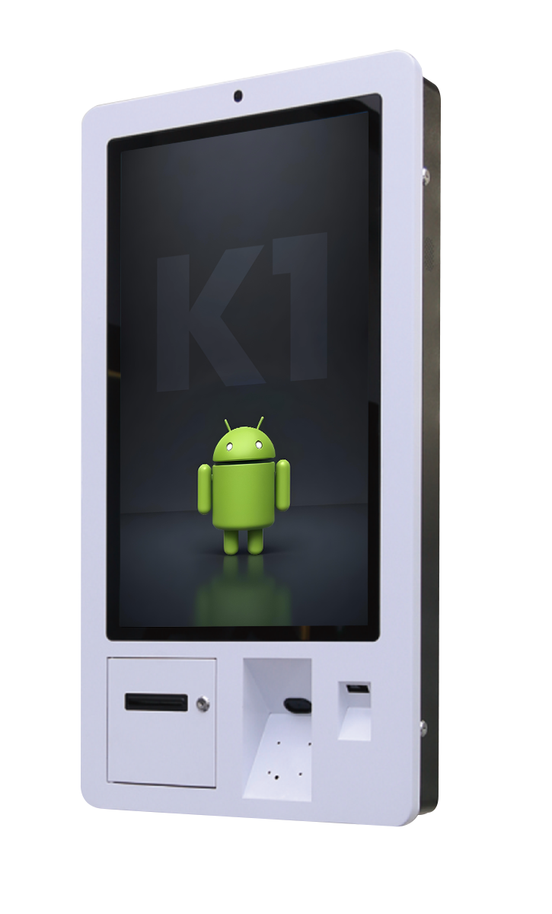

# DCB Technologies — Standard Mobile v1.0
> Référentiel technique complet pour la construction des pages mobiles (.m-shell).
> **Source de vérité** : `caisse-enregistreuse/index.html` (fusion desktop + mobile, 13/05/2026).
> Utiliser ce document pour répliquer le shell mobile sur toutes les autres pages du site.

---

## 0. Règles fondamentales — non négociables

Ces règles s'appliquent à toute intégration mobile, sans exception. Elles ont été établies après les intégrations boulangerie, restaurant, coiffure et commerce (mai 2026).

### Règle 1 — Contenu desktop = source de vérité absolue
Le contenu de la page desktop ne change jamais dans le shell mobile. La seule modification autorisée est l'utilisation du skill **`humanizer`** pour réduire la densité (texte long → texte court, même sens, même information). Jamais de réécriture créative, jamais d'invention de contenu.

### Règle 2 — Zéro section inventée
Si une section n'existe pas sur le desktop de la page, elle n'existe pas sur le mobile. On ne crée rien. On adapte ce qui existe.

### Règle 3 — Skills obligatoires dans l'ordre
Avant d'écrire une ligne HTML :
1. **`page-cro`** — audit de l'ordre des sections et du nombre optimal pour la narration mobile
2. **`impeccable shape`** ou **`ui-ux-pro-max`** — brief design validé par l'utilisateur avant tout code

Ces skills sont non négociables. Procéder sans eux produit des shells copiés mécaniquement du desktop.

### Règle 4 — Pattern existant vs section jamais adaptée
- **Section déjà adaptée mobile** (présente sur boulangerie ou restaurant) : utiliser le pattern existant directement, sans design à refaire. On adapte le contenu, pas la structure.
- **Section jamais adaptée mobile** (ex. Différenciateur comparatif, Process IT, Stats résultats) : passage obligatoire par **`impeccable shape`** ou **`ui-ux-pro-max`** pour concevoir le composant mobile avant d'écrire le HTML.

**Sections validées (référence boulangerie + restaurant) :**
Hero, Marquee, Pain points, Features (`.cm-feats`), Pricing, Témoignages, Cross-sell (`.peri-a`), FAQ (`.faq`), CTA Final (`.final-a`)

**Sections à concevoir avant code (jamais adaptées) :**
Différenciateur comparatif, Process/étapes, Stats résultats, NF525 conformité, Section techniciens (hub uniquement)

---

## Table des matières

1. [Architecture shell (dual-shell)](#1-architecture-shell)
2. [Head setup](#2-head-setup)
3. [Éléments de frame](#3-éléments-de-frame)
   - 3.1 Header sticky (`.top`)
   - 3.2 Progress bar (`#m-pg`)
   - 3.3 Skip link
   - 3.4 Menu plein écran (`#menu`)
   - 3.5 FAB sticky (`.fab`)
   - 3.6 Bottom-sheet devis (`#sheet`)
   - 3.7 Footer accordéon (`.footer`)
4. [Sections de contenu](#4-sections-de-contenu)
   - S1 Hero
   - S2 Trust Bar / Marquee
   - S3 Pain points
   - S4 Témoignages
   - S5 Carousel métiers
   - S6 CashMag card
   - S7 NF525 conformité
   - S8 Écosystème matériel
   - S9 Techniciens de proximité
   - S10 FAQ
   - S11 CTA Final
5. [Variables CSS globales](#5-variables-css-globales)
6. [Z-index scale](#6-z-index-scale)
7. [Guide de réplication — checklist](#7-guide-de-réplication--checklist)

---

## 1. Architecture shell

### Principe
Un seul fichier HTML sert desktop ET mobile. Deux `<div>` exclusifs gèrent l'affichage selon le breakpoint 640px.

### CSS (inline dans `<style>` du `<head>`)
```css
/* Shells mobile / desktop */
.m-shell { display: none }
@media(max-width:640px) {
  .m-shell { display: block }
  .d-shell { display: none }
  #dcb-phone-fab { display: none !important }  /* masque le FAB injecté par scripts.js */
}
```

### Structure HTML
```html
<body>
  <div class="d-shell">
    <!-- Tout le HTML desktop (nav injectée, <main>, footer injecté, scripts.js) -->
    <div id="dcb-nav"></div>
    <main class="pt-[76px]"> ... </main>
    <div id="dcb-footer"></div>
    <script src="../js/scripts.js?v=12"></script>
  </div><!-- /d-shell -->

  <div class="m-shell">
    <!-- Tout le HTML mobile -->
    ...
  </div><!-- /m-shell -->
</body>
```

### JS conditionnel (fin de `.m-shell`)
```html
<script>
(function(){
  if(window.innerWidth<=640){
    var s=document.createElement('script');
    s.src='../m/js/mobile.js';
    document.body.appendChild(s);
  }
})();
</script>
```

### Décisions techniques
- Breakpoint unique `640px` (cohérent entre CSS et JS).
- `#dcb-phone-fab { display:none!important }` : `scripts.js` injecte ce FAB dans `<body>` hors shells — sans cette règle il flotterait par-dessus le mobile.
- `mobile.css` chargé via `media="screen and (max-width:640px)"` : parsé mais non appliqué en desktop (gain de rendu).
- `scripts.js` s'exécute toujours (les IDs `dcb-nav`/`dcb-footer` existent dans `.d-shell`) mais ses éléments sont masqués en mobile.

### ⚠️ Injection DRY via scripts.js (pattern depuis 13/05/2026)

**Les éléments de frame mobile NE SONT PLUS HARDCODÉS dans les pages HTML.** `scripts.js` les injecte dans des placeholders via `outerHTML`, exactement comme il le fait pour la nav/footer desktop.

**Structure des placeholders dans `.m-shell` :**
```html
<div class="m-shell" data-metier="[METIER]">
  <!-- ... main content ... -->
  <!-- FRAME MOBILE : injecté par scripts.js -->
  <div id="m-footer"></div>
  <div id="m-fab"></div>
  <div id="m-sheet"></div>
  <div id="m-menu"></div>
</div>
```

L'attribut `data-metier` sur `.m-shell` pré-sélectionne le bon bouton dans le segment métier du formulaire devis (valeurs : `"boulangerie"`, `"restaurant"`, `"commerce"`, `"beaute"`). Sur le hub, laisser vide `data-metier=""`.

L'injection dans `scripts.js` cherche ces IDs et remplace le `outerHTML`. Si un ID est absent, l'injection est ignorée silencieusement. Le header `.top` est injecté dans `<div id="m-nav"></div>`.

**Ne jamais hardcoder header/menu/FAB/sheet/footer dans `.m-shell`**. C'est une mauvaise pratique qui crée des doublons à maintenir sur chaque page.

---

## 2. Head setup

```html
<meta charset="utf-8">
<!-- viewport-fit=cover : requis pour env(safe-area-inset-*) sur iPhone notch -->
<meta name="viewport" content="width=device-width, initial-scale=1.0, viewport-fit=cover">

<!-- Fonts partagées desktop/mobile -->
<link rel="preconnect" href="https://fonts.googleapis.com">
<link rel="preconnect" href="https://fonts.gstatic.com" crossorigin>
<link href="https://fonts.googleapis.com/css2?family=Sora:wght@400;600;700;800&family=Inter:wght@400;500;600&display=swap" rel="stylesheet">
<link href="https://fonts.googleapis.com/css2?family=Material+Symbols+Outlined:wght,FILL@100..700,0..1&display=swap" rel="stylesheet">

<!-- CSS desktop (chargés toujours) -->
<link rel="stylesheet" href="../css/style.css?v=7">
<link rel="stylesheet" href="../css/tailwind.min.css?v=17">

<!-- CSS mobile (conditionnel navigateur) -->
<link rel="stylesheet" href="../m/css/mobile.css" media="screen and (max-width:640px)">

<!-- Preload LCP image mobile uniquement -->
<link rel="preload" as="image" type="image/webp"
      href="../assets/[IMAGE-LCP-PAGE].webp"
      fetchpriority="high" media="(max-width:640px)">
```

> **Note** : `[IMAGE-LCP-PAGE]` = image hero de la page concernée. Pour la page caisse : `tpv-cashmag.webp`.

---

## 3. Éléments de frame

### 3.1 Header sticky (`.top`)

```html
<header class="top">
  <div class="lg">
    <a href="../index.html" aria-label="DCB Technologies, retour accueil">
      
    </a>
  </div>
  <div class="grp">
    <button id="btnMenu" aria-label="Ouvrir le menu"
            aria-expanded="false" aria-controls="menu">
      <span class="material-symbols-outlined">menu</span>
    </button>
  </div>
</header>
```

**CSS clé :**
```css
.top {
  position: fixed; top: 10px; left: 10px; right: 10px; /* floating pill */
  z-index: var(--z-nav);   /* 50 */
  background: #fff;         /* JAMAIS backdrop-blur */
  border: 1px solid rgba(11,61,145,0.08);
  border-radius: 18px;
  box-shadow: 0 6px 20px -8px rgba(7,43,107,0.18);
  height: 52px;
  display: flex; align-items: center; justify-content: space-between;
  padding: 0 12px 0 14px;
}
.top .lg img { height: 32px; }           /* taille validée — ne pas réduire */
.top .grp button { width:44px; height:44px; border-radius:11px; background:var(--s1); }
```

**Adaptation :** Identique sur toutes les pages. Seule l'URL du logo (`href`) change selon la profondeur.

---

### 3.2 Progress bar (`#m-pg`)

```html
<div class="progress" aria-hidden="true"><span id="m-pg"></span></div>
```

```css
.progress { position:fixed; top:0; left:0; right:0; height:3px; z-index:51; }
.progress span { display:block; height:100%; background:linear-gradient(90deg,var(--cta),#FFB36B); width:0; }
```

**JS** : `updProgress()` via `requestAnimationFrame` sur scroll. ID `m-pg` (pas `pg`) pour éviter conflit avec `scripts.js`.

---

### 3.3 Skip link

```html
<!-- Premier enfant de .m-shell -->
<a class="skip-link" href="#m-main">Aller au contenu principal</a>
<!-- Cible : -->
<main id="m-main"> ... </main>
```

> `id="m-main"` (pas `main-content`) car `scripts.js` peut injecter un `id` similaire en desktop.

---

### 3.4 Menu plein écran (`#menu`)

```html
<div class="menu" id="menu" role="dialog" aria-modal="true"
     aria-labelledby="menu-title" aria-hidden="true">
  <h2 id="menu-title" class="sr-only" tabindex="-1">Menu principal</h2>
  <div class="mtop">
    <a href="../index.html" aria-label="DCB Technologies, retour accueil">
      
    </a>
    <button class="x" id="btnClose" aria-label="Fermer le menu">
      <span class="material-symbols-outlined">close</span>
    </button>
  </div>
  <nav aria-label="Menu principal mobile">
    <a href="index.html" aria-current="page">Caisse enregistreuse<span class="material-symbols-outlined" aria-hidden="true">arrow_forward</span></a>
    <a href="../maintenance-informatique/index.html">Maintenance informatique<span class="material-symbols-outlined" aria-hidden="true">arrow_forward</span></a>
    <a href="../visibilite-web/index.html">Visibilité web<span class="material-symbols-outlined" aria-hidden="true">arrow_forward</span></a>
    <a href="../notre-adn/index.html">Notre ADN<span class="material-symbols-outlined" aria-hidden="true">arrow_forward</span></a>
    <a href="../blog/index.html">Blog<span class="material-symbols-outlined" aria-hidden="true">arrow_forward</span></a>
    <a href="../contact/index.html">Contact<span class="material-symbols-outlined" aria-hidden="true">arrow_forward</span></a>
  </nav>
  <div class="mbot">
    <a href="tel:0482530510" class="menu-tel" aria-label="Appeler DCB Technologies au 04 82 53 05 10">
      <span class="material-symbols-outlined fill" aria-hidden="true" style="font-variation-settings:'FILL' 1">call</span>04 82 53 05 10
    </a>
    <button class="btn btn-pri" data-sheet>Demander un devis<span class="material-symbols-outlined" aria-hidden="true">arrow_forward</span></button>
  </div>
</div>
```

**Adaptation par page :** changer `aria-current="page"` sur le lien actif. Les 6 liens de nav sont identiques sur toutes les pages.

**CSS menu :**
```css
/* Fond uni — JAMAIS de gradient sur le menu burger */
.menu { background: #0B3D91; }
.menu .mtop img { height: 36px; filter: brightness(0) invert(1); }  /* logo blanc, taille validée */
```

**Comportements JS :** `openMenu` / `closeMenu`, focus trap, `history.pushState({dcb:'menu'},'')` pour le bouton back Android, focus restauré sur `_menuOpener`.

---

### 3.5 FAB sticky (`.fab`)

```html
<!-- Placé après </footer>, avant sheet et menu -->
<div class="fab hidden" role="group" aria-label="Actions rapides">
  <button class="b1" id="fabDevis" aria-label="Demander un devis [PAGE]">
    Demander un devis<span class="material-symbols-outlined" aria-hidden="true">arrow_forward</span>
  </button>
  <a class="b2" href="tel:0482530510" aria-label="Appeler DCB Technologies au 04 82 53 05 10">
    <span class="material-symbols-outlined fill" style="font-variation-settings:'FILL' 1">call</span>
  </a>
</div>
```

```css
.fab {
  position:fixed; left:14px; right:14px;
  bottom:calc(14px + env(safe-area-inset-bottom,0px));
  background:#fff; border-radius:20px; padding:8px;
  display:grid; grid-template-columns:1fr 56px; gap:8px;
  z-index:var(--z-fab); /* 40 */
  box-shadow:0 18px 36px -10px rgba(7,43,107,0.30);
}
.fab.hidden { display:none }
```

**Logique :** masqué tant que `.hero` est visible (IntersectionObserver, threshold 0.1), masqué si menu ou sheet ouverts.

---

### 3.6 Bottom-sheet devis (`#sheet`)

```html
<div class="sheet-bg" id="sheetbg"></div>
<div class="sheet" id="sheet" role="dialog" aria-modal="true"
     aria-labelledby="sheet-title" aria-hidden="true">
  <div class="grab" aria-hidden="true"></div>
  <button type="button" id="btnCloseSheet" class="sheet-close" aria-label="Fermer">
    <span class="material-symbols-outlined" aria-hidden="true">close</span>
  </button>
  <h3 id="sheet-title" tabindex="-1">Demander un devis</h3>
  <p class="sub">Réponse d'un technicien sous 2h ouvrées. Sans engagement.</p>
  <form action="../contact/" method="post" novalidate>
    <fieldset class="field">
      <legend class="field-lbl">Mon métier</legend>
      <div class="seg">
        <button type="button" class="on" role="radio" aria-checked="true"><span class="material-symbols-outlined" aria-hidden="true">bakery_dining</span>Boulangerie</button>
        <button type="button" role="radio" aria-checked="false"><span class="material-symbols-outlined" aria-hidden="true">restaurant</span>Resto</button>
        <button type="button" role="radio" aria-checked="false"><span class="material-symbols-outlined" aria-hidden="true">storefront</span>Commerce</button>
        <button type="button" role="radio" aria-checked="false"><span class="material-symbols-outlined" aria-hidden="true">content_cut</span>Beauté</button>
      </div>
    </fieldset>
    <div class="row2">
      <div class="field"><label for="sheet-prenom">Prénom</label><input id="sheet-prenom" name="prenom" type="text" placeholder="Marie" autocomplete="given-name" required></div>
      <div class="field"><label for="sheet-nom">Nom</label><input id="sheet-nom" name="nom" type="text" placeholder="Dupont" autocomplete="family-name"></div>
    </div>
    <div class="field"><label for="sheet-tel">Téléphone</label><input id="sheet-tel" name="telephone" type="tel" inputmode="tel" placeholder="06 12 34 56 78" autocomplete="tel" required></div>
    <div class="field"><label for="sheet-ville">Ville</label><input id="sheet-ville" name="ville" type="text" placeholder="Mâcon" autocomplete="address-level2"></div>
    <button type="submit" class="btn btn-pri" style="width:100%;margin-top:6px">Envoyer ma demande<span class="material-symbols-outlined" aria-hidden="true">arrow_forward</span></button>
    <p id="sheet-status" aria-live="polite" aria-atomic="true" class="sr-only"></p>
  </form>
</div>
```

**Typography sheet — valeurs correctes :**
```css
.sheet h3 { font-family:'Sora',sans-serif; font-size:20px; font-weight:700; color:var(--p); }
.field label, .field-lbl { font-size:11px; font-weight:700; letter-spacing:0.2em; text-transform:uppercase; color:var(--p); }
/* ⚠️ Ne jamais utiliser font-size:13px/letter-spacing:0.08em sur les labels — écart avec convention DCB */
```

**Déclencheur universel :** tout élément avec `data-sheet` ouvre la sheet.
**Comportements JS :** slide-up (`translateY(100%` → `0`), swipe-down dismiss (dy>80 && dy>dx*1.5), visualViewport iOS resize, focus trap, `history.pushState({dcb:'sheet'},'')`.

**Adaptation :** le segment métier peut être adapté par silo (ex. IT : Maintenance, Cloud, Location, Outils).

---

### 3.7 Footer accordéon (`.footer`)

```html
<footer class="footer">
  <div class="brand-row">
    <a href="../index.html" aria-label="DCB Technologies, retour accueil">
      
    </a>
  </div>
  <p class="tag">Votre partenaire technologique de proximité pour le commerce et l'entreprise.</p>
  <div class="contact">
    <a href="tel:0482530510" class="tel" aria-label="Appeler DCB Technologies au 04 82 53 05 10"><span class="material-symbols-outlined" aria-hidden="true" style="font-variation-settings:'FILL' 1">call</span>04 82 53 05 10</a>
    <a href="mailto:contact@dcb-technologies.fr" class="em" aria-label="Envoyer un email à contact@dcb-technologies.fr"><span class="material-symbols-outlined" aria-hidden="true" style="font-variation-settings:'FILL' 1">mail</span>contact@dcb-technologies.fr</a>
  </div>
  <details>
    <summary>Solutions Caisse<span class="material-symbols-outlined faq-icon" aria-hidden="true">expand_more</span></summary>
    <ul>
      <li><a href="[REL]caisse-enregistreuse/boulangerie/index.html">Boulangerie &amp; Pâtisserie</a></li>
      <li><a href="[REL]caisse-enregistreuse/restaurant/index.html">Bar, Brasserie &amp; Resto</a></li>
      <li><a href="[REL]caisse-enregistreuse/commerce-de-detail/index.html">Mode &amp; Commerce détail</a></li>
      <li><a href="[REL]caisse-enregistreuse/coiffure/index.html">Coiffure &amp; Beauté</a></li>
      <li><a href="[REL]caisse-enregistreuse/borne-de-commande/index.html">Borne de commande</a></li>
      <li><a href="[REL]caisse-enregistreuse/monnayeur/index.html">Monnayeur automatique</a></li>
      <li><a href="[REL]caisse-enregistreuse/cashmag/index.html">Logiciel CashMag</a></li>
    </ul>
  </details>
  <details>
    <summary>IT &amp; Digital<span class="material-symbols-outlined faq-icon" aria-hidden="true">expand_more</span></summary>
    <ul>
      <li><a href="[REL]maintenance-informatique/maintenance-depannage/index.html">Maintenance informatique</a></li>
      <li><a href="[REL]maintenance-informatique/cloud-securite/index.html">Cloud &amp; Sécurité</a></li>
      <li><a href="[REL]maintenance-informatique/location-vente-installation/index.html">Location &amp; Installation</a></li>
      <li><a href="[REL]maintenance-informatique/outils-collaboratifs/index.html">Outils collaboratifs</a></li>
    </ul>
  </details>
  <details>
    <summary>Visibilité Web<span class="material-symbols-outlined faq-icon" aria-hidden="true">expand_more</span></summary>
    <ul>
      <li><a href="[REL]visibilite-web/creation-site-internet/index.html">Création de site web</a></li>
      <li><a href="[REL]visibilite-web/seo-sea-local/index.html">SEO &amp; SEA local</a></li>
      <li><a href="[REL]visibilite-web/hebergement/index.html">Hébergement</a></li>
    </ul>
  </details>
  <details>
    <summary>L'entreprise<span class="material-symbols-outlined faq-icon" aria-hidden="true">expand_more</span></summary>
    <ul>
      <li><a href="[REL]notre-adn/index.html">Notre ADN</a></li>
      <li><a href="[REL]contact/index.html">Contact</a></li>
      <li><a href="[REL]blog/index.html">Blog &amp; Actus</a></li>
    </ul>
  </details>
  <div class="zones">
    <div class="lb">Zones d'intervention</div>
    <div class="vl"><strong>Lyon · Mâcon · Chalon-sur-Saône · Villefranche · Bourg-en-Bresse · Roanne</strong><br>Paray-le-Monial, Charolles, Tournus, Cluny, Le Creusot, Montceau<br>Saône-et-Loire (71) · Rhône (69) · Ain (01) · Loire (42)</div>
  </div>
  <div class="bottom">
    <div class="cp">© 2026 DCB Technologies. Tous droits réservés.</div>
    <div class="lg">
      <a href="[REL]mentions-legales/index.html">Mentions légales</a>
      <a href="[REL]confidentialite/index.html">Confidentialité</a>
      <a href="[REL]cgv/index.html">CGV</a>
    </div>
  </div>
</footer>
```

> `[REL]` = préfixe de profondeur. Depth 1 (hub) : `../`. Depth 2 (sous-page) : `../../`.
> Accordéons natifs `<details>/<summary>` — zéro JS. Chevron rotation : CSS `.footer details[open] summary .material-symbols-outlined { transform:rotate(180deg) }`.

---

## 4. Sections de contenu

### S1 — Hero (`.hero`)

**Rôle :** Première impression. Promesse + validation + visuel produit + CTA.

```html
<section class="hero">
  <div class="chips">
    <span class="chip"><span class="material-symbols-outlined fill" style="font-variation-settings:'FILL' 1">[ICON]</span>[LABEL]</span>
    <span class="chip gold">Dès [PRIX]€/mois</span>
    <span class="chip">[GARANTIE]</span>
  </div>
  <h1>[TITRE PRINCIPAL], <em>[PROMESSE EN ITALIQUE]</em>.</h1>
  <p class="lede">[LEDE GÉO + PRIX + DÉLAI]</p>
  <div class="scene">
    <div class="tpv">
      
    </div>
    <div class="float1" aria-hidden="true"><div class="ic"><span class="material-symbols-outlined fill" style="font-variation-settings:'FILL' 1">[ICON1]</span></div><div><div class="lb">[LABEL1]</div><div class="vl">[KPI1]</div></div></div>
    <div class="float2" aria-hidden="true"><div class="ic"><span class="material-symbols-outlined" style="font-variation-settings:'FILL' 1">[ICON2]</span></div><div><div class="lb">[LABEL2]</div><div class="vl">[KPI2]</div></div></div>
  </div>
  <div class="checks">
    <div><span class="material-symbols-outlined fill" style="font-variation-settings:'FILL' 1">check_circle</span>[BÉNÉFICE 1]</div>
    <div><span class="material-symbols-outlined fill" style="font-variation-settings:'FILL' 1">check_circle</span>[BÉNÉFICE 2]</div>
    <div><span class="material-symbols-outlined fill" style="font-variation-settings:'FILL' 1">check_circle</span>[BÉNÉFICE 3]</div>
  </div>
  <div class="cta-row">
    <button class="btn btn-pri" data-sheet aria-label="Demander un devis [PAGE]">Demander un devis<span class="material-symbols-outlined" aria-hidden="true">arrow_forward</span></button>
    <a class="btn btn-icon" href="tel:0482530510" aria-label="Appeler DCB Technologies"><span class="material-symbols-outlined fill" style="font-variation-settings:'FILL' 1">call</span></a>
  </div>
</section>
```

**CSS clé :**
```css
.hero { background:linear-gradient(135deg,#0B3D91 0%,#072B6B 100%); color:#fff; padding:78px 18px 26px; border-bottom-left-radius:32px; border-bottom-right-radius:32px; }
.hero h1 { font-family:'Sora',sans-serif; font-weight:800; font-size:27px; line-height:1.1; letter-spacing:-0.03em; }
.hero h1 em { font-style:italic; color:var(--cta); font-weight:700; }
.chip { font-size:9.5px; font-weight:700; letter-spacing:0.16em; text-transform:uppercase; padding:5px 10px; border-radius:99px; background:rgba(255,255,255,0.08); border:1px solid rgba(255,255,255,0.18); }
.chip.gold { background:var(--cta); border-color:var(--cta); }
.hero .cta-row { display:grid; grid-template-columns:1fr auto; gap:8px; }
.btn-pri { background:var(--cta); color:#fff; border-radius:14px; font-weight:700; padding:14px 16px; }
.btn-icon { width:50px; height:50px; background:rgba(255,255,255,0.12); border:1.5px solid rgba(255,255,255,0.32); border-radius:14px; }
```

**Adaptation :**
- `gradient` hero : remplacer par couleur accent de la page si nécessaire (ex. `#76B737` CashMag).
- Chips : adapter certification/prix/garantie selon le produit.
- Max 3 checks.

---

### Variantes `.scene` — 3 familles de composition

Trois familles structurellement distinctes. **Ne jamais utiliser la même sur deux pages consécutives dans une navigation probable.** Choisir selon la nature de la page (matériel vs logiciel vs metric-driven).

#### Famille A — Diagonal *(image paysage + 2 badges flottants)*

Usage : pages à produit **physique visible** (TPV, matériel). Tension diagonale naturelle.

```html
<div class="scene">
  <div class="tpv">
    
  </div>
  <div class="float1" aria-hidden="true">
    <div class="ic" style="background:linear-gradient(135deg,[ACCENT1],[ACCENT2])">
      <span class="material-symbols-outlined" style="font-variation-settings:'FILL' 1">[ICON1]</span>
    </div>
    <div><div class="lb">[LABEL1]</div><div class="vl">[VALEUR1]</div></div>
  </div>
  <div class="float2" aria-hidden="true">
    <div class="ic"><!-- gradient bleu par défaut CSS -->
      <span class="material-symbols-outlined" style="font-variation-settings:'FILL' 1">[ICON2]</span>
    </div>
    <div><div class="lb">[LABEL2]</div><div class="vl">[VALEUR2]</div></div>
  </div>
</div>
```

CSS : `.hero .scene` (height calculée) + `.hero .tpv` (absolute 84% width, aspect 5/4) + `.hero .float1/.float2` (absolute, animations `fl1`/`fl2`).

#### Famille B — Stat-hero *(image paysage + 1 badge metric centré bas)*

Usage : pages avec un **chiffre-preuve fort** comme promesse centrale (gain, réduction, taux). Le silence visuel en haut du `.tpv` donne du poids au chiffre.

```html
<div class="scene">
  <div class="tpv">
    
  </div>
  <div class="float-stat" aria-hidden="true">
    <div class="ic" style="background:linear-gradient(135deg,[ACCENT1],[ACCENT2])">
      <span class="material-symbols-outlined" style="font-variation-settings:'FILL' 1">[ICON]</span>
    </div>
    <div class="num">[STAT]</div>       <!-- ex. "-50%", "+20%", "0" -->
    <div class="desc">[DESC 3-4 MOTS]</div>   <!-- ex. "Temps d'attente" -->
  </div>
</div>
```

CSS : `.hero .float-stat` (absolute, centré bas, `max-width:calc(100% - 24px)`, animation `fls`). `.num` : Sora 800 22px, `white-space:nowrap`. `.desc` : 10px, `white-space:normal`, `max-width:90px` (peut wrapper sur 2 lignes).

> **Règle desc** : max 4 mots courts. "Temps d'attente" fonctionne. "Zéro commission par transaction" déborde — raccourcir.

#### Famille C — Cert inline *(image pleine largeur + badge certification dans l'image)*

Usage : pages **logiciel** où l'interface elle-même est le produit. Image plus immersive (100% largeur, aspect 16/10), badge de certification inséré dans l'image, rien sous l'image. Les `.checks` en dessous font leur travail sans redondance.

```html
<div class="scene scene-c">
  <div class="tpv">
    
    <div class="cert-pill">
      <span class="material-symbols-outlined"
            style="font-variation-settings:'FILL' 1;color:[ACCENT]">verified</span>
      NF525 Certifié
    </div>
  </div>
</div>
```

CSS : `.hero .scene.scene-c` (height auto, position relative, margin 8px 0 12px). `.tpv` en flow (non absolute), `width:100%`, `aspect-ratio:16/10`. `.cert-pill` (absolute top-left dans `.tpv`, fond blanc 93% opacité, pill arrondi).

> **Règle critique** : ne jamais ajouter de chips ou d'éléments sous le `.tpv` — le `.checks` en dessous du `.scene` est déjà la liste de features. Dupliquer = contenu redondant visible deux fois dans le même scroll.

---

#### Table d'assignation — silo caisse (état 15/05/2026)

| Page | Famille | Détail badge |
|---|---|---|
| `boulangerie` | **A** | float1 ambre #F59E0B / float2 bleu DCB |
| `commerce-de-detail` | **A** | float1 teal #0D9488 / float2 bleu DCB |
| `restaurant` | **B** | "-50%" / "Temps d'attente", gradient coral |
| `coiffure` | **B** | "+35%" / "Clients fidélisés", gradient violet |
| `borne-de-commande` | **B** | "+20%" / "Panier moyen", gradient indigo |
| `monnayeur` | **B** | "0" / "Erreur rendu monnaie", gradient vert |
| `cashmag` | **C** | cert pill NF525, icône vert #76B737 |
| `hairnet` | **C** | cert pill NF525, icône violet #4527a4 |

**Règle de cohérence inter-silos :** pour les pages logiciel d'autres silos (IT, Web), utiliser Famille C. Pour les pages à metric forte (stats IT, résultats SEO), utiliser Famille B.

---

### S2 — Trust Bar / Marquee (`.marquee`)

**Rôle :** Réassurance immédiate post-hero, défilement infini.

```html
<ul class="sr-only">
  <li>Intervention sur site en moins de 4h</li>
  <li>Garantie 5 ans matériel</li>
  <li>Certifié NF525</li>
  <li>Zéro sous-traitance</li>
  <li>Support 7j/7</li>
</ul>
<div class="marquee" aria-hidden="true">
  <div class="marquee-track">
    <!-- Série 1 (items originaux) -->
    <div class="it"><span class="material-symbols-outlined fill" style="font-variation-settings:'FILL' 1">speed</span>Intervention &lt;4h</div>
    <div class="it"><span class="material-symbols-outlined fill" style="font-variation-settings:'FILL' 1">verified_user</span>Garantie 5 ans</div>
    <div class="it"><span class="material-symbols-outlined fill" style="font-variation-settings:'FILL' 1">verified</span>Certifié NF525</div>
    <div class="it"><span class="material-symbols-outlined fill" style="font-variation-settings:'FILL' 1">groups</span>Zéro sous-traitance</div>
    <div class="it"><span class="material-symbols-outlined fill" style="font-variation-settings:'FILL' 1">support_agent</span>Support 7j/7</div>
    <!-- Série 2 (duplicata — aria-hidden sur chaque) -->
    <div class="it" aria-hidden="true">...</div>
    <div class="it" aria-hidden="true">...</div>
    <div class="it" aria-hidden="true">...</div>
    <div class="it" aria-hidden="true">...</div>
    <div class="it" aria-hidden="true">...</div>
  </div>
</div>
```

```css
.marquee { background:#fff; border-bottom:1px solid var(--line); padding:14px 0; overflow:hidden; -webkit-mask-image:linear-gradient(90deg,transparent,#000 8%,#000 92%,transparent); }
.marquee-track { display:flex; gap:22px; width:max-content; animation:scroll 22s linear infinite; }
@keyframes scroll { from { transform:translateX(0) } to { transform:translateX(-50%) } }
.marquee:hover .marquee-track { animation-play-state:paused }
.marquee-track .it { display:flex; align-items:center; gap:8px; color:var(--p); font-size:13px; font-weight:600; white-space:nowrap; }
.marquee-track .it .material-symbols-outlined { color:var(--cta); font-size:18px; }
```

**Adaptation :** Items identiques sur toutes les pages DCB. Toujours 5+5 items (duplicata pour translateX(-50%) parfait).

---

### S3 — Pain points (`.sec.s1` + `.pain`)

**Rôle :** Nommer les frustrations du prospect avant de présenter la solution.

```html
<section class="sec s1">
  <p class="eyebrow">Pourquoi changer ?</p>
  <h2>[TITRE NÉGATIF avec <em>mot clé</em>].</h2>
  <div class="pain">
    <div class="row"><div class="n">01</div><div><h3>[TITRE]</h3><p>[TEXTE HUMAIN 2-3 phrases]</p></div></div>
    <div class="row"><div class="n">02</div><div><h3>[TITRE]</h3><p>[TEXTE]</p></div></div>
    <div class="row"><div class="n">03</div><div><h3>[TITRE]</h3><p>[TEXTE]</p></div></div>
  </div>
</section>
```

```css
.sec { padding:32px clamp(18px,4vw,48px) 32px; }
.sec.s1 { background:linear-gradient(180deg,#fff,#F8F9FA); }
.sec h2 { font-family:'Sora',sans-serif; font-weight:700; font-size:24px; line-height:1.15; letter-spacing:-0.025em; color:var(--p); }
.sec h2 em { font-style:italic; color:var(--cta); }
.eyebrow { font-size:10px; font-weight:700; letter-spacing:0.22em; text-transform:uppercase; color:var(--cta); margin:0 0 8px; }
.pain { display:flex; flex-direction:column; gap:8px; }
.pain .row { display:grid; grid-template-columns:auto 1fr; gap:14px; align-items:center; background:#fff; border:1px solid var(--line); border-radius:14px; padding:14px; }
.pain .n { font-family:'Sora',sans-serif; font-weight:800; font-size:30px; color:var(--cta); line-height:1; letter-spacing:-0.04em; width:34px; font-variant-numeric:tabular-nums; }
```

**Règle :** Numéros TOUJOURS `var(--cta)` (#F57C00), jamais la couleur accent métier. Toujours 3 rows.

---

### S4 — Témoignages (cards inline)

**Rôle :** Preuve sociale avec attribution locale.

```html
<section class="sec">
  <p class="eyebrow">Ce que disent nos clients</p>
  <h2>Ils ont fait <em>confiance à DCB</em>.</h2>
  <div style="display:flex;flex-direction:column;gap:12px;margin-top:14px">
    <div style="background:var(--s1);border-radius:18px;padding:18px;border:1px solid var(--line)">
      <div style="display:flex;gap:2px;margin-bottom:10px" aria-label="5 étoiles sur 5">
        <!-- 5x : --><span class="material-symbols-outlined fill" style="font-variation-settings:'FILL' 1;font-size:16px;color:#F59E0B">star</span>
      </div>
      <p style="font-size:14px;line-height:1.6;color:var(--ink);margin:0 0 12px">"[CITATION]"</p>
      <div style="display:flex;align-items:center;gap:10px">
        <div style="width:36px;height:36px;border-radius:99px;background:linear-gradient(135deg,[C1],[C2]);display:flex;align-items:center;justify-content:center;font-family:'Sora',sans-serif;font-weight:700;font-size:13px;color:#fff">[INITIALES]</div>
        <div>
          <div style="font-family:'Sora',sans-serif;font-weight:700;font-size:13px;color:var(--ink)">[NOM]</div>
          <div style="font-size:11.5px;color:var(--mute)">[MÉTIER], [VILLE] ([DEPT])</div>
        </div>
      </div>
    </div>
  </div>
</section>
```

**Gradients avatar par métier :**
- Boulangerie : `#F59E0B,#D97706`
- Restaurant : `#EF4444,#DC2626`
- Commerce : `#0D9488,#0F766E`
- Coiffure : `#A855F7,#9333EA`
- IT/Web (générique) : `#0B3D91,#1E5BD9`

---

### S5 — Carousel métiers (`#tabs` + `#carou` + `#dots`)

**Rôle :** Segmentation de l'audience. Scroll horizontal snappé, sync tabs/dots via JS.

```html
<section class="sec">
  <p class="eyebrow">Configurations sur mesure</p>
  <h2>Une solution pour <em>chaque métier</em>.</h2>
  <div class="tabs" id="tabs" role="tablist" aria-label="Filtrer par métier">
    <button class="tab active" role="tab" id="tab-boul" aria-selected="true" aria-controls="card-boul" tabindex="0"><span class="material-symbols-outlined" aria-hidden="true">bakery_dining</span>Boulangerie</button>
    <button class="tab" role="tab" id="tab-rest" aria-selected="false" aria-controls="card-rest" tabindex="-1"><span class="material-symbols-outlined" aria-hidden="true">restaurant</span>Restaurant</button>
    <button class="tab" role="tab" id="tab-com" aria-selected="false" aria-controls="card-com" tabindex="-1"><span class="material-symbols-outlined" aria-hidden="true">storefront</span>Commerce</button>
    <button class="tab" role="tab" id="tab-coif" aria-selected="false" aria-controls="card-coif" tabindex="-1"><span class="material-symbols-outlined" aria-hidden="true">content_cut</span>Beauté</button>
  </div>
  <div class="carou" id="carou">
    <a class="mcard boul" id="card-boul" role="tabpanel" aria-labelledby="tab-boul" href="boulangerie/index.html" aria-label="Caisse boulangerie et pâtisserie, dès 59 euros par mois">
      <div class="bar"></div>
      <div class="body">
        <div class="head"><div class="ic"><span class="material-symbols-outlined">bakery_dining</span></div><span class="pill">Dès 59€/mois</span></div>
        <h3>Boulangerie &amp; Pâtisserie</h3>
        <p class="ds">Encaissement rapide dès l'ouverture, gestion des invendus, fidélisation.</p>
        <div class="feats">
          <div><span class="material-symbols-outlined fill" style="font-variation-settings:'FILL' 1">scale</span>Vente au poids et gestion des DLC</div>
          <div><span class="material-symbols-outlined fill" style="font-variation-settings:'FILL' 1">inventory</span>Suivi des invendus en temps réel</div>
          <div><span class="material-symbols-outlined fill" style="font-variation-settings:'FILL' 1">loyalty</span>Fidélité client et rendu monnaie automatique</div>
        </div>
        <div class="go"><span class="lb">Voir les configurations<span class="material-symbols-outlined" aria-hidden="true">arrow_forward</span></span><span class="ab" aria-hidden="true"><span class="material-symbols-outlined" aria-hidden="true">arrow_outward</span></span></div>
      </div>
    </a>
    <!-- cards .rest, .com, .coif — même structure -->
  </div>
  <div class="dots" id="dots" aria-hidden="true"><span class="on"></span><span></span><span></span><span></span></div>
</section>
```

```css
.carou { display:flex; gap:14px; overflow-x:auto; padding:18px 18px 6px; margin:0 -18px; scroll-snap-type:x mandatory; scroll-padding-inline-start:18px; scrollbar-width:none; touch-action:pan-x; }
.mcard { flex-shrink:0; width:84%; scroll-snap-align:center; scroll-snap-stop:always; background:#fff; border-radius:20px; overflow:hidden; border:1px solid var(--line); }
/* Variantes couleur : .boul .bar { background:linear-gradient(90deg,#F59E0B,#FBBF24) } */
/* .rest=#EF4444, .com=#0D9488, .coif=#A855F7 */
.dots span { width:6px; height:6px; border-radius:99px; background:var(--subtle); }
.dots span.on { width:22px; background:var(--p); }
```

**Requis :** JS de sync tabs/carousel/dots dans `mobile.js` (`#tabs`, `#carou`, `#dots`). Tous les IDs sont hardcodés dans JS — ne pas les renommer.

---

### S6 — CashMag card (`.cm-card`)

**Rôle :** Présenter le logiciel clé + valeur ajoutée DCB.

```html
<section class="sec s1">
  <p class="eyebrow eyebrow-cm">Le cerveau de votre établissement</p>
  <h2>CashMag : <em>le logiciel de caisse certifié</em> que nous installons et maîtrisons.</h2>
  <div class="cm-card">
    <div class="cm-bar"></div>
    <div class="cm-body">
      <div class="cm-h">
        
      </div>
      <p class="cm-intro">...</p>
      <div class="cm-feats">
        <div class="ft"><div class="ic"><span class="material-symbols-outlined">monitoring</span></div><div><h3>Dashboard temps réel</h3><p>...</p></div></div>
        <div class="ft"><div class="ic"><span class="material-symbols-outlined">account_balance_wallet</span></div><div><h3>Comptabilité automatisée</h3><p>...</p></div></div>
        <div class="ft"><div class="ic"><span class="material-symbols-outlined">inventory_2</span></div><div><h3>Gestion de stock dynamique</h3><p>...</p></div></div>
      </div>
      <a class="cm-cta" href="cashmag/index.html">Découvrir CashMag en détail<span class="material-symbols-outlined" aria-hidden="true">arrow_forward</span></a>
    </div>
  </div>
</section>
```

```css
.cm-card { background:#fff; border-radius:22px; overflow:hidden; border:1px solid var(--line); }
.cm-card .cm-bar { height:5px; background:linear-gradient(90deg,#76B737,#A8D060); }
/* Logo : fichier assets/logo-cashmag-logiciel-caisse-nf525.png — 419×80px */
.cm-card .cm-logo-img { width:59%; max-width:224px; height:auto; display:block; margin:14px 0; }
.cm-feats .ft { display:grid; grid-template-columns:38px 1fr; gap:12px; }
.cm-feats .ft .ic { width:38px; height:38px; border-radius:11px; background:rgba(118,183,55,0.10); color:var(--cm); }
.cm-card .cm-cta { display:inline-flex; align-items:center; gap:8px; background:var(--cmd); color:#fff; padding:13px 18px; border-radius:12px; }
```

**Logo CashMag :** `src="../assets/logo-cashmag-logiciel-caisse-nf525.png"` — `width="419" height="80"`. Ne pas utiliser `partenaire-cashmag.webp` (ancienne version grise).

**Adaptation :** Section spécifique au silo caisse. Non présente sur IT/Web. Peut servir de template pour une card produit partenaire générique sur d'autres silos.

---

### S7 — NF525 conformité légale

**Rôle :** Argument légal + amende 7 500€ + réassurance. Spécifique au silo caisse.

Structure : `.nf-pillars-a` (3 piliers grid icon/texte) + `.nf-alert-a` (alerte amber + shield vert).

```css
.nf-alert-a { background:rgba(245,158,11,0.06); border:1px solid rgba(245,158,11,0.25); border-radius:16px; padding:18px; }
.nf-alert-a .amt { font-family:'Sora',sans-serif; font-weight:800; font-size:30px; color:#D97706; }
.nf-alert-a .shield { border-top:1px dashed rgba(217,119,6,0.30); } /* séparateur tirets */
```

**Note :** La formulation "7 500 € par caisse non conforme" est validée (cf. CLAUDE.md). Ne jamais écrire "par poste" ou "par logiciel".

---

### S8 — Cross-sell / Écosystème (`.peri-a`)

**Deux usages selon contexte :**
- **Hub caisse** : cross-sell périphériques (borne + monnayeur) — liens internes au silo
- **Sous-pages** : cross-sell inter-pilier (ex. monnayeur + création de site web) — au moins un lien sortant vers un autre silo

**⚠️ Règle contenu sous-pages** : Réduire la densité de texte en mobile (2 phrases max par card) MAIS conserver les marqueurs métier-spécifiques. Ne jamais simplifier vers du générique qui duplique le hub ou crée du duplicate content inter-pages. Exemples de marqueurs à préserver :
- Boulangerie : "pain/argent", "7h en plein rush", "carte des pains", "commandes de fêtes"
- Restaurant : références "couverts", "service", "ardoise"

**Couleurs badges `.pp` (définis dans mobile.css, ne pas surcharger en inline) :**
```css
.peri-a .b1 .pp { background:rgba(79,70,229,0.10); color:#4F46E5; }  /* indigo/violet */
.peri-a .b2 .pp { background:rgba(5,150,105,0.10); color:#059669; }  /* vert */
```
Ne JAMAIS ajouter `style="..."` sur la `<span class="pp">` — cela écrase les couleurs CSS.

**Rôle (hub) :** Cross-sell périphériques (borne + monnayeur).

```html
<section class="sec s1">
  <p class="eyebrow">Écosystème matériel</p>
  <h2>Optimisez votre <em>point de vente</em>.</h2>
  <div class="peri-a">
    <a class="b1" href="borne-de-commande/index.html" aria-label="Borne de commande self-service K1">
      <div class="txt"><span class="pp">+20% panier moyen</span><h3>Borne de commande</h3><p>Désengorgez votre file d'attente et augmentez votre panier moyen.</p><span class="lk">Découvrir la borne<span class="material-symbols-outlined" aria-hidden="true">arrow_forward</span></span></div>
      <div class="vis"></div>
    </a>
    <a class="b2" href="monnayeur/index.html" aria-label="Monnayeur automatique">
      <div class="txt"><span class="pp">0 contact argent</span><h3>Monnayeur automatique</h3><p>Rendu de monnaie exact, zéro erreur, hygiène totale.</p><span class="lk">Découvrir le monnayeur<span class="material-symbols-outlined" aria-hidden="true">arrow_forward</span></span></div>
      <div class="vis"><video autoplay loop muted playsinline preload="none" width="120" height="120" aria-hidden="true"><source src="../assets/monnayeur-3d.webm" type="video/webm"></video></div>
    </a>
  </div>
</section>
```

```css
.peri-a a { display:grid; grid-template-columns:1.2fr 1fr; background:#fff; border:1px solid var(--line); border-radius:18px; overflow:hidden; }
.peri-a .b1 .pp { background:rgba(79,70,229,0.10); color:#4F46E5; }
.peri-a .b2 .pp { background:rgba(5,150,105,0.10); color:#059669; }
```

---

### S9 — Techniciens de proximité (`.tech`)

**Rôle :** Section transversale commune à toutes les pages. Fond bleu #0B3D91, 4 depts + 3 SLA + CTA.

```html
<section class="tech">
  <p class="eyebrow">Expertise de proximité</p>
  <h2>Nos techniciens, <em>à vos côtés</em>.</h2>
  <p class="lede">Chaque client a un interlocuteur identifié, quelqu'un qui connaît son installation, son activité, ses horaires. Pas un numéro de ticket. Un nom, un téléphone, une présence.</p>
  <div class="tech-deps">
    <div class="tech-dep"><div class="num">71</div><div class="nm">Saône-<br>et-Loire</div></div>
    <div class="tech-dep"><div class="num">69</div><div class="nm">Rhône</div></div>
    <div class="tech-dep"><div class="num">01</div><div class="nm">Ain</div></div>
    <div class="tech-dep"><div class="num">42</div><div class="nm">Loire</div></div>
  </div>
  <div class="tech-promises">
    <div class="tech-prom"><div class="ic"><span class="material-symbols-outlined fill" style="font-variation-settings:'FILL' 1">support_agent</span></div><div class="t">Télémaintenance 7j/7</div><div class="b">&lt;20min</div></div>
    <div class="tech-prom"><div class="ic"><span class="material-symbols-outlined fill" style="font-variation-settings:'FILL' 1">directions_car</span></div><div class="t">Si besoin, sur site</div><div class="b">&lt;4h</div></div>
    <div class="tech-prom"><div class="ic"><span class="material-symbols-outlined fill" style="font-variation-settings:'FILL' 1">inventory_2</span></div><div class="t">Remplacement matériel</div><div class="b">&lt;48h</div></div>
  </div>
  <button class="tech-cta" data-sheet>Demander un devis<span class="material-symbols-outlined" aria-hidden="true">arrow_forward</span></button>
</section>
```

```css
.tech { background:#0B3D91; color:#fff; border-radius:26px; margin:18px; padding:28px 20px 24px; }
.tech-deps { display:grid; grid-template-columns:1fr 1fr; gap:8px; margin-bottom:20px; }
.tech-dep .num { font-family:'Sora',sans-serif; font-weight:800; font-size:28px; color:var(--cta); }
.tech-prom { display:grid; grid-template-columns:38px 1fr auto; gap:12px; align-items:center; background:rgba(255,255,255,0.04); border-radius:14px; padding:12px 14px; }
.tech-prom .b { font-family:'Sora',sans-serif; font-weight:800; font-size:18px; color:var(--cta); }
.tech .tech-cta { display:flex; width:100%; background:var(--cta); color:#fff; padding:14px; border-radius:14px; border:none; }
```

**Identique sur toutes les pages.** SLA `<20min`, `<4h`, `<48h` ne pas modifier sans validation client.

---

### S10 — FAQ (`.faq`)

**Rôle :** Traitement des dernières objections. `<details>/<summary>` natif, 0 JS.

```html
<section class="sec">
  <p class="eyebrow">Besoin de précisions ?</p>
  <h2>Questions <em>fréquentes</em>.</h2>
  <div class="faq">
    <details>
      <summary><span class="qi"><span class="material-symbols-outlined" aria-hidden="true">help</span></span>[QUESTION]<span class="material-symbols-outlined ch faq-icon" aria-hidden="true">expand_more</span></summary>
      <div class="ans">[RÉPONSE]</div>
    </details>
    <!-- 5 à 7 items total -->
  </div>
</section>
```

```css
.faq { display:flex; flex-direction:column; gap:10px; }
.faq details { background:linear-gradient(180deg,#fff,#F8F9FA); border:1px solid var(--line); border-radius:18px; overflow:hidden; }
.faq summary { list-style:none; display:grid; grid-template-columns:32px 1fr 24px; gap:10px; align-items:center; padding:14px; font-weight:700; color:var(--p); font-size:13.5px; cursor:pointer; }
.faq summary::-webkit-details-marker { display:none }
.faq summary .ch { color:var(--subtle); transition:transform 0.2s; }
.faq details[open] summary .ch { transform:rotate(180deg) }
.faq .ans { padding:0 14px 16px 56px; color:#475569; font-size:13px; line-height:1.55; }
```

**Note :** Les questions/réponses DOIVENT correspondre au JSON-LD FAQPage dans `<head>`.

---

### S11 — CTA Final (`.final-a`)

**Rôle :** Dernière conversion. Card épurée, bouton sheet, alternative téléphone.

```html
<section class="final-a">
  <div class="card">
    <h3>Demandez votre diagnostic [SERVICE] gratuit.</h3>
    <p>[SOUS-TITRE rassurant], sans engagement.</p>
    <button class="btn btn-pri" data-sheet>Demander un devis<span class="material-symbols-outlined" aria-hidden="true">arrow_forward</span></button>
    <div class="divider">ou appelez-nous</div>
    <div class="tel">
      <div class="ic"><span class="material-symbols-outlined fill" style="font-variation-settings:'FILL' 1">call</span></div>
      <a class="num" href="tel:0482530510" aria-label="Appeler le 04 82 53 05 10">04 82 53 05 10</a>
    </div>
  </div>
</section>
<p style="font-size:11px;color:#94A3B8;text-align:center;padding:8px 16px 16px">Mis à jour le <time datetime="[YYYY-MM-DD]">[DATE EN FRANÇAIS]</time></p>
```

```css
.final-a { padding:30px 18px 30px; }
.final-a .card { background:#fff; border:1px solid var(--line); border-radius:20px; padding:24px 22px; box-shadow:0 18px 36px -16px rgba(11,61,145,0.18); }
.final-a .divider { display:flex; align-items:center; gap:10px; margin:18px 0 14px; color:var(--mute); font-size:10px; font-weight:700; letter-spacing:0.18em; text-transform:uppercase; }
.final-a .divider::before, .final-a .divider::after { content:""; flex:1; height:1px; background:var(--line); }
.final-a .tel { display:flex; align-items:center; justify-content:center; gap:12px; padding:14px; background:var(--s1); border-radius:14px; }
.final-a .tel .ic { width:42px; height:42px; background:rgba(245,124,0,0.10); color:var(--cta); border-radius:11px; display:flex; align-items:center; justify-content:center; }
.final-a .tel .num { font-family:'Sora',sans-serif; font-weight:700; font-size:18px; color:var(--p); }
```

---

## 5. Variables CSS globales

```css
/* Couleurs */
--p:     #0B3D91   /* primary bleu */
--pd:    #072B6B   /* primary dark (footer, gradient fin) */
--cta:   #F57C00   /* orange CTA */
--ink:   #0F172A   /* texte principal */
--mute:  #64748B   /* texte secondaire */
--s0:    #FFFFFF   /* surface blanche */
--s1:    #F8F9FA   /* surface légère */
--s2:    #F3F4F5   /* surface medium */
--line:  #E5E9F0   /* bordures */
--subtle:#94A3B8   /* gris dot inactif, chevron */

/* Accents métier */
--boul:  #F59E0B   /* boulangerie */
--rest:  #EF4444   /* restaurant */
--com:   #0D9488   /* commerce */
--coif:  #A855F7   /* coiffure */

/* CashMag */
--cm:    #76B737   /* vert CashMag */
--cmd:   #5A8E29   /* vert foncé CTA CashMag */

/* Animations */
--fsc: clamp(1, calc((610px + 100vw) / 930px), 1.3)  /* scale badges flottants hero */
```

---

## 6. Z-index scale

| Élément | Valeur |
|---|---|
| FAB (`.fab`) | 40 |
| Header (`.top`) | 50 |
| Progress bar | 51 |
| Scrim sheet (`#sheetbg`) | 55 |
| Sheet (`#sheet`) | 56 |
| Menu (`#menu`) | 60 |
| Skip link (`:focus`) | 9999 |

---

## 7. Skills obligatoires par étape

Chaque intégration mobile passe par 4 compétences. Ne pas en sauter une.

| Étape | Skill | Objectif | Déclencheur |
|---|---|---|---|
| 0 — Audit narration | `page-cro` | Valider l'ordre des sections pour la narration mobile (visiteur froid, scroll court, intention spécifique) | Avant d'écrire une ligne HTML |
| 1 — Ordre sections | `impeccable craft` | Confirmer la structure narrative avec un brief shape validé par l'utilisateur | Après audit CRO, avant code |
| 2 — Design atoms | `ui-ux-pro-max` (`--domain ux` + `--domain landing`) | Vérifier densité, hiérarchie, touch targets, lisibilité mobile | Pendant l'écriture des sections |
| 3 — Textes cross-sell | `page-cro` (copywriting) | S'assurer que les textes réduisent la densité SANS perdre les marqueurs métier-spécifiques ni créer de duplicate content | Avant finalisation |

### Règle d'ordre des sections mobile

L'ordre desktop n'est pas forcément optimal mobile. Le visiteur mobile = scroll court, intention claire, décision rapide.

**Grille d'analyse à faire avec `page-cro` avant chaque page :**
- Qui est le visiteur ? (cherche "caisse restaurant", déjà qualifié)
- Quelle est sa première question ? (ça marche pour mon métier ?)
- Quel est son plus grand frein ? (prix, complexité, confiance)
- Qu'est-ce qui le fait partir ? (densité, trop de texte, pas de preuve)

**Pattern validé boulangerie (référence) :**
`Hero → Marquee → Pain points → Tarifs → Témoignages → Cross-sell → FAQ → CTA Final`

Chaque nouvelle page doit justifier son ordre via `page-cro` — ne pas copier-coller l'ordre boulangerie sans validation.

---

## 8. Guide de réplication — checklist

Pour refaire le shell mobile sur une nouvelle page (ex. `maintenance-informatique/index.html`), suivre cette séquence :

### Étape 0 — Skills (avant tout code) — 20 min
- [ ] **`page-cro`** : auditer l'ordre des sections mobile pour la narration de la page (visiteur, intention, frein principal)
- [ ] **`impeccable shape`** : brief shape validé par l'utilisateur (ordre confirmé, sections manquantes identifiées)
- [ ] **`ui-ux-pro-max --domain landing`** : vérifier les patterns de conversion mobile spécifiques au type de page

### Étape A — Head (5 min)
- [ ] Ajouter `viewport-fit=cover` au viewport meta
- [ ] Ajouter shell CSS dans `<style>` (`.m-shell{display:none}` + `@media(max-width:640px){...}`)
- [ ] Ajouter `<link href="../m/css/mobile.css" media="screen and (max-width:640px)">`
- [ ] Ajouter `<link rel="preload" ... href="../assets/[IMAGE-LCP].webp" media="(max-width:640px)">`

### Étape B — Wrapper desktop (1 min)
- [ ] `<div class="d-shell">` juste après `<body>`
- [ ] `</div><!-- /d-shell -->` juste après `<script src="../js/scripts.js?vN">` et avant la fin du content desktop

### Étape C — Shell mobile (30-45 min)
- [ ] `<div class="m-shell">` après `/d-shell`
- [ ] Skip link `<a href="#m-main">...`
- [ ] Progress bar `id="m-pg"` (jamais `id="pg"`)
- [ ] Header `.top` (bouton `#btnMenu`, logo `../assets/logo-dcb.svg`)
- [ ] `<main id="m-main">` (jamais `id="main-content"`)
- [ ] Sections de contenu adaptées à la page (voir catalogue §4)
- [ ] Date E-E-A-T `<time datetime="...">` (en bas de `<main>`)
- [ ] Footer accordéon (adapter les chemins `[REL]` selon la profondeur)
- [ ] FAB `.fab.hidden` (`#fabDevis` + lien tel)
- [ ] Sheet `#sheetbg` + `#sheet` (formulaire)
- [ ] Menu `#menu` (mettre `aria-current="page"` sur le bon lien)
- [ ] Loader JS conditionnel (`if(window.innerWidth<=640){ s.src='../m/js/mobile.js' }`)
- [ ] `</div><!-- /m-shell -->`

### Étape D — Vérifications (5 min)
- [ ] Grep `—` (em dash) sur le fichier : résultat 0 match obligatoire
- [ ] Tester en mobile (DevTools, breakpoint 375px) : header visible, FAB caché au départ, sheet s'ouvre
- [ ] Tester en desktop : shell mobile invisible, navigation desktop normale
- [ ] Vérifier que `#dcb-phone-fab` n'apparaît pas en mobile (règle CSS shell)

### Sections communes à toutes les pages (copier-coller sans modification)
- Trust bar marquee (S2) — contenu identique
- Section techniciens (S9) — identique
- Footer accordéon — seuls les chemins `[REL]` changent
- Menu `#menu` — seul `aria-current="page"` change

### Sections à adapter par page
- Hero (S1) — titre, chips, image LCP, bénéfices
- Pain points (S3) — 3 frustrations spécifiques au service
- Témoignages (S4) — citations adaptées au métier
- Carousel (S5) — services/sous-pages du silo
- CashMag/partenaire (S6) — ou supprimer si hors-silo caisse
- NF525 (S7) — spécifique silo caisse, supprimer sur IT/Web
- Cross-sell (S8) — adapter les produits périphériques
- FAQ (S10) — 5-7 questions spécifiques + JSON-LD FAQPage cohérent
- CTA Final (S11) — adapter "diagnostic [SERVICE]"

### Profondeur des chemins
| Niveau | Exemple | Préfixe |
|---|---|---|
| Hub (depth 1) | `caisse-enregistreuse/index.html` | `../` |
| Sous-page (depth 2) | `caisse-enregistreuse/boulangerie/index.html` | `../../` |

---

---

## 8. Erreurs à ne pas reproduire (anti-patterns)

Erreurs commises lors des premières intégrations — à bannir sur toutes les prochaines pages.

### 8.1 Hardcoder la frame dans `.m-shell`
**Erreur :** Copier-coller le HTML du header, menu, FAB, sheet, footer directement dans `.m-shell`.
**Correct :** Utiliser uniquement les 5 placeholders (`id="m-nav"`, `id="m-footer"`, `id="m-fab"`, `id="m-sheet"`, `id="m-menu"`). `scripts.js` injecte le reste. Voir §1 DRY injection.

### 8.2 Éditer le mauvais fichier lors d'une correction visuelle
**Erreur :** Modifier `m/caisse-enregistreuse/index.html` (prototype orphelin, supprimé) au lieu de `caisse-enregistreuse/index.html` (le vrai fichier dual-shell).
**Correct :** Avant toute édition, vérifier le `src` d'une ressource dans DevTools (`../../` = depth 2, `../` = depth 1) pour confirmer quel fichier est servi. Le dossier `m/` ne contient plus que les assets partagés (`m/css/`, `m/js/`).

### 8.3 Inline style sur les badges `.pp` dans `.peri-a`
**Erreur :** `<span class="pp" style="background:rgba(11,61,145,0.08);color:var(--p)">` — écrase les couleurs définies par `.b1 .pp` / `.b2 .pp` dans mobile.css.
**Correct :** Laisser la `<span class="pp">` sans aucun style inline. Les couleurs viennent du CSS selon la classe `b1`/`b2` du lien parent.

### 8.4 Vider le contenu métier-spécifique pour "réduire la densité"
**Erreur :** Simplifier les textes cross-sell sous-pages jusqu'à ce qu'ils deviennent génériques (ex. "Zéro erreur de rendu" sans contexte boulangerie) — crée du duplicate content avec le hub.
**Correct :** Réduire le nombre de phrases (max 2 par card en mobile) MAIS garder au moins un marqueur unique à la page (métier, contexte horaire, produit spécifique). Tester : "ce texte pourrait-il être sur le hub ?" — si oui, le réécrire.

### 8.5 Labels form avec la mauvaise taille de police
**Erreur :** `.field label { font-size:13px; letter-spacing:0.08em }` — trop grand, tracking insuffisant.
**Correct :** `font-size:11px; letter-spacing:0.2em` — conforme à la convention labels DCB (`text-[11px] tracking-[0.2em]`).

### 8.6 Gradient sur le menu burger
**Erreur :** `background:linear-gradient(160deg,#0B3D91,#051d4b)` sur `.menu`.
**Correct :** `background:#0B3D91` — fond uni, pas de gradient.

### 8.7 Logo CashMag avec l'ancien fichier ou les mauvaises dimensions CSS
**Erreur :** `src="partenaire-cashmag.webp"` (gris) ou CSS `height:22px` (trop petit).
**Correct :** `src="../assets/logo-cashmag-logiciel-caisse-nf525.png"` (vert, 419×80px), CSS `width:59%;max-width:224px;height:auto;margin:14px 0`.

### 8.8 Intégrer sans re-scanner l'état réel du fichier
**Erreur :** Partir des notes de session, d'une lecture ancienne, ou d'un résumé de conversation pour écrire directement dans un fichier. Des agents ou corrections externes peuvent avoir modifié les fichiers entre deux sessions — l'état réel diverge de ce qu'on croit connaître.
**Correct :** Avant toute intégration sur une page, toujours `Read` les fichiers concernés dans leur état actuel :
- La page cible (structure du `d-shell`, scripts.js version, mobile.css version déjà en place ou non)
- La page pilote de référence (`boulangerie/index.html`) pour vérifier le pattern courant
- `mobile.css` si un composant nouveau est prévu (vérifier que la règle CSS n'existe pas déjà)

Ne jamais supposer qu'une intégration précédente est propre. Grep les fichiers (`scripts.js?v=`, `mobile.css?v=`, `data-metier=`) pour confirmer avant d'écrire.

### 8.9 Ajouter du contenu sous `.scene` en Famille C
**Erreur :** Insérer des chips, labels ou listes features sous l'image dans `.scene.scene-c` pour "compléter" le visuel.
**Correct :** Famille C utilise image pleine largeur + 1 cert-pill dans l'image. Le `.checks` immédiatement après le `.scene` est déjà la liste de features — tout ajout sous l'image crée une redondance visible dans le même scroll. Résister à la tentation d'ajouter du contenu : la sobriété EST la variation.

---

*Document généré le 13/05/2026 — Mise à jour : 15/05/2026 (variations .scene 3 familles A/B/C, table d'assignation silo caisse, anti-patterns 8.8 re-scan et 8.9 Famille C).*
